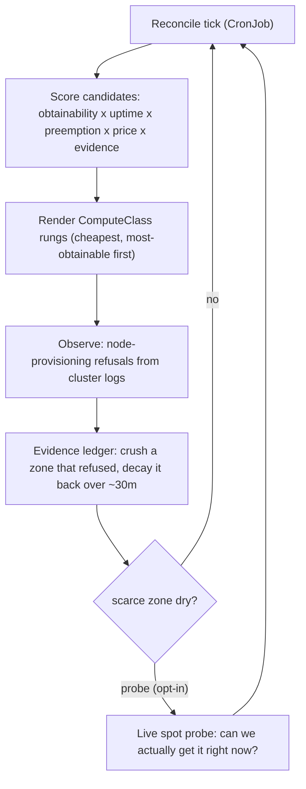

# GKE Spot Playbook

Running real workloads on [**GKE Spot**](https://cloud.google.com/kubernetes-engine/docs/concepts/spot-vms?utm_campaign=CDR_0x5d16fa53_user-journey_b550269617&utm_medium=external&utm_source=lab) capacity is cheap—often 60–90% off
on-demand—but spot is *interruptible* and, for scarce shapes like GPUs, not
always *obtainable*. This repo is a hands-on playbook for making spot dependable
anyway: a capacity **advisor/reconciler** that turns the spot failure surface
into a self-maintaining cost-and-obtainability ladder, plus lifecycle levers
(suspend/resume, scale-to-zero, warm GPU restore) that keep expensive nodes from
sitting idle.

It's built as a series of **acts** — each a runnable scenario with a runbook
whose every claim is tagged `LIVE` (measured on a real cluster) or `PROJECTED`.
Read an act, run it, watch the mechanism work.

> **Companion to the *Obtainability* series.** This repo is the reference
> implementation for *Obtainability*, a hands-on series on making GKE Spot
> dependable — the write-ups that explain *why* each act works live at
> [caseywest.com](https://caseywest.com/). Read a post, then run its act here.

> **Educational sample.** This is a demo/teaching repo, not a supported product.
> The project id is a placeholder (`example-sandbox`); set your own before
> running anything. Everything it builds is reproducible from `infra/` and torn
> down by `infra/90-teardown.sh`.

## The idea in one picture

The advisor runs on a schedule. Each tick it scores every candidate
shape × zone, writes the winning rungs as [GKE ComputeClasses](https://cloud.google.com/kubernetes-engine/docs/concepts/about-custom-compute-classes?utm_campaign=CDR_0x5d16fa53_user-journey_b550269617&utm_medium=external&utm_source=lab), and learns from
what actually happened — observed provisioning failures decay in an evidence
ledger, and (optionally) a live capacity probe confirms a scarce shape is
really obtainable before widening onto it.



## The acts

| Act | Title | What it teaches |
| --- | --- | --- |
| 1 | *spot survives* | A CPU batch/queue worker keeps making progress across spot preemptions. |
| 2 | *spot survives, with GPUs* | The same resilience for GPU batch work. |
| 3 | *spot survives, on the ladder* | A cost/obtainability ladder across machine types and zones, expressed as ComputeClasses. |
| 4 | *the ladder maintains itself* | The reconciler + evidence ledger route around real stockouts automatically. |
| 5 | *how dense can one node get* | Packing idle agents by suspending/resuming them (gVisor lifecycle). |
| 6 | *serving on spot, warm and cheap* | A vLLM endpoint that scales to zero and wakes from a warm GPU snapshot — no model reload. |
| 7 | *obtainability under GPU scarcity* | Probe-gated A100 obtainability and next-cheapest-region failover. |

Each act lives in `demo/act<N>/` with a `runbook.md`. Start with Act 1.

## Repository layout

- **`advisor/`** — the Go capacity advisor/reconciler. Subcommands: `analyze`,
  `render`, `cost`, `serving-cost`, `density`, `reconcile`, `probe`. Config is
  `advisor.yaml`.
- **`workloads/`** — the demo workloads: `01-queue`, `02-embeddings`,
  `03-finetune`, `05-agents`, `06-serve` (vLLM). Manifests are
  `kubeconform`-validated.
- **`infra/`** — numbered, idempotent setup scripts (`00-preflight.sh` …
  `09-*.sh`), the reconciler deployment, `migrate-region.sh`, and
  `90-teardown.sh`.
- **`demo/`** — the acts (`act1`–`act7`), each with its runbook and helpers.
- **`docs/`** — the operator runbook and, under `docs/design/`, the design
  specs and implementation plans each act was built from (kept as a "how it was
  built" record).

## Quickstart

Prerequisites: a GCP project you own, `gcloud`, `kubectl`, `go` (1.26.5+),
`python3`, `kubeconform`, and `shellcheck`.

```bash
# 0. Install the pinned Go-based tooling (kubeconform). Or: brew install kubeconform shellcheck
make tools

# 1. Build and run the full test suite (Go + shellcheck + kubeconform).
make test

# 2. Point the scripts and config at YOUR project (replace the placeholder).
export PROJECT=your-project-id
# advisor.yaml and infra/lib/common.sh default to `example-sandbox` — override.

# 3. Stand up the cluster and platform (reads PROJECT via infra/lib/common.sh).
bash infra/00-preflight.sh
bash infra/01-cluster.sh
# ... continue through the numbered infra scripts as an act's runbook directs.

# 4. See what the advisor would do, without a cluster:
go build -o /tmp/capacity-advisor ./advisor/cmd/capacity-advisor
/tmp/capacity-advisor analyze --profile cpu-batch --config advisor.yaml --out /tmp/out
```

> **Credentials note.** If your shell exports `GOOGLE_APPLICATION_CREDENTIALS`,
> it can shadow your `gcloud` ADC login. The `infra/*.sh` scripts unset it per
> run; for ad-hoc `gcloud`/`kubectl`/advisor commands, prefix with
> `env -u GOOGLE_APPLICATION_CREDENTIALS ...`.

## Teardown

```bash
REGION=us-central1 bash infra/90-teardown.sh
```

Idempotent and safe to re-run. It removes everything the demo creates (cluster,
[Pub/Sub](https://cloud.google.com/pubsub/docs/overview?utm_campaign=CDR_0x5d16fa53_user-journey_b550269617&utm_medium=external&utm_source=lab), service accounts + IAM, [Artifact Registry](https://cloud.google.com/artifact-registry/docs?utm_campaign=CDR_0x5d16fa53_user-journey_b550269617&utm_medium=external&utm_source=lab), the [GCS](https://cloud.google.com/storage/docs?utm_campaign=CDR_0x5d16fa53_user-journey_b550269617&utm_medium=external&utm_source=lab) bucket) and leaves
the empty [Firestore](https://cloud.google.com/firestore/docs?utm_campaign=CDR_0x5d16fa53_user-journey_b550269617&utm_medium=external&utm_source=lab) default database in place.

## Status

Acts 1–7 are complete, each validated live and torn down afterward. This is a
teaching companion — read the acts in order, or jump to the one that matches the
problem you're facing on spot.
