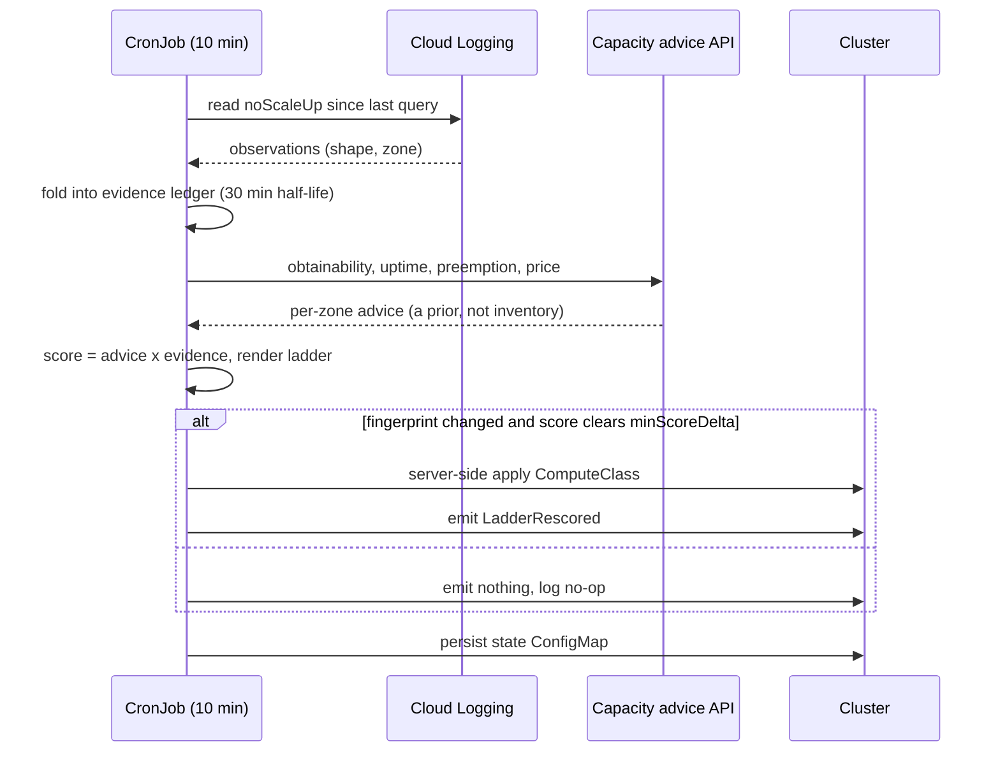
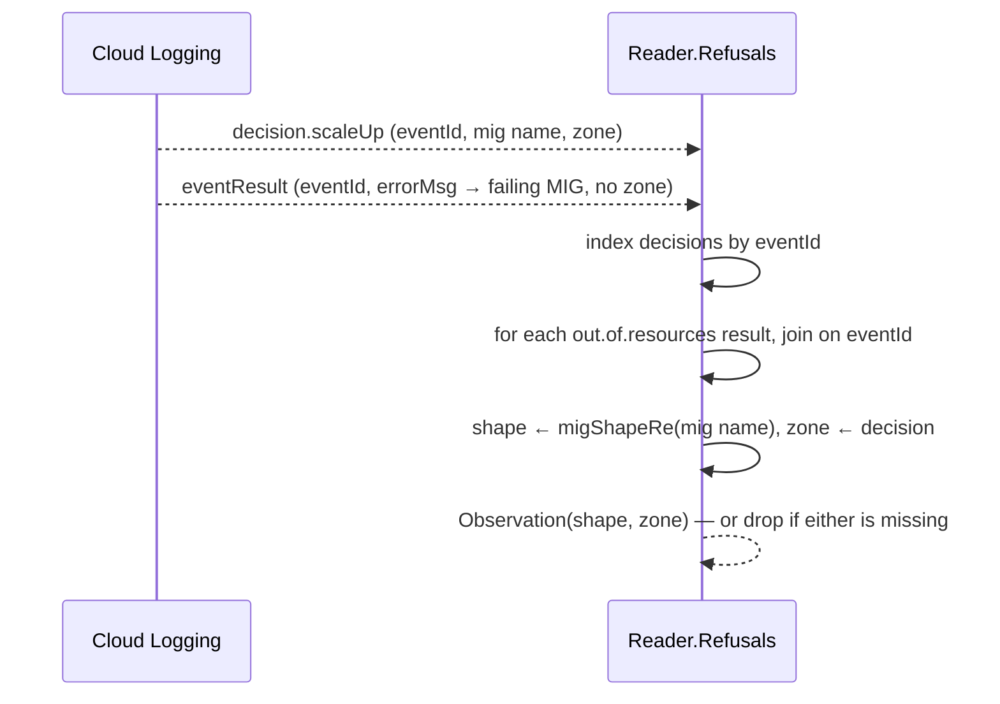

# Act 4 runbook — "the ladder maintains itself"

Acts 1–3 proved that workloads survive spot preemption on a ladder. What they
also proved, less comfortably, is how that ladder got built: a human ran
`analyze`, read a report, believed an obtainability score, watched it fail, and
then hand-edited the live ComputeClass — twice. Act 3's saga is four region
migrations, a live probe, and a `g2-standard-8` rung typed in by hand at the
end. The ladder worked. The loop that produced it was a person refreshing logs.

Act 4 removes the human. A CronJob ticks every ten minutes: it reads the
cluster autoscaler's own record of what it could not provision, folds that into
a decaying evidence ledger, rescores the capacity advice against it, and
server-side applies the ladder — but only when the change is real enough to
clear a hysteresis bar. This runbook is the live verification of that loop
against the `spot-demo` cluster in `us-central1`, run on **2026-08-02 (UTC)**.

The verification turned up four defects, and both failure modes behind them are
silent. "The reconciler said success and did nothing" is the first, and it is
the one an automated loop like this exists to rule out. The second is worse:
**the reconciler said success and confidently did the wrong thing**, penalising
two perfectly healthy zones and advising a region migration on the strength of
it. Beat 3 is mostly about that.

> **Credentials warning (read once).** Running `kubectl`, `go run`, or `gcloud`
> ad hoc from a shell that has `GOOGLE_APPLICATION_CREDENTIALS` set will use the
> wrong identity and fail (the coder SA lacks `container` perms → `Forbidden`).
> The `infra/*.sh` and `demo/*.sh` scripts handle this for you
> (`spotdemo::init` unsets it per run). For the **ad-hoc** commands in this
> runbook prefix them with `env -u GOOGLE_APPLICATION_CREDENTIALS ...` or
> `unset` it in your shell first.

---

## What the reconciler does



Two details in that diagram carry most of the design.

**The advice API is a prior, not inventory.** Act 3 learned this the hard way:
obtainability read `0.90` for zones that were, right then, empty. So the
reconciler never trusts it alone — it multiplies it by evidence of what the
autoscaler actually refused, and evidence wins.

**The log read is gated.** `ingest` returns before querying Cloud Logging
unless at least one pod is pending against a managed class. A cluster with
nothing waiting on capacity has nothing to learn, and pays nothing to learn it.
The discriminator is `lastLogQuery` in the state ConfigMap: if it did not
advance, no query was billed.

---

## Beat 1: deploy

```bash
./infra/04-build.sh
./infra/08-reconciler.sh
env -u GOOGLE_APPLICATION_CREDENTIALS kubectl -n spot-demo get cronjob capacity-advisor
```

```
NAME               SCHEDULE       TIMEZONE   SUSPEND   ACTIVE   LAST SCHEDULE   AGE
capacity-advisor   */10 * * * *   <none>     False     0        9m19s           56m
```

**The dry run reads and writes nothing.** `kubectl create job --from` refuses
to take a command override, so render the Job and append the flag:

```bash
env -u GOOGLE_APPLICATION_CREDENTIALS kubectl -n spot-demo create job \
  --from=cronjob/capacity-advisor advisor-dryrun --dry-run=client -o json \
| python3 -c '
import sys, json
d = json.load(sys.stdin)
c = d["spec"]["template"]["spec"]["containers"][0]
c["args"] = list(c.get("args", [])) + ["--dry-run"]
json.dump(d, sys.stdout)
' | env -u GOOGLE_APPLICATION_CREDENTIALS kubectl apply -f -
env -u GOOGLE_APPLICATION_CREDENTIALS kubectl -n spot-demo logs -l job-name=advisor-dryrun --tail=-1
```

```
observations: 0
would:    batch-cpu
would:    batch-gpu
advisory: us-south1 scores 0.810 vs 0.300 here at $0.0069/unit-hr — run: infra/migrate-region.sh us-south1; us-west1 scores 0.510 vs 0.377 here at $0.3973/unit-hr — run: infra/migrate-region.sh us-west1
```

`would:` instead of `applied:`, and the state ConfigMap does not exist yet:

```
Error from server (NotFound): configmaps "capacity-advisor-state" not found
```

**The first real tick adopts the ladder.**

```
observations: 0
applied:  batch-cpu
applied:  batch-gpu
advisory: us-south1 scores 0.540 vs 0.300 here at $0.0069/unit-hr — …
```

The applied `batch-cpu` class, read back from the cluster:

```yaml
apiVersion: cloud.google.com/v1
kind: ComputeClass
metadata:
  generation: 2
  name: batch-cpu
spec:
  activeMigration:
    optimizeRulePriority: true
  nodePoolAutoCreation:
    enabled: true
  priorities:
  - location:
      zones:
      - us-central1-b
      - us-central1-c
    machineType: t2d-standard-8
    priorityScore: 1000
    spot: true
  whenUnsatisfiable: ScaleUpAnyway
```

and `batch-gpu`, which keeps its flex-start floor:

```
=== batch-gpu (generation 4) ===
  [0] g2-standard-4 spot=True score=1000 zones=['us-central1-a']
  [1] flexStart g2-standard-4 score=1 (nodeRecycling leadTimeSeconds 3600)
  whenUnsatisfiable: DoNotScaleUp
```

State after adoption — an empty ledger, both classes fingerprinted, and
`lastLogQuery` still at its zero value because nothing was pending:

```json
{
  "ledger": {"latest": {}},
  "applied": {
    "batch-cpu": {"fingerprint": "d36e9b0d…7356", "score": 0.2995218763596809,
                  "region": "us-central1", "at": "2026-08-02T18:08:59Z", "evidence": false},
    "batch-gpu": {"fingerprint": "82e28191…b999", "score": 0.37686513393486326,
                  "region": "us-central1", "at": "2026-08-02T18:08:59Z", "evidence": false}
  },
  "pending": {},
  "lastLogQuery": "0001-01-01T00:00:00Z"
}
```

> **This tick found the first defect.** It also logged three warnings that are
> not in the expected output above, because they should not have happened. See
> defect 1 below.

---

## Beat 2: it holds still

Run a second tick immediately, with nothing changed.

```
observations: 0
no-op:    batch-cpu
no-op:    batch-gpu
advisory: us-south1 scores 0.810 vs 0.300 here at $0.0069/unit-hr — …
```

**The no-op is the hardest thing here to get right.** A
controller that re-applies an identical object every ten minutes is not
idempotent in any sense an operator cares about: it bumps `metadata.generation`
on a cluster-scoped resource forever, floods the event stream, and makes
`kubectl get computeclass` useless as a change signal. Worse, on a live
ComputeClass with `activeMigration` enabled, a spurious apply is not free —
it invites the autoscaler to re-evaluate placement for a ladder that did not
move.

Two independent gates produce that no-op:

- **Fingerprint.** The rendered ladder is hashed. Identical render, no apply,
  regardless of score.
- **`minScoreDelta` (0.15) plus `consecutiveTicks` (3).** Even a changed
  fingerprint waits until the score has moved enough, for long enough. The
  advice API is noisy — across the ticks in this runbook the same `us-south1`
  read 0.810, 0.540, and 0.810 again within an hour. Hysteresis is what keeps
  that noise off the cluster.

Note that the *advisory* line still updates on a no-op tick. Telling a human
"another region is 2.7× better here" costs nothing and changes nothing; that
is deliberately not gated.

---

## Beat 3: it reads the refusal — and refuses to over-read it

The interesting problem is provoking a scale-up failure on demand. Waiting for
a genuine L4 stockout is what cost Act 3 several days, and it is not a
repeatable verification step.

The trick: ask `batch-cpu` for a pod no rung shape can ever satisfy.

```bash
env -u GOOGLE_APPLICATION_CREDENTIALS kubectl apply -f demo/act4/seed-nap-mig.yaml
# wait for the node
env -u GOOGLE_APPLICATION_CREDENTIALS kubectl apply -f demo/act4/provoke-noscaleup.yaml
```

The 200-vCPU pod is the provocation; the seed pod is a prerequisite that is easy
to miss. **The autoscaler can only reject a MIG that already exists.**
With no `batch-cpu` node pool, a 200-vCPU pod produces a pod-group-level
`napFailureReasons` entry that names a zone but no shape — which the evidence
parser deliberately refuses to attribute, because writing a shape it did not
observe into the ledger would steer the ladder off a rung that is actually
healthy. Seeding one 1-vCPU pod first makes NAP create a real
`t2d-standard-8` MIG, and *then* the 200-vCPU pod produces MIG-attributed
rejections.

Here is the real record, pulled verbatim from
`container.googleapis.com/cluster-autoscaler-visibility` and kept as a test
fixture at
[`advisor/internal/evidence/gcplog/testdata/provoke-both-lists.json`](../../advisor/internal/evidence/gcplog/testdata/provoke-both-lists.json):

```json
{
  "noDecisionStatus": {
    "measureTime": "1785699485",
    "noScaleUp": {
      "unhandledPodGroups": [
        {
          "napFailureReasons": [
            {"messageId": "no.scale.up.nap.pod.zonal.resources.exceeded",
             "parameters": ["us-central1-a"]},
            {"messageId": "no.scale.up.nap.pod.zonal.resources.exceeded",
             "parameters": ["us-central1-b"]},
            {"messageId": "no.scale.up.nap.pod.zonal.resources.exceeded",
             "parameters": ["us-central1-c"]},
            {"messageId": "no.scale.up.nap.pod.zonal.resources.exceeded",
             "parameters": ["us-central1-f"]}
          ],
          "podGroup": {
            "samplePod": {"name": "provoke-noscaleup", "namespace": "spot-demo"},
            "totalPodCount": 1
          },
          "rejectedMigs": [
            {
              "mig": {
                "name": "gke-spot-demo-nap-t2d-standard-8-spot-4eb946e7-grp",
                "nodepool": "nap-t2d-standard-8-spot-tnq5qvem",
                "zone": "us-central1-c"
              },
              "reason": {
                "messageId": "no.scale.up.mig.failing.predicate",
                "parameters": ["NodeResourcesFit", "Insufficient cpu"]
              }
            },
            {
              "mig": {
                "name": "gke-spot-demo-nap-t2d-standard-8-spot-67640a5e-grp",
                "nodepool": "nap-t2d-standard-8-spot-tnq5qvem",
                "zone": "us-central1-b"
              },
              "reason": {
                "messageId": "no.scale.up.mig.failing.predicate",
                "parameters": ["NodeResourcesFit", "Insufficient cpu"]
              }
            }
          ]
        }
      ],
      "unhandledPodGroupsTotalCount": 1
    }
  }
}
```

Read that record carelessly and it says: four zones in `us-central1` are out of
capacity, and `t2d-standard-8` was refused in two of them. Read it honestly and
it says something else entirely: **a pod asking for 200 vCPU does not fit on an
8-vCPU machine.** Every line of it is a fact about the pod. Not one line is a
fact about capacity.

### The false positive a careless read produces

The parser did read it carelessly, and the live cluster showed what that costs:

```
observations: 2
advisory: us-south1 scores 0.540 vs 0.047 here at $0.0069/unit-hr — …
```

```
t2d-standard-8  us-central1-b  no.scale.up.nap.pod.zonal.resources.exceeded  2026-08-02T19:38:05Z
t2d-standard-8  us-central1-c  no.scale.up.nap.pod.zonal.resources.exceeded  2026-08-02T19:38:05Z
```

`us-central1` at **0.047** against `us-south1` at 0.540, and two healthy zones
marked dry — on the strength of a pod the operator wrote to be unschedulable.
Nothing was out of stock. The ledger had been taught a lie, and the advisory
built on it ("migrate to `us-south1`") was a recommendation to move a production
workload out of a region that was working fine.

(Eight raw observations produced those two rows: four zonal reasons paired
against two rejected MIGs. `Ledger.Add` keeps the newest per `(shape, zone)` and
`Observations` counts distinct keys, so the cross product collapsed rather than
compounding — the count an operator reads was never inflated. Only the two rows
were wrong, and two was enough.)

The ledger is keyed by `(shape, zone)` and an
entry drops that pair's weight straight to the floor — the same penalty a hard
stockout earns. So only a fact about *that pair* may ever be written to it. Two
distinct confusions put pod facts there:

- **`no.scale.up.mig.failing.predicate` is never capacity.** It is the
  scheduler's own predicate result — here `NodeResourcesFit` / `Insufficient
  cpu`. Every reason GKE documents at MIG level describes the pending pod, so
  the MIG-level `reason` field is now read for its parameters and never as
  evidence in its own right.
- **`no.scale.up.nap.pod.zonal.resources.exceeded` is capacity *usually*.** GKE
  folds three causes into this one message — the zone was short, a cluster
  maximum was hit, or **no machine type could fit the request at all** — and its
  only parameter is the zone. The third cause is what fired here, and it makes
  an oversized pod look identical to a region-wide stockout.

The second has no allowlist answer, because the message is genuinely ambiguous.
What resolves it is that **the record disambiguates itself**: a pod that fits no
shape also fails `NodeResourcesFit` against MIGs of that shape that already
exist. A genuinely empty zone would not simultaneously report that the pod is
too big for the shape it is refusing to build. So zonal exhaustion is believed
only for a shape whose own MIGs did not reject the pod on size — and the
predicate *name* matters, because a `NodeAffinity` or taint rejection
means the pod was steered away, which says nothing about whether the zone had
capacity.

The bias throughout is deliberately asymmetric. A capacity signal that gets
missed leaves the advice API's prior in charge — merely uninformed. A capacity
signal that gets fabricated steers a live ladder off a healthy rung. So the
pod-fact reasons are enumerated and skipped, and anything unrecognised is still
read as evidence.

### What a correct read does with the same provocation

The provocation was left pending, the state ConfigMap deleted to force a cold
start, and the tick re-run against the identical record:

```
observations: 0
applied:  batch-cpu
applied:  batch-gpu
advisory: us-south1 scores 0.810 vs 0.300 here at $0.0069/unit-hr — run: infra/migrate-region.sh us-south1; us-west1 scores 0.540 vs 0.465 here at $0.3973/unit-hr — run: infra/migrate-region.sh us-west1
```

```
lastLogQuery: 2026-08-02T19:54:06Z
ledger: {}
applied classes: ['batch-cpu', 'batch-gpu']
```

**Zero observations, an empty ledger, and `us-central1` holding at its
unpenalised 0.300.** The query did run — `lastLogQuery` advanced, because the
provocation pod really was pending — read the record, and correctly concluded it
had learned nothing about capacity. The reconciler does not react to whatever
the cluster reports; it reacts to the part that is about capacity and discards
the rest.

The events confirm the same tick end to end:

```
NAMESPACE  TYPE      REASON           OBJECT      MESSAGE
default    Normal    LadderRescored   batch-cpu   re-ranked batch-cpu (top score 0.300 in us-central1)
default    Normal    LadderRescored   batch-gpu   re-ranked batch-gpu (top score 0.465 in us-central1)
default    Warning   RegionAdvisory   batch-cpu   us-south1 scores 0.810 vs 0.300 here at $0.0069/unit-hr — …
```

`default`, not `spot-demo` — see defect 1.

### What this beat does not prove

It does not prove the reaction. An unschedulable pod cannot produce genuine
capacity evidence, by construction, and now that the parser is honest about that
the provocation produces none at all.

What is proven, and where:

- **The parse-and-discriminate path** — against the live record above, kept as a
  fixture and pinned by six tests in `gcplog_test.go`, each verified to fail
  when the discrimination it covers is removed.
- **The score collapse itself** — arithmetic independent of where the
  observation came from. It was measured on the live cluster: two
  `(t2d-standard-8, zone)` entries drove `us-central1` from 0.300 to 0.047, a 6×
  penalty, and Beat 4's decay curve was measured on entries just like them. A
  real stockout writes the same rows; only their provenance was wrong.
- **The no-op-on-exhaustion path** — below, and pinned by
  `TestComputeClassNeverEmitsAZonelessRung`.

**Provoking a genuine capacity refusal on demand remains unsolved**, and the
options are all bad: ask for a shape with no regional stock (unreliable, and it
moves), ask for quota you do not have (a different message id entirely), or wait
for a real stockout (what cost Act 3 days). That is the gap this act closes
least well. The numbers above are the only live measurement of the reaction
that exists, which is why they stay.

### Why the ladder did not move under evidence, and why that was correct

This is the behaviour a real stockout will trigger, so it is worth the reason
behind the no-op rather than an assumption. It is not the ordinary reason ("the
crushed zone was not in the top rung") — here the crushed zones *were* the
entire top rung:

1. Evidence sets each zone's factor to `floor` (0.05) at the instant of
   observation, recovering with a 30-minute half-life. `dryBelow` is 0.5, so a
   fresh observation keeps a zone dry for about 28 minutes.
2. `buildRungs` drops evidence-dry zones from their rung. Both `us-central1-b`
   and `us-central1-c` were dry, so the `t2d-standard-8` rung emptied.
3. An emptied rung is **widened** to the in-region zones the advice API never
   sharded for that shape. The widening universe here is every in-region zone in
   the analysis — and the analysis returned exactly two candidates in
   `us-central1`, `t2d-standard-8` in `-b` and in `-c`. Both were dry. The
   universe is exhausted.
4. A priority with no zones is invalid, and the rule is never to degrade a
   working ladder, so the rung keeps its original zones and is marked
   `exhausted=all-zones-dry`.
5. Original zones → identical render → identical fingerprint → no apply.

So the reconciler concluded there was nowhere better to go inside `us-central1`
and said so the only way it can: by leaving the ladder alone and raising the
region advisory.

The exhaustion marker is emitted as a YAML comment on the rendered class
(`# rung t2d-standard-8 … exhausted=all-zones-dry`) and is therefore **stripped
by server-side apply** — visible in `capacity-advisor analyze --render` output
but not on the live object. That is a real observability gap; see "What the live
run surfaced" below.

---

## Beat 4: it forgets

> **These entries were written by the pre-discrimination parser.** The two
> entries decaying below are pod facts that should never have reached the ledger.
> What they exercise — `Factor`, `dryBelow`, and the gate on the log query —
> reads only a key and an `at` timestamp and cannot tell how the row was
> written. A real stockout produces rows of exactly this shape, so the decay
> curve is measured even though its source was wrong.

```bash
env -u GOOGLE_APPLICATION_CREDENTIALS kubectl -n spot-demo delete pod provoke-noscaleup
```

Then one more tick:

```
observations: 0
no-op:    batch-cpu
no-op:    batch-gpu
advisory: us-south1 scores 0.810 vs 0.061 here at $0.0069/unit-hr — run: infra/migrate-region.sh us-south1; us-west1 scores 0.540 vs 0.399 here at $0.3973/unit-hr — …
```

The `us-central1` score across the ticks, against the age of the newest
observation at the moment each tick ran:

| tick | age of newest observation | score for `us-central1` |
| ---- | ------------------------- | ----------------------- |
| before any evidence | — | 0.300 |
| ingest (`advisor-5`) | ~3 min | 0.036 |
| scheduled tick, 18:50Z | ~4 min | 0.040 |
| after deleting the provocation, ~18:53Z | ~7.6 min | 0.061 |

Recovering along the 30-minute half-life, on its way back to 0.300 — no
operator action, no manual ledger edit.

The curve those rows sit on is
`factor = 0.05 + 0.95 · (1 − 2^(−age/30))`, scored as `0.300 × factor`. Note
that the first row is not age zero: the observation was already about three
minutes old when the ingesting tick ran, because the autoscaler writes the
visibility record on its own cadence and the tick reads it afterwards. An
age-zero observation would score 0.015. **The floor is reached by the
observation, not by the tick that notices it** — which is also why a tick
arriving late still applies a meaningful penalty rather than none.

```
lastLogQuery: 2026-08-02T18:50:03.126613195Z
t2d-standard-8 us-central1-b no.scale.up.mig.failing.predicate 2026-08-02T18:46:07Z
t2d-standard-8 us-central1-c no.scale.up.mig.failing.predicate 2026-08-02T18:46:07Z
```

**`observations: 0` did not mean "the query found nothing".** It means the query
never ran: with the provocation deleted there are no pending class pods, so
`ingest` short-circuits before Cloud Logging. `lastLogQuery` frozen at
`18:50:03Z` — the previous tick's value, not this one's — is the proof. A
cluster that is not waiting on capacity does not pay to ask why.

**The ledger stores the observation, not the weight.** The keys and their `at`
timestamps are unchanged; the decay is a function of age computed at read time.
That is why the decay is visible in the score and not in the ConfigMap.

### Cleanup

```bash
env -u GOOGLE_APPLICATION_CREDENTIALS kubectl -n spot-demo \
  delete pod provoke-noscaleup seed-nap-mig --ignore-not-found
env -u GOOGLE_APPLICATION_CREDENTIALS kubectl -n spot-demo \
  delete job -l job-name --ignore-not-found   # or name the advisor-* jobs you created
env -u GOOGLE_APPLICATION_CREDENTIALS gcloud container node-pools list \
  --cluster spot-demo --region us-central1 --filter 'name~^nap-'
env -u GOOGLE_APPLICATION_CREDENTIALS gcloud container node-pools delete \
  <the nap-* pool from the previous command> --cluster spot-demo --region us-central1
```

The auto-created node pool does not disappear with the pod. It scales to zero on
its own, but the pool object lingers; delete it explicitly rather than leaving a
spot node billing while you write up the results. Its name carries a random
suffix (`nap-t2d-standard-8-spot-tnq5qvem` on this run), so list before you
delete rather than copying a name out of this runbook. The delete takes several
minutes.

### Kueue gotcha — still neutralized

Verify-only. `infra/07-kueue.sh` patches `waitForPodsReady` so Kueue v0.19 does
not evict a job that is waiting on a spot node:

```
#waitForPodsReady:
#  timeout: 5m
#  recoveryTimeout: 3m
--
waitForPodsReady:
  timeout: 9999h
```

Still in place. No action.

---

## Beat 5: it reads scale-up stockouts too

Beats 1–4 exercise one half of what the autoscaler can refuse: `noScaleUp`, the
decision *not to create* a node. The other half is a node the autoscaler *tries*
to create and cannot, because an **existing** MIG's zone is out of spot stock.
That is `scale.up.error.out.of.resources` — a class of genuine capacity refusal
the `noScaleUp` read never sees, and the most likely source of the very evidence
Beat 3 could not provoke. The reader collects it too.

**A failed scale-up is split across two log events.** A `noScaleUp` record is
self-contained; a stockout is not. The autoscaler writes a `decision.scaleUp`
carrying the MIG name and its zone, and — separately — an `eventResult` carrying
the `errorMsg` that names the failing MIG but no zone. The two are joined by
`eventId`, and only the pair yields a `(shape, zone)` the ledger can key on: the
shape comes from the NAP MIG name via `migShapeRe`, the zone from the matching
decision.



The reader's interface reflects that. A single `Refusals` method returns both
kinds of refusal merged into one
`[]evidence.Observation`; the reconciler does not care which list a refusal came
from, only that a zone refused capacity for a shape. Everything downstream —
`ingest`, `Ledger.Add`, the decay curve, the scoring — is untouched. This adds a
source of observations, nothing else.

### The recipe

```bash
# prereq: a seeded NAP GPU MIG must already exist for batch-gpu
env -u GOOGLE_APPLICATION_CREDENTIALS kubectl apply -f demo/act4/provoke-scaleup-stockout.yaml
```

The provocation drives a burst of GPU pods into the `batch-gpu` ComputeClass so
the autoscaler must scale an **existing** NAP MIG. If that MIG's zone is out of
spot GPU, the failure surfaces as the scaleUp error the reader now collects. The
prerequisite is the mirror of Beat 3's seed-first lesson, with a sharper edge:
the MIG must be **NAP-created**. An explicit node pool will not do — its MIG name
is `gke-<cluster>-<poolname>-…` and carries no `nap-<shape>` segment, so
`migShapeRe` parses no shape from it and the observation is dropped as
unattributable. Only a `gke-<cluster>-nap-<shape>-…` MIG works.

### The honest finding

On 2026-08-03 the provocation was run live **twice, and neither stocked out.**

- An L4 (`g2-standard-4`) spot pool bursted to 16 pods brought up eight nodes.
  `us-central1-a` had L4 spot capacity; the scale-up **succeeded**, and its
  `eventResult` carried no `errorMsg` at all.
- An A100 (`a2-highgpu-1g`) spot pool bursted brought up nodes too. A100 spot
  **also** had capacity.

So a genuine on-demand stockout is, right now, blocked by healthy capacity — not
by code. This is the same wall Beat 3 hit from the other side: an unschedulable
pod cannot manufacture capacity evidence, and abundant spot cannot be talked
into refusing it. You cannot summon a real GCE stockout when the stock is there.

Aim the provocation at an explicit L4 pool instead and the join produces zero
observations even where a failure would have landed: the scale-up's MIG name has
no `nap-` segment, so `migShapeRe` returns nothing. Only the `batch-gpu` NAP
path yields MIG names the ledger can key on.

### What is proven, and where

- **The parse-and-join path** — unit-tested and mutation-verified.
  `TestScaleUpFailures_HappyPath` and its siblings in `gcplog_test.go` pin the
  `eventId` join, the orphan-result drop, the partial-failure single-zone
  attribution, the non-stockout (`quota.exceeded`) rejection, and the
  unparseable-MIG drop. `TestReaderMergesNoScaleUpAndScaleUp` covers the merged
  return and fails if the scaleUp wiring is dropped.
- **The fixture is hand-authored**, not a raw capture, and the fixture README
  says so. Its structure is confirmed from the two real 2026-08-03 captures —
  both of which were *successful* scale-ups — plus the documented `errorMsg`
  shape from GKE's cluster-autoscaler-visibility reference. No real stockout
  could be captured, so none is claimed.
- **The end-to-end reaction against a real refusal is NOT proven.** It is
  opportunistic: capture a real pair when spot scarcity next returns, and
  replace the fixture with it. This mirrors Beat 3 exactly — the parser is
  honest about a signal it has never actually been fed in anger.

### Provocation on demand: still unsolved, now on both paths

Beat 3 closed by recording that provoking a genuine capacity refusal on demand
remains unsolved for the `noScaleUp` path. This beat confirms the same verdict
for the `scaleUp` path, for the same root reason: a real GCE stockout cannot be
summoned while capacity exists. The collection code is now in place for both
kinds of refusal; the ability to *provoke* one on command is bounded by spot
availability, not by anything in this repo. What changed is the reach of the
reader, not the reliability of the demo — when scarcity returns, the reconciler
will see the half of the story a `noScaleUp`-only read leaves out.

---

## Beat 6: it verifies capacity by probe before it widens

Act 3's stale-prior lesson had a second half the reconciler could not act on: the
advice API reads high for zones that are empty, so widening a dry rung onto a
never-sampled zone — or promoting a larger shape — was trusting the same prior
that had already lied. Act 3 verified those by hand with a live probe (that is
where the four-zone widening and the `g2-standard-8` rung came from). This makes
that verification automatic: before the reconciler widens an evidence-dry rung
onto a zone the advice API never sharded, it requires a **live probe** to confirm
the zone can actually supply the shape right now.

The signal is deliberately one-directional. A **successful** probe confirms a
`(shape, zone)` and lets the rung widen onto it; a **failed or errored** probe is
inconclusive and does nothing — it is never written to the evidence ledger. A
probe can fail for reasons that have nothing to do with capacity (quota, a bad
image, a network policy), and the ledger drops a pair straight to the floor, so
folding a probe failure into it would crush a zone the reconciler should have
left alone. That boundary — **probe outcomes never reach the ledger** — is pinned
by a test and holds on every branch of the reap.

The probe runs asynchronously so a ten-minute tick never blocks on a VM boot: one
tick creates the spot probe VM and records it as pending; a later tick reads its
status (RUNNING → confirm and delete; stockout/gone → delete and forget; past its
`maxRunDuration` backstop → give up and delete). Spend is bounded — a confirmation
is trusted for 30 minutes, at most one probe launches per tick, and a daily cap
holds the total down. The whole path is off unless `probe.automated: true`, which
is also what binds the instance-create IAM to the reconciler service account
(`PROBE_AUTOMATED=true bash infra/08-reconciler.sh`); a default install grants
nothing and probes nothing.

### The live verification, run 2026-08-09

The reconciler drives the probe through the same three operations the `probe`
subcommand does — insert a spot VM, poll its status, delete it — so the
subcommand is the honest live check of that machinery. Against the `spot-demo`
cluster (probe on a cheap CPU shape, not a GPU, to keep it cents):

```bash
cd advisor && env -u GOOGLE_APPLICATION_CREDENTIALS \
  go run ./cmd/capacity-advisor probe \
    --machine-type e2-standard-8 --zone us-central1-a --config <probe-enabled.yaml>
```

```json
{
  "machineType": "e2-standard-8",
  "zone": "us-central1-a",
  "obtained": true
}
```

The insert created a real spot VM on the cluster's default VPC (the probe's
network fallback matches `spot-demo`'s `default`/`default` network — no extra
config needed), the poll saw it reach RUNNING, and the delete cleaned it up:
`gcloud compute instances list --filter 'name~^capacity-probe-'` returns nothing
after the run. So the insert/status/delete ops and the network path are verified
end to end against real GCE (the reconciler's async orchestration around them —
insert one tick, reap the next — is pinned by the unit tests, not this run).

### What this beat does not prove

Two things, both the same kind as Beat 5's limitation:

- **The stockout mapping is not exercised.** `us-central1-a` had `e2` capacity
  (as it had L4 and A100 in Beat 5), so the probe returned `obtained`. The
  RUNNING path is verified; the `VMStatus` → *stockout* mapping is not, because a
  probe cannot be made to fail for capacity on demand any more than a scale-up
  can. When a zone is genuinely short, a probe that never reaches RUNNING is
  simply not a confirmation — the conservative direction (a missed confirmation
  withholds a widen; it never fabricates one).
- **The full automated widen was not driven in-cluster.** `gateWiden` only
  probes when a rung is *already* evidence-dry, which needs a real stockout in
  the ledger — the provocation Beat 5 could not summon. The gate, the budget, the
  reap, and the ledger boundary are pinned by unit tests and mutation checks; the
  end-to-end in-cluster widen-on-confirmation is opportunistic, to be captured
  when scarcity returns (and a reconciler built with `probe.automated`).

Not gated, and out of scope: promoting a shape the advice API never offered at
all (Act 3's `g2-standard-8`). Widening onto a never-sampled *zone* is gated
here; synthesising a never-offered *shape* would need the analysis to propose one
first, which it does not — a separate future step.

---

## What the automated ladder does differently from a hand-built one

Act 3 ended with two hand edits to the live ladder: `batch-gpu` widened to four
zones, and a `g2-standard-8` spot rung added at `priorityScore: 900` because a
live probe found stock one shape up when `g2-standard-4` was dry everywhere.

**The reconciler did not reproduce either of them.** As adopted, `batch-gpu` is
a single `g2-standard-4` rung in `us-central1-a` plus the flex-start floor —
one zone, not four, and no `g2-standard-8` rung at all. `batch-cpu` likewise
moved from the hand-set `[us-central1-a]` to `[us-central1-b, us-central1-c]`.

Neither difference is a regression:

- **The four-zone widening was a response to evidence the reconciler no longer
  has.** Those L4 stockouts were in July. Evidence has a 6-hour `maxAge` and a
  30-minute half-life, precisely so the ladder does not carry a grudge about a
  stockout that ended weeks ago. A reconciler that reproduced a July widening
  in August would be broken.
- **The `g2-standard-8` rung came from a live probe, and the probe is off.**
  `probe.enabled: false` by default because it creates a real spot VM. The
  reconciler scores what the advice API and the ledger tell it; "capacity
  exists one shape up" is knowledge only a probe produces. **Widen-by-probe is
  now automated (Beat 6):** the reconciler probes before it *widens* a dry rung
  onto a never-sampled zone, so the four-zone widening would now fall out of
  scoring plus a live probe rather than a hand edit. Promoting a larger *shape*
  the advice API never offered (the `g2-standard-8` rung) still is not automated
  — that needs the analysis to propose the shape first, which it does not.
- **What the reconciler does reproduce is the mechanism, not the answer.** The
  widening logic is there — an evidence-dry rung is rebuilt from the in-region
  zones the advice API never sampled, which is exactly the hand edit Act 3
  performed. It did not fire on this run because the widening
  universe was exhausted (Beat 3), not because the feature is absent.

The through-line from Act 3 stands: the score is a prior to be verified. Act 4
automates the verification loop for everything the cluster reports about
itself, and leaves the money-spending probe as an explicit human decision.

---

## What is deliberately out of scope

**ProvisioningRequest.** Act 3's saga ends by saying "Plan 4 fixes this by
wiring a Kueue `ProvisioningRequest` admission check so the flex rung actually
engages when spot is exhausted." **Act 4 does not do that**, and the promise
should be read as retracted. `ProvisioningRequest` /
`queued-provisioning.gke.io` is documented as incompatible with custom compute
classes, which is what this whole demo is built on. Wiring it would mean
abandoning the ComputeClass ladder, so the flex-start rung remains passive
insurance that NAP's spot-retry path will not escalate to on its own. That is a
known, unfixed limitation of the ladder, not something Act 4 quietly resolved.

**The live capacity probe.** Built, tested, and off by default, because it
creates a real spot VM. It is a human decision, run by hand:

```bash
cd advisor && env -u GOOGLE_APPLICATION_CREDENTIALS \
  go run ./cmd/capacity-advisor probe \
    --machine-type g2-standard-4 --zone us-central1-a --config ../advisor.yaml
```

Set `probe.enabled: true` in `advisor.yaml` first — the probe refuses to run
otherwise. `probe.maxRunDurationSeconds` (default 300) is a GCE-side backstop so
an abandoned probe VM terminates itself even if the CLI dies mid-run.

By hand it stays off-by-default. **But the reconciler now calls it too, opt-in:**
with `probe.automated: true` it verifies a zone by probe before widening a dry
rung onto it (Beat 6), a positive-only signal that never enters the evidence
ledger. That path is off unless `probe.automated` is set — which is also what
binds instance-create IAM to the reconciler service account — so a default
install still probes nothing.

---

## What the live run surfaced

### Four silent-failure defects, and what each one teaches

**1. Every event the reconciler emitted was rejected by the API server.** The
first live tick logged:

```
warning:  batch-cpu: event: emit event LadderRescored: Event "capacity-advisor-9x4f5" is invalid: involvedObject.namespace: Invalid value: "": does not match event.namespace
warning:  batch-gpu: event: emit event LadderRescored: …
warning:  advisory event: emit event RegionAdvisory: …
```

The events are about a ComputeClass, which is cluster-scoped, so their
`involvedObject.namespace` is empty — and the API server accepts that only in
`default`. The callers passed the pod's own namespace (`spot-demo`, where the
state ConfigMap lives). An emit failure only appends a warning, so the tick
reported success while the one signal a human watches went nowhere. Fixed by
pinning the event namespace to `default` at the call sites, with the RBAC Role
moved to follow it. The fake discarded its namespace argument, which is why the
entire suite was blind to this; it now records every call, including the ones
it then fails.

**2. The CronJob ran a stale binary.** The image tag `:v1` is mutable and
`04-build.sh` overwrites it, but Kubernetes defaults `imagePullPolicy` to
`IfNotPresent` for any tag other than `:latest`. A node that had already pulled
`:v1` kept running the old code — observed twice while chasing a bug that was
already fixed in the registry. Fixed to `imagePullPolicy: Always`.

**3. The evidence parser wrote facts about the pod into a ledger keyed by
capacity.** The one that matters, and the reason Beat 3 leads with it. Any
non-empty `messageId` became an observation, so an unschedulable pod condemned
`us-central1-b` and `-c` to the evidence floor and drove the region score down
by 6×. The full anatomy is in Beat 3; the mechanism in one line is that
`Ledger.Add` treats every entry as a hard stockout, so writing anything that is
not a fact about that exact `(shape, zone)` pair is not a small error.

The fix is two rules. Reasons GKE documents as pod facts are enumerated and
skipped — a list, not a guess, taken from GKE's `noScaleUp` reference. And
`no.scale.up.nap.pod.zonal.resources.exceeded`, which is ambiguous by
construction, is disbelieved for any shape whose own MIGs rejected the pod on
`NodeResourcesFit`. Unrecognised reasons are still read as evidence, because
missing a signal is recoverable and inventing one is not.

**4. The first attempt to fix defect 3 shipped, and made it worse.** Diagnosing
a `observations: 0` against a MIG-attributed record, the parser was changed to
*prefer* the MIG's own `reason` over the pod group's. That is backwards: every
reason GKE documents at MIG level is a statement about the pending pod, so the
change promoted the single least trustworthy field in the record to primary
evidence. It survived a full green suite because the tests written alongside it
asserted the new behaviour rather than the desired one — the fixtures were built
from the same misreading. Reverted; the MIG `reason` is now decoded only for its
predicate parameters, never as evidence.

Two live re-provocations caught this, and the unit suite caught neither. After
the first fix the tests were green and the live cluster still condemned two
healthy zones, because the pod-group path was untouched. A test written from a
misunderstanding encodes the misunderstanding.

### Field notes for anyone running this loop

- **The autoscaler's record is not stable between reads.** The 18:40Z capture
  carried `rejectedMigs` and no `napFailureReasons`; the 19:38Z capture of the
  same still-pending pod carried both. Anything that assumes one list is always
  present will work until it does not.
- **The advice API is noisy tick to tick.** The same `us-south1` scored 0.810,
  0.540, and 0.810 within an hour, and the second-ranked region alternated
  between `us-west1` and `us-east1`. This is the noise `minScoreDelta` and
  `consecutiveTicks` exist to absorb, and it is a good argument against ever
  applying on a single reading.
- **A `noScaleUp` filter alone misses scale-up stockouts.** A filter selecting
  `jsonPayload.noDecisionStatus.noScaleUp:*` covers the autoscaler declining to
  create a node. A stockout hitting an **existing** MIG that is trying to scale
  surfaces instead as `scale.up.error.out.of.resources` under the `scaleUp`
  decision. Beat 5 broadens the filter to the `decision.scaleUp` / `eventResult`
  pair and joins them by `eventId` into the same `(shape, zone)` observations.
  The **collection** is implemented and unit-tested; what remains
  capacity-dependent is **provoking** such a stockout on demand, which no code
  can guarantee while spot stock is healthy (Beat 5's honest finding).
- **`exhausted=all-zones-dry` is invisible on the live cluster.** The render
  emits it as a YAML comment, and server-side apply strips comments. An
  operator asking "why didn't the ladder move?" has to re-run
  `capacity-advisor analyze --render` locally to see it. Worth surfacing as a
  condition or an event in a future plan.
- **The advice API returned `us-south1-ai1b` as a zone.** `gcloud compute zones
  list` knows only `us-south1-a`, `-b` and `-c`, so this is not a GCE zone —
  and it still landed on a rendered `us-south1` rung. **Nothing validates it.**
  `analyze.buildCandidate` stamps a candidate's `Region` from the region that
  was queried and copies the shard's zone through untouched; there is no zone
  check anywhere on that path. (`zoneRe` in the log parser is the only zone
  pattern in the codebase, it is applied only to `napFailureReasons`
  parameters, and `us-south1-ai1b` does not match it — it is not what let this
  through.) The rung never reached the live cluster, because rungs are filtered
  to the target region and the cluster is in `us-central1`. Recorded rather
  than chased: a rung that named it would be rejected by the API server on
  apply, which is loud, not silent. A future fix belongs in `buildCandidate`,
  not in a regex.
