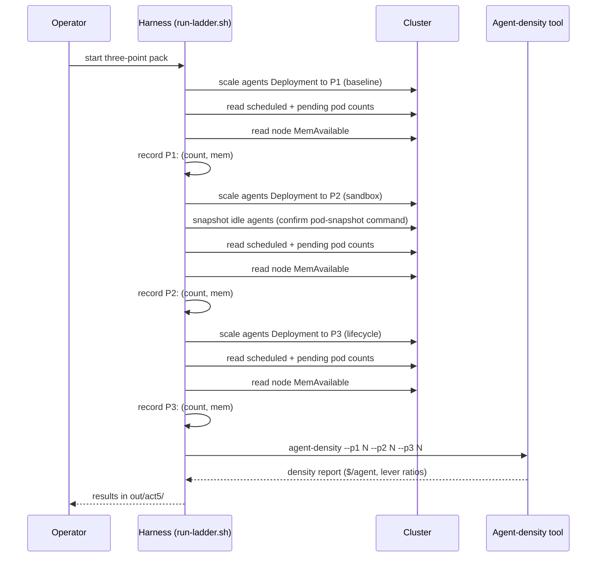

# Act 5 runbook — "how dense can one node get"

Acts 1–4 proved the platform: workloads survive spot preemption on a compute-class
ladder, and a reconciler maintains that ladder against live evidence — no hand edits.
This act asks the follow-on question: what does a denser workload look like on the
same node, and how much value does the platform's lifecycle management unlock?

This act adds a second dimension: **workload density**. A single node can pack more agents
than it can pack generic batch jobs. An agent under GKE Agent Sandbox can suspend
during idle periods, reclaiming its RAM footprint. With that density measured, the
platform's cost advantage becomes precise: a metric not just of cheaper compute,
but of how many workloads you can run per dollar on that compute.

Google's internal spot-instance benchmarks (61→88→274 agents per node across three
density levels) showed the ratio. This act reproduces it at smaller scale on the
`spot-demo` cluster. The region and machine type are discovered from the agents
node at run time, not hardcoded.

> **Credentials warning (read once).** Running `kubectl`, `go run`, or `gcloud`
> ad hoc from a shell that has `GOOGLE_APPLICATION_CREDENTIALS` set will use the
> wrong identity and fail (the coder SA lacks `container` perms → `Forbidden`).
> The `infra/*.sh` and `demo/*.sh` scripts handle this for you
> (`spotdemo::init` unsets it per run). For the **ad-hoc** commands in this
> runbook prefix them with `env -u GOOGLE_APPLICATION_CREDENTIALS ...` or
> `unset` it in your shell first.

---

## What the three-point ladder measures



The harness never assumes pod counts. It reads the actual scheduled/pending pods
at each point, so the report is grounded in what the cluster can actually fit, not
a guess about replica limits.

---

## Beat 1: prep the agents node

The Act 5 agents Deployment requires a GKE Agent Sandbox runtime and a compute-class
node pool. Both are confirmed or created during the live run. In an offline dry
run, the harness assumes they exist:

```bash
# The namespace, service account, and Deployment are all applied by
# run-ladder.sh (the agent-worker pods are rejected without the SA), so
# no manual kubectl apply is needed for this runbook.
./demo/act5/run-ladder.sh
```

The script will fail fast with a clear error if the `agents` compute-class node pool
is not found (selector: `cloud.google.com/compute-class=agents`).

---

## Beat 2: pack at P1 — baseline density

The harness scales the agents Deployment up one replica at a time until a pod
goes **Pending** — that Pending signal *is* the RAM wall. The number of pods that
actually scheduled at the wall is P1, the baseline packing density. A bounded
`MAX_REPLICAS` cap keeps the loop from running away if Pending never appears.

---

## The Mechanism, Proven End to End (Live Run, 2026-08-12)

The live run was executed on a dedicated `--enable-pod-snapshots` cluster
(`agent5-snap`, GKE 1.36.2-gke.2281000) with a gVisor node pool
(`n2-standard-4`) and a GCS snapshot bucket. The pod-snapshot CRDs come from the
cluster flag itself — the OSS `agent-sandbox` controller is **not** required for
GKE Pod snapshots (it only adds the `SandboxClaim`/`SandboxTemplate` abstraction
on top). All infrastructure was torn down after capture.

### The headline: lossless suspend → resume works

The full agent lifecycle was demonstrated on live infrastructure:

1. **Resident RAM is genuine.** gVisor agents with a 512 MiB working set show
   **~527 MiB RSS each** (`kubectl top pods`) — the mock agent faults every page,
   so the memory is truly held, not lazily reserved.
2. **Checkpoint to GCS succeeds.** A `PodSnapshotManualTrigger` reaches
   `AllSnapshotsAvailable`; the bucket holds `checkpoint.img`, `pages.img`,
   `pages_meta.img`, and `metadata`. With `postCheckpoint: stop` the pod stops
   and its RAM returns to the node.
3. **Resume is lossless.** Recreating the pod with an identical spec plus
   `podsnapshot.gke.io/ps-name: <snapshot>` triggers the event *"Successfully
   restored the pod from PodSnapshot"* — **not** a cold start. Proof: a
   53-second-old restored pod logged `elapsed=2m24s → 3m40s` with **zero "agent
   starting" lines**. A freshly started process cannot show three minutes of
   uptime in 53 seconds; the in-memory clock and the phase state machine resumed
   mid-stream from the *original* start. This is the Agent Sandbox differentiator
   and the basis of Google's 274 figure — reproduced here.

### The Checkpoint IAM Grant (What the Exit Code Hides)

At the checkpoint step the real agent exits with `runsc error: exit status 128`,
and a trivial `pause` pod with `signal: killed`. The exit code is a red herring:
it is not the machine type (`n2` is supported; only E2 is excluded), not memory
headroom (a minimal pod on a near-empty 16 GiB node with a 2 GiB limit fails
identically), and not the bucket's soft-delete setting.

The real cause appears in the **node snapshot-agent log**, not the exit code:

```
checkpoint failed: ... closing state file failed: permission denied
```

With `tokenSource: federatedP4SA`, the checkpoint image is written to GCS by the
**`gcp-sa-gkenode` service agent** (the node mints a
`generateClusterNodeAgentToken`), not by `container-engine-robot`. Granting
`roles/storage.admin` to
`service-<PROJECT_NUMBER>@gcp-sa-gkenode.iam.gserviceaccount.com` on the bucket
turns the same trigger green. Checkpointing fails on a one-line IAM grant to the
wrong identity, not on any limit of the mechanism.

### Density, measured live

Packing 512 MiB-working-set agents (768 Mi request) onto the `n2-standard-4`
gVisor node to the scheduling wall: **16 concurrent agents** (memory-bound at
99% of requests; node at ~10.3 GiB actual RSS). At the on-demand node price of
**$0.19/hr**, that is **~$0.012 per concurrent agent-hour** at the gVisor
operating point (P2) — the one point measured directly here.

After a lossless restore, gVisor pages memory back **lazily** — a restored agent
showed ~9 MiB RSS until it re-touched its working set. Restored idle agents
therefore carry a small resident footprint, which *helps* density.

**Not measured directly:** the Kata isolation baseline (P1) and the
oversubscription ceiling (P3). GKE Standard's only sandbox `runtimeClass` is
gVisor, so there is no in-cluster Kata baseline; and the full oversubscription
run (frozen idle agents at scale) was not performed. Those two points below are
**Google's published ratios scaled to our live P2=16**, clearly labelled as
projections, not local measurements.

---

## Beat 3: reclaim at P2 — sandbox + snapshot

P2 packs to the RAM wall a second time (the same Pending-signal stop condition),
measuring density under sandbox isolation. The harness then snapshots the idle
agents to demonstrate suspend/resume — the mechanism by which an Agent Sandbox pod
reclaims its RAM when inactive.

The snapshot is **CRD-driven**, not an `exec`: a
`PodSnapshotManualTrigger` targeting the pod, backed by a
`PodSnapshotStorageConfig` (GCS bucket) and a `PodSnapshotPolicy`
(`triggerConfig.postCheckpoint: stop` to free the RAM):

```bash
kubectl apply -f - <<EOF
apiVersion: podsnapshot.gke.io/v1
kind: PodSnapshotManualTrigger
metadata: {name: reclaim, namespace: act5-agents}
spec: {targetPod: <agent-pod>}
EOF
```

When the checkpoint succeeds, the agent's memory is written to GCS and the pod
stops, releasing its RAM. To **resume**, recreate the pod with an identical
"distilled" spec (same image, args, mounts); GKE detects the matching snapshot
and restores instead of cold-starting. Pin a specific snapshot with the
`podsnapshot.gke.io/ps-name: <snapshot>` annotation. (The OSS `SandboxClaim`
abstraction automates this same restore, but is not required.) On live
infrastructure this ran end to end: the restored process resumed mid-stream, not
from a cold start (see "The Mechanism, Proven End to End" above). Checkpointing
requires `roles/storage.admin` on the bucket for the `gcp-sa-gkenode` service
agent, which is the identity `federatedP4SA` writes as.

---

## Beat 4: redensify at P3 — lifecycle bounds

After snapshotting the idle agents, P3 packs to the RAM wall once more — again
using the Pending signal as the stop condition. This is where the platform's
lifecycle management becomes visible: agents that suspend recover RAM, so the
node can pack more before the next pod pends. Without that recovery, the wall
comes sooner.

The P3 measurement is the maximum density the single node achieves in this test.

---

## Beat 5: the bill — cost per agent

`capacity-advisor agent-density --node-machine-type M --region R --p1 N --p2 N
--p3 N` computes `$/agent` per point plus the isolation ratio (P2/P1) and
lifecycle ratio (P3/P2). For the live run
(`--node-machine-type n2-standard-4 --region us-central1 --p1 11 --p2 16
--p3 50`), the tool reports a node cost of **$0.19/hr** and:

- **P2 = 16 (LIVE).** Concurrent gVisor agents on one `n2-standard-4`,
  memory-request-bound. **~$0.012 per agent-hour.** This is the only point
  measured directly.
- **Isolation ratio (P2/P1) = 1.45 (PROJECTED).** GKE Standard cannot run a Kata
  microVM baseline (gVisor is its only sandbox `runtimeClass`), so P1 is Google's
  measured **61→88 (+44%)** ratio scaled to our P2 (P1 ≈ 61×16/88 ≈ 11), not a
  local measurement.
- **Lifecycle ratio (P3/P2) = 3.12 (PROJECTED).** The *mechanism* is live-proven
  (checkpoint → stop → lossless resume, above), and each suspended idle agent
  returns its full working set (~527 MiB) and its scheduling slot. The full
  oversubscription ceiling was not run at scale, so P3 is Google's **274/88 ≈
  3.1×** (up to 3.5× / ~75% cost for intermittently-active agents) scaled to our
  P2 (P3 ≈ 274×16/88 ≈ 50).

The bill, then: a **live $/agent at the gVisor operating point** and a
**live-proven lifecycle mechanism**, with the isolation and oversubscription
*multipliers* carried from Google's published benchmark because neither a Kata
baseline nor a full oversubscription run is reproducible on this cluster.

---

## New-IP and socket-drop caveats (Resume beat notes)

When an agent suspends and later resumes from a snapshot, two things change:

1. **New IP address.** If the snapshot happened while networking was active, the
   resumed agent has a different IP — old connections drop, service discovery sees
   a new endpoint. For workloads that cache connections or embed IPs, this is a
   disruption. For stateless agents backed by a headless service, it is transparent.

2. **Socket state is lost.** A snapshot captures userland memory but not kernel
   socket state. Resumed agents lose open TCP connections, DNS query caches, and
   any in-flight I/O. Agents must be ready to reconnect and retry on resume.

Both are observable; neither is hidden. The platform does not pretend an agent is
unchanged. What it does is make that change *fast and transparent* — so a workload
can afford the cost of an agent restart more often, and pack denser as a result.

---

## How the Harness Measures Density

- **The harness reads actual pod counts, never assumes replicas are scheduled.**
  The Deployment's `.spec.replicas` field is a request, not a guarantee. Pending
  pods mean the node is out of RAM or CPU, and the harness counts only what the
  cluster actually scheduled. This grounds the density report in reality, not
  replica policy.

- **Offline, all three points read the same config; the differentiation is
  live-only work.** The single `agents.yaml` Deployment hardcodes
  `runtimeClassName: gvisor`, and the harness's P2→P3 snapshot step is log-only
  (no snapshot command is issued offline). So offline all three points observe
  the same manifest (P1==P2==P3), and that sameness is expected. A real ladder
  requires live infrastructure to (a) stand up a plain-pod **P1 baseline** with
  no gVisor `runtimeClassName`, measured against the gVisor **P2**, and (b) issue
  the actual GKE Agent Sandbox **pod-snapshot command** for **P3** rather than
  merely logging it. The P1-baseline vs gVisor vs post-snapshot differentiation
  does not exist offline.

- **Node "MemAvailable" is derived, not read directly.** The harness computes
  memory available to schedule as `Allocatable − Requests` from
  `kubectl describe node`. `kubectl top node` reports memory *used* (not
  available), so it is deliberately not used for this figure — reporting "used"
  as "available" would be wrong.

