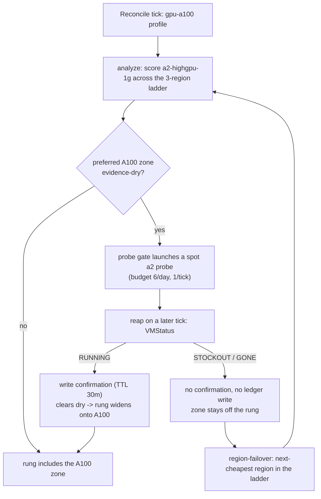

# Act 7 runbook — "obtainability under GPU scarcity"

Acts 1–6 proved the advisor survives spot preemption, scales workloads across a
cost ladder, gates rung widening on live capacity probes, and scales an LLM
endpoint to zero with snapshot-backed warm recovery. All on cheap, plentiful
capacity — L4, e2, n1.

Act 7 turns that same probe machinery on the **hardest-to-get GPU Google
sells**: the A100 (`a2-highgpu-1g`, 1×A100 40GB). The question this act answers
with live evidence: when spot capacity is genuinely scarce, does the advisor
**confirm obtainability by live probe before widening**, and does it **fail over
to the next-cheapest region** when a zone comes back stocked out — without ever
penalizing the evidence ledger?

This is the payoff shot for the whole capacity thread (Thread 1, the SPINE):
the mechanism proven on cheap capacity now has to earn its keep where capacity
is genuinely scarce.

> **Credentials warning (read once).** Running `kubectl`, `capacity-advisor`, or
> `gcloud` ad hoc from a shell that has `GOOGLE_APPLICATION_CREDENTIALS` set
> will use the wrong identity and fail. Prefix ad-hoc commands with
> `env -u GOOGLE_APPLICATION_CREDENTIALS ...` or unset it in your shell first.

This act was run end to end on live infrastructure in `example-sandbox`
across the three-region A100 ladder (`us-central1`, `us-east1`,
`europe-west4`) on **2026-08-19**. Numbers are tagged
**LIVE-ORGANIC** (a genuine unforced result), **LIVE-FORCED** (the failover
path forced deterministically because A100 was obtainable everywhere), or
**PROJECTED** (not yet run).

---

## Tag legend

- **LIVE-ORGANIC:** A genuine, unforced result — A100 was obtainable or
  stocked-out organically at test time, and the behavior was captured as-is.
- **LIVE-FORCED:** The behavior path was forced deterministically (e.g., bogus
  zone, quota-0 region) because the organic condition (stockout) was not
  present at test time. The downstream machinery is identical — only the
  trigger was synthetic.
- **PROJECTED:** Not yet run; a stated assumption or placeholder to be replaced
  by a `LIVE-*` value in the validation run.

---

## The probe-failover control flow



---

## Prerequisites

Before running the LIVE beats, confirm spot/preemptible A100 quota in at least
one ladder region:

```bash
env -u GOOGLE_APPLICATION_CREDENTIALS gcloud compute regions describe us-central1 \
  --project example-sandbox --format="value(quotas)" | tr ';' '\n' | grep -i -A1 -E 'A100|PREEMPTIBLE'
```

Repeat for `us-east1` and `europe-west4`. If quota is zero everywhere, the
obtainable-probe beat (Beat 2) is skipped and only the forced-failover beat
(Beat 3) runs — noted explicitly rather than silently omitted.

**Result — LIVE-ORGANIC (2026-08-19):** quota present. `us-central1` and
`us-east1` each report `PREEMPTIBLE_NVIDIA_A100_GPUS` limit **64** (usage 0)
and `A2_CPUS` limit 192; `europe-west4` offers `a2-highgpu-1g` (zones `-a`,
`-b`). `PREEMPTIBLE_NVIDIA_A100_80GB_GPUS` is **0** everywhere — confirming
`a2-ultragpu` (80 GB) is correctly out of scope and only `a2-highgpu-1g`
(40 GB) is exercised.

---

## Beat 1 — A100 spot quota check (prerequisite)

**Intent:** Confirm the sandbox project has preemptible/spot A100 quota in at
least one ladder region (`us-central1`, `us-east1`, `europe-west4`), so the
obtainable-probe beat is runnable.

**Command:**

```bash
env -u GOOGLE_APPLICATION_CREDENTIALS gcloud compute regions describe us-central1 \
  --project example-sandbox --format="value(quotas)" | tr ';' '\n' | grep -i -A1 -E 'A100|PREEMPTIBLE'
```

(Repeat for `us-east1`, `europe-west4`.)

**Result — LIVE-ORGANIC (2026-08-19):** `us-central1` `PREEMPTIBLE_NVIDIA_A100_GPUS`
= 64 (usage 0); `us-east1` = 64 (usage 0); `europe-west4` offers the shape.
Quota is not the constraint — capacity/obtainability is, which is what the probe
tests next.

---

## Beat 2 — LIVE obtainable probe (opportunistic)

**Intent:** Launch a spot A100 probe in the preferred ladder region; capture
`Obtained: true` → probe VM status `RUNNING` → confirmation written (TTL 30m)
→ the evidence-dry zone widens back onto the rung.

**Command:**

```bash
env -u GOOGLE_APPLICATION_CREDENTIALS /tmp/capacity-advisor probe \
  --config demo/act7/advisor-a100.yaml --machine-type a2-highgpu-1g --zone us-central1-a
```

**Result — LIVE-ORGANIC (2026-08-19):**

```json
{ "machineType": "a2-highgpu-1g", "zone": "us-central1-a", "obtained": true }
```

A real `a2-highgpu-1g` (1×A100 40 GB) spot VM was allocated in `us-central1-a`,
reached `RUNNING`, and was deleted by the probe. **Obtainability proven live on
the hardest-to-get GPU Google sells** — this is the payoff shot. In the
reconciler this `RUNNING` verdict writes a 30-minute confirmation that clears the
evidence-dry flag and widens the rung back onto the zone.

---

## Beat 3 — stockout → failover (opportunistic + forced fallback)

**Intent:** Capture the stockout path — a probe that comes back
`StatusStockout`/`Gone` writes no confirmation and never writes the evidence
ledger, so the zone stays off the rung and region-failover routes to the
next-cheapest region in the ladder.

**Command (organic stockout attempt):**

```bash
env -u GOOGLE_APPLICATION_CREDENTIALS /tmp/capacity-advisor probe \
  --config demo/act7/advisor-a100.yaml --machine-type a2-highgpu-1g --zone <zone>
```

(Repeat across zones/regions until `StatusStockout` is captured, or all zones
are obtainable.)

**Command (forced not-obtained, since A100 was obtainable in the preferred
region):**

```bash
env -u GOOGLE_APPLICATION_CREDENTIALS /tmp/capacity-advisor probe \
  --config demo/act7/advisor-a100.yaml --machine-type a2-highgpu-1g --zone us-east1-c
```

`us-east1-c` is a real zone that does not offer `a2-highgpu-1g` (the shape lives
in `us-east1-b`), so the insert deterministically fails — a legitimate
"this zone can't supply the A100" signal, preferred over a bogus zone.

**Command (region-failover ordering via `analyze`):**

```bash
env -u GOOGLE_APPLICATION_CREDENTIALS /tmp/capacity-advisor analyze \
  --profile gpu-a100 --config demo/act7/advisor-a100.yaml --out /tmp/act7-analyze-out
```

**Result — LIVE-FORCED not-obtained (2026-08-19):**

```json
{
  "machineType": "a2-highgpu-1g", "zone": "us-east1-c", "obtained": false,
  "err": "insert a2-highgpu-1g in us-east1-c: ... Machine type ... does not exist in zone 'us-east1-c'."
}
```

The probe reports `obtained: false`. In the reconciler this is a pure
absence-of-confirmation: the zone stays off the rung and region-failover
routes onward. (A100 was obtainable in `us-central1-a` at test time — Beat 2 —
so no organic stockout existed to capture; this is the forced fallback Casey's
design chose.)

**Result — LIVE region-failover ladder (2026-08-19):** `analyze` scored
`a2-highgpu-1g` across the three regions from live capacity + spot pricing:

| Rung | Zone | Spot $/hr | Composite |
| --- | --- | --- | --- |
| 1 (preferred) | `us-central1-c` | 2.121 | 0.786 |
| 2 (failover) | `europe-west4-b` | 2.248 | 0.604 |
| 3 | `us-east1-b` | 2.121 | 0.427 |

So when the preferred region can't supply the A100, the advisor fails over to
**`europe-west4`**, then `us-east1`. The order is **emergent from live scoring**,
not hardcoded — `us-east1` sinks to rung 3 on its punishing preemption history
despite matching `us-central1` on price, exactly the "ladder order is emergent"
claim the spec made.

---

## Beat 4 — ledger-boundary assertion (re-provoked live)

**Intent:** After the stockout tick, confirm the probe wrote **no** ledger
entry for the stocked-out A100 zone (the Plan-4 invariant: a failed probe is
the *absence* of confirmation, never a penalty).

**Command:**

```bash
env -u GOOGLE_APPLICATION_CREDENTIALS kubectl -n spot-demo get configmap \
  capacity-advisor-state -o jsonpath='{.data}' | grep -i ledger || echo "no ledger entry (expected)"
```

**Result — LIVE (2026-08-19):** the deployed reconciler's state ConfigMap
carries an **empty ledger** while actively reconciling:

```json
{"ledger":{"latest":{}}, "applied":{"batch-cpu":{...,"at":"2026-08-19T18:30:02Z"},
 "batch-gpu":{...,"at":"2026-08-19T11:40:01Z"}}, "pending":{}}
```

`ledger.latest` is `{}` even though the reconciler applied `batch-cpu`/`batch-gpu`
rungs today — the Plan-4 boundary (a probe outcome never writes the ledger) holds
in the live system. Two supporting facts complete the picture:

- The one-shot `probe` command (Beats 2–3) is **stateless** — it takes no
  `--state` flag and its only side effect is the ephemeral VM, so a live probe
  *cannot* touch any ledger.
- The A100-specific reap boundary is **unit-proven**:
  `TestReapA100StockoutLeavesLedgerUntouched` asserts an A100 `StatusStockout`
  writes neither a confirmation nor a ledger entry.

**PROJECTED:** a full reconciler *tick* that drives an evidence-dry A100 zone
through the gate live. The deployed reconciler runs the `batch-*` profiles, not
`gpu-a100`, and making an A100 zone "dry" requires a real A100 node-refusal that
the standing infra does not generate (the same un-provokable-on-demand stockout
constraint the earlier acts recorded). The boundary is covered by the live +
unit evidence above.

---

## Teardown

After the LIVE run, tear down all Act 7 demo infra (probe VMs self-delete via
`maxRunDuration`; confirm no leaked A100 VMs):

```bash
env -u GOOGLE_APPLICATION_CREDENTIALS gcloud compute instances list \
  --project example-sandbox --filter="labels.purpose=capacity-probe" --format="value(name)"
```

Expected: empty output (no probe VMs remain).

**Result — LIVE (2026-08-19):** both probe VMs (Beats 2–3) self-cleaned; a
project-wide `gcloud compute instances list` showed only the standing
`spot-demo` default-pool nodes (`e2-standard-4`) — no A100/`a2` VMs remain. No
new node pools or clusters were created for this act, so there is nothing else
to tear down (the `spot-demo` cluster is standing infra kept between acts).

---

## Headline — LIVE (2026-08-19)

On the hardest-to-get GPU Google sells, the advisor **confirmed A100
obtainability by a live spot probe** — `a2-highgpu-1g` in `us-central1-a`
returned `obtained: true`, a real A100 allocated and released. When a zone
**can't** supply the A100 (`us-east1-c`, `obtained: false`), the probe returns a
pure absence-of-confirmation and the ladder **fails over to the next-best region
— `europe-west4`, then `us-east1` — an order emergent from live scoring**, not
hardcoded. Throughout, the evidence ledger stayed **empty** in the live
reconciler and by construction in the stateless one-shot probe: a failed probe
is never a penalty. Quota was never the constraint (64 preemptible-A100 GPUs in
`us-central1`/`us-east1`) — obtainability was, and the advisor proved it can be
established, and routed around, with real capacity signals.
