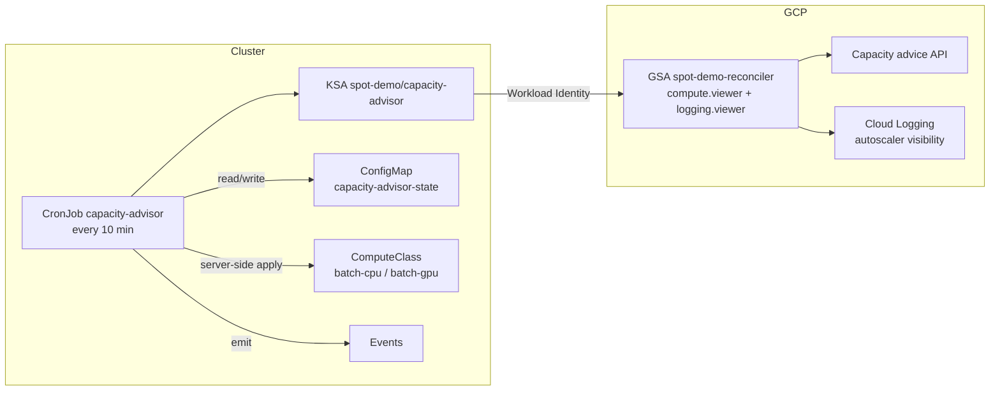
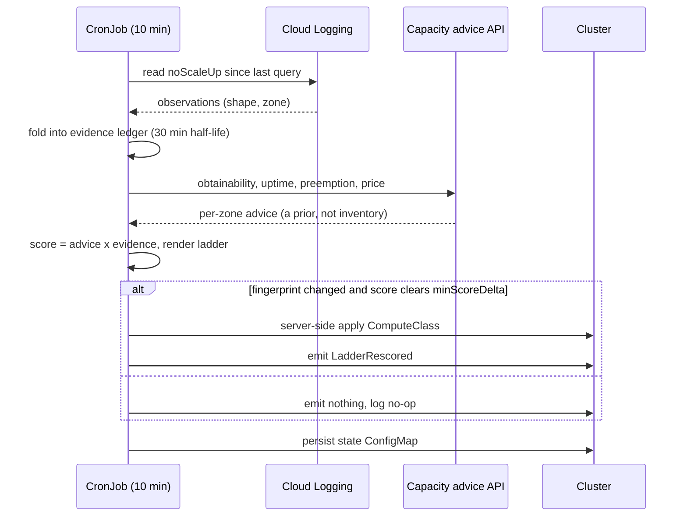

# Plan 4 — Reconcile Mode Implementation Plan

> **For implementers:** This plan is written to be executed task-by-task. Steps use checkbox (`- [ ]`) syntax for tracking.

**Goal:** Turn the one-shot capacity advisor into an in-cluster reconciler that continuously re-ranks the spot ladder using observed provisioning failures as evidence, and make the demo stack portable enough to follow the reconciler's region advice.

**Architecture:** Phase 1 makes the stack region-portable (multi-region Artifact Registry, US multi-region bucket, a `migrate-region.sh` driver) so a region move is a scripted operation rather than a rebuild. Phase 2 adds an evidence ledger fed by cluster-autoscaler visibility logs, folds an `evidenceFactor` into the composite score, teaches the renderer to widen zones and promote shapes when evidence says a rung is dry, and wraps it all in a `reconcile` tick that applies ComputeClasses through server-side apply behind hysteresis. A CronJob runs the tick every 10 minutes under Workload Identity.

**Tech Stack:** Go 1.26 (cobra, `cloud.google.com/go/compute/apiv1beta`, `google.golang.org/api/logging/v2`, new: `k8s.io/client-go`), bash + gcloud for infra, GKE Standard with custom ComputeClasses (`cloud.google.com/v1`), Kueue v0.19.

**Design doc:** `docs/design/specs/2026-07-26-plan4-reconcile-mode-design.md`

## Global Constraints

- Project is `example-sandbox`; cluster is `spot-demo`; git email is `<your-git-email>`.
- Go module path is `github.com/cwest/gke-spot-playbook/advisor`. Go version `1.26`.
- Every Go package gets a package doc comment on the first line of its primary file.
- All diagrams in docs are Mermaid in ```` ```mermaid ```` fences. Never ASCII/box-drawing.
- All commits must be signed. Follow the commit gate: `git status` then `git log -n 3` before writing a message. Commit style: `<emoji> <type>(<scope>): <subject>` — lowercase, imperative, no trailing period.
- Bash scripts: `set -euo pipefail`, source `infra/lib/common.sh`, call `spotdemo::init`, must pass `shellcheck`.
- `make test` (which runs `test-go test-python test-shell test-manifests`) must stay green after every task. In this environment run it as `PIP_INDEX_URL=https://pypi.org/simple make test` — the default pip mirror lacks `pytest==8.3.2`.
- Any `kubectl` / `gcloud` invocation from an interactive shell must be prefixed `env -u GOOGLE_APPLICATION_CREDENTIALS` — a stale value in `~/.zshenv` shadows ADC. (`spotdemo::init` already handles this inside scripts.)
- Core scoring invariant: `Composite = obtainability² × uptime × preemption × price^priceExponent × evidenceFactor`. Obtainability from the advice API is a **prior**; observed provisioning failures are **evidence**; evidence outranks the prior.
- The reconciler must never degrade a working ladder: on any partial failure it leaves the applied ComputeClass untouched and reports.
- ProvisioningRequest / `queued-provisioning.gke.io` is explicitly OUT of scope (documented incompatible with custom compute classes). The Kueue v0.19 `waitForPodsReady` gotcha is **verify-only** — do not re-engineer `infra/07-kueue.sh`.

---

## File Structure

**Phase 1 — portability**

| File | Responsibility |
| --- | --- |
| `infra/03-pubsub.sh` (modify) | Create the Artifact Registry repo in the `us` multi-region instead of `${REGION}` |
| `infra/04-build.sh` (modify) | Push/pull images from `us-docker.pkg.dev` |
| `infra/06-gpu-data.sh` (modify) | Create the demo bucket with `--location US`; warn on a pre-existing regional bucket |
| `infra/90-teardown.sh` (modify) | Delete the AR repo at `us` |
| `infra/00-preflight.sh` (modify) | Require `logging.googleapis.com` |
| `infra/migrate-region.sh` (create) | Tear down the regional cluster and rebuild it in a new region, reusing AR + bucket |

**Phase 2 — reconciler**

| File | Responsibility |
| --- | --- |
| `advisor/internal/evidence/evidence.go` (create) | Pure decay ledger: observations in, per-(shape,zone) factor out |
| `advisor/internal/evidence/gcplog/gcplog.go` (create) | Read `noScaleUp` entries from the cluster-autoscaler visibility log |
| `advisor/internal/evidence/gcplog/fake/fake.go` (create) | Fake log reader for tests |
| `advisor/internal/score/score.go` (modify) | Accept the evidence factor as a sixth multiplicand |
| `advisor/internal/analyze/analyze.go` (modify) | Thread an `EvidenceSource` through; record the factor on each candidate |
| `advisor/internal/render/computeclass.go` (modify) | Widen zones / promote shapes when evidence marks rungs dry |
| `advisor/internal/kube/kube.go` (create) | Narrow cluster interface (pending pods, state, apply, events) |
| `advisor/internal/kube/clientgo/clientgo.go` (create) | client-go implementation |
| `advisor/internal/kube/fake/fake.go` (create) | Fake cluster for tests |
| `advisor/internal/reconcile/reconcile.go` (create) | The tick: gate → ingest → score → hysteresis → apply → advise |
| `advisor/internal/probe/probe.go` (create) | Opt-in single-VM spot probe with a max-run-duration backstop |
| `advisor/internal/probe/gce/gce.go` (create) | Compute Engine implementation of the probe |
| `advisor/internal/probe/fake/fake.go` (create) | Fake compute for tests |
| `advisor/internal/config/config.go` (modify) | `evidence:` and `probe:` blocks with defaults |
| `advisor/internal/cli/cli.go` (modify) | `RunReconcile`, `RunProbe` |
| `advisor/cmd/capacity-advisor/main.go` (modify) | `reconcile` and `probe` subcommands |
| `advisor/Dockerfile` (create) | Container image for the CronJob |
| `infra/reconciler/*.yaml` (create) | ServiceAccount, RBAC, CronJob |
| `infra/08-reconciler.sh` (create) | IAM + Workload Identity + apply the manifests |
| `infra/tests/test_reconciler_manifests.sh` (create) | Structural checks on the manifests and IAM grants |
| `Makefile` (modify) | kubeconform over `infra/reconciler`; the shell-test glob picks up the new test |
| `docs/runbook.md` (create) | Operator notes; first section is the regional-bucket migration |
| `demo/act4/provoke-noscaleup.yaml` (create) | Impossible-shape pod that forces a real `noScaleUp` at zero cost |
| `demo/act4/runbook.md` (create) | The reconcile beat |

---

## Task 1: Multi-region Artifact Registry

The demo's images are pushed to a repo pinned to `${REGION}`. A region move would orphan them and force a rebuild. Artifact Registry supports the `us` multi-region, which is reachable from every US region at the same hostname, so the image path stops being a function of the cluster's region.

**Files:**
- Modify: `infra/03-pubsub.sh:50-52`
- Modify: `infra/04-build.sh:15`
- Modify: `infra/90-teardown.sh:26-29`
- Modify: `infra/00-preflight.sh` (REQUIRED_APIS)
- Test: `shellcheck` via `make test-shell`, plus a grep assertion

**Interfaces:**
- Consumes: `spotdemo::log`, `spotdemo::exists`, `${PROJECT}` from `infra/lib/common.sh`
- Produces: the image path prefix `us-docker.pkg.dev/${PROJECT}/spot-demo` — Task 3 and Task 11 both depend on this literal, and Task 12's CronJob manifest embeds it

- [ ] **Step 1: Write the failing assertion**

Create `infra/tests/test_region_portability.sh`:

```bash
#!/usr/bin/env bash
# Asserts the image/registry path is region-independent so migrate-region.sh
# can move the cluster without rebuilding images.
set -euo pipefail
root="$(cd "$(dirname "$0")/../.." && pwd)"
fail=0

check() {
  local desc="$1" file="$2" pattern="$3"
  if grep -qE "${pattern}" "${root}/${file}"; then
    printf 'ok   %s\n' "${desc}"
  else
    printf 'FAIL %s (%s !~ %s)\n' "${desc}" "${file}" "${pattern}"
    fail=1
  fi
}

refute() {
  local desc="$1" file="$2" pattern="$3"
  if grep -qE "${pattern}" "${root}/${file}"; then
    printf 'FAIL %s (%s still matches %s)\n' "${desc}" "${file}" "${pattern}"
    fail=1
  else
    printf 'ok   %s\n' "${desc}"
  fi
}

check 'AR repo created in the us multi-region' infra/03-pubsub.sh '--location us'
refute 'AR repo not pinned to REGION' infra/03-pubsub.sh 'repositories create spot-demo.*\$\{REGION\}'
check 'images pushed to us-docker.pkg.dev' infra/04-build.sh 'us-docker\.pkg\.dev'
check 'teardown deletes the us AR repo' infra/90-teardown.sh '--location us'
check 'teardown still removes a legacy region-pinned repo' infra/90-teardown.sh 'location. .\$\{REGION\}'
check 'logging API required' infra/00-preflight.sh 'logging\.googleapis\.com'

exit "${fail}"
```

```bash
chmod +x infra/tests/test_region_portability.sh
```

- [ ] **Step 2: Run it to verify it fails**

Run: `./infra/tests/test_region_portability.sh`
Expected: exit 1, with `FAIL` lines for every check.

- [ ] **Step 3: Point the registry at the `us` multi-region**

In `infra/03-pubsub.sh`, replace the repo-creation block:

```bash
# The repo lives in the `us` multi-region, not ${REGION}: migrate-region.sh moves
# the cluster between US regions and must not have to rebuild or re-push images.
spotdemo::exists gcloud artifacts repositories describe spot-demo --location us --project "${PROJECT}" ||
  gcloud artifacts repositories create spot-demo --repository-format docker \
    --location us --project "${PROJECT}"
spotdemo::log "pubsub/iam/registry ready"
```

In `infra/04-build.sh`, introduce the host as a variable above the build loop:

```bash
# One hostname for every US region. Task 11 adds another image build and reuses
# this variable; do not re-inline the literal.
AR_HOST="${AR_HOST:-us-docker.pkg.dev}"
```

and replace line 15 to use it:

```bash
IMAGE="${AR_HOST}/${PROJECT}/spot-demo/${name}:v1"
```

In `infra/90-teardown.sh`, replace the AR block. The `us` delete is unguarded by REGION — the repo's location no longer depends on it — but a *second*, REGION-guarded delete stays for the legacy repo. A stack built before this change has a region-pinned repo holding images; without this, teardown would leave it behind and keep billing for it.

```bash
spotdemo::exists gcloud artifacts repositories describe spot-demo --location us --project "${PROJECT}" &&
  gcloud artifacts repositories delete spot-demo --location us --project "${PROJECT}" --quiet

# Legacy: stacks built before the multi-region move have a ${REGION}-pinned repo.
# Teardown must still remove it or it is orphaned and silently billed.
if [[ -n "${REGION:-}" ]] && spotdemo::exists gcloud artifacts repositories describe spot-demo \
    --location "${REGION}" --project "${PROJECT}"; then
  spotdemo::log "removing legacy ${REGION}-pinned artifact registry repo"
  gcloud artifacts repositories delete spot-demo --location "${REGION}" --project "${PROJECT}" --quiet
fi
```

In `infra/00-preflight.sh`, add `logging.googleapis.com` to `REQUIRED_APIS` — the reconciler reads cluster-autoscaler visibility logs through the Logging API.

- [ ] **Step 4: Run the assertion and shellcheck**

Run: `./infra/tests/test_region_portability.sh && shellcheck infra/*.sh infra/lib/*.sh infra/tests/*.sh`
Expected: six `ok` lines, exit 0; shellcheck silent.

- [ ] **Step 5: Wire the new test dir into the Makefile**

In `Makefile`, extend the `test-shell` target's shellcheck argument list with `infra/tests/*.sh`, and add a line running the new script:

```make
test-shell:
	shellcheck infra/*.sh infra/lib/*.sh infra/tests/*.sh demo/*.sh demo/act1/*.sh demo/act2/*.sh demo/cost/*.sh
	./infra/tests/test_region_portability.sh
```

- [ ] **Step 6: Run the full suite**

Run: `PIP_INDEX_URL=https://pypi.org/simple make test`
Expected: all four sub-targets pass.

- [ ] **Step 7: Commit**

```bash
git add infra/03-pubsub.sh infra/04-build.sh infra/90-teardown.sh infra/00-preflight.sh \
  infra/tests/test_region_portability.sh Makefile
git commit -S -m "♻️ refactor(infra): host images in the us multi-region artifact registry

A region-pinned repo would orphan every image the moment the reconciler
advises a region move. The us multi-region is reachable from all US
regions at one hostname, so the image path stops depending on REGION.
Also requires logging.googleapis.com, which the reconciler needs to read
cluster-autoscaler visibility logs."
```

---

## Task 2: US multi-region demo bucket

`infra/06-gpu-data.sh` creates the GCS bucket in `${REGION}`. After a region move the cluster would read its model/dataset across regions, paying egress and latency. A US multi-region bucket is region-agnostic.

**Deviation to state plainly:** the design says "dual-region"; this task uses `--location US` (multi-region) instead. A dual-region pins exactly two regions, so it only survives the one move you predicted. Multi-region survives any US move, which is what the next-cheapest-region policy actually needs. The existing `gs://example-sandbox-spot-demo` is regional and the describe-first guard will **not** recreate it — so this task also adds a loud warning and documents the manual migration. Never auto-delete demo data.

**Files:**
- Modify: `infra/06-gpu-data.sh:17-22`
- Modify: `infra/tests/test_region_portability.sh`
- Create: `docs/runbook.md` (operator notes; does not exist yet — this task creates it with the bucket migration note as its first section, under an `# Operator runbook` H1)

**Interfaces:**
- Consumes: `spotdemo::log`, `${BUCKET}`, `${PROJECT}`
- Produces: nothing consumed by later tasks; `${BUCKET}` keeps its name

- [ ] **Step 1: Add the failing assertions**

Append to the check list in `infra/tests/test_region_portability.sh`, above the `exit` line:

```bash
check 'bucket created in the US multi-region' infra/06-gpu-data.sh -- '--location US'
check 'regional bucket warns instead of silently persisting' infra/06-gpu-data.sh 'multi-region'
```

Note the `check` helper takes `desc file pattern` — drop the stray `--`:

```bash
check 'bucket created in the US multi-region' infra/06-gpu-data.sh '--location US'
check 'regional bucket warns instead of silently persisting' infra/06-gpu-data.sh 'multi-region'
```

- [ ] **Step 2: Run it to verify it fails**

Run: `./infra/tests/test_region_portability.sh`
Expected: exit 1 with two new `FAIL` lines.

- [ ] **Step 3: Create multi-region, warn on regional**

Replace the bucket block in `infra/06-gpu-data.sh`:

```bash
if ! gcloud storage buckets describe "${BUCKET}" --project "${PROJECT}" >/dev/null 2>&1; then
  spotdemo::log "creating ${BUCKET} in the US multi-region"
  gcloud storage buckets create "${BUCKET}" --project "${PROJECT}" \
    --location US --uniform-bucket-level-access --quiet
else
  # A bucket created before Plan 4 is pinned to a single region. We never delete
  # demo data automatically; warn so the operator can migrate deliberately.
  loc=$(gcloud storage buckets describe "${BUCKET}" --project "${PROJECT}" \
    --format='value(location)')
  if [[ "${loc}" != "US" ]]; then
    spotdemo::log "WARNING: ${BUCKET} is regional (${loc}), not the US multi-region."
    spotdemo::log "WARNING: after a region move it will serve cross-region. See docs/runbook.md."
  fi
fi
```

- [ ] **Step 4: Document the manual migration**

Create `docs/runbook.md` (it does not exist yet) with an `# Operator runbook` H1 and this as its first section:

```markdown
## Migrating a pre-Plan-4 regional bucket

`infra/06-gpu-data.sh` now creates `gs://${PROJECT}-spot-demo` in the US
multi-region. A bucket created before Plan 4 is pinned to one region and is
never deleted automatically. To migrate it deliberately:

```bash
env -u GOOGLE_APPLICATION_CREDENTIALS gcloud storage buckets create \
  "gs://${PROJECT}-spot-demo-us" --project "${PROJECT}" \
  --location US --uniform-bucket-level-access
env -u GOOGLE_APPLICATION_CREDENTIALS gcloud storage rsync -r \
  "gs://${PROJECT}-spot-demo" "gs://${PROJECT}-spot-demo-us"
```

Verify the copy, then delete the old bucket and rename by re-running the rsync
into a freshly created bucket of the original name. Until you do, the demo
still works — it just reads across regions after a move.
```

- [ ] **Step 5: Verify**

Run: `./infra/tests/test_region_portability.sh && shellcheck infra/*.sh infra/tests/*.sh`
Expected: eight `ok` lines, exit 0.

- [ ] **Step 6: Commit**

```bash
git add infra/06-gpu-data.sh infra/tests/test_region_portability.sh docs/runbook.md
git commit -S -m "♻️ refactor(infra): create the demo bucket in the US multi-region

A region-pinned bucket serves cross-region after a move. US multi-region
is region-agnostic for any US target, unlike a dual-region which only
survives the one move you predicted. An existing regional bucket is left
alone and warned about — demo data is never deleted automatically."
```

---

## Task 3: `infra/migrate-region.sh`

The reconciler can only *advise* a region move; a human runs it. This makes that one command. It tears down the regional cluster and rebuilds it in the target region, reusing the now-portable registry and bucket.

**Files:**
- Create: `infra/migrate-region.sh`
- Test: `infra/tests/test_migrate_region.sh`

**Interfaces:**
- Consumes: `spotdemo::log`, `spotdemo::require`, `spotdemo::init`, `SPOTDEMO_ROOT`; the numbered scripts `01-cluster.sh`, `02-computeclasses.sh`, `05-deploy.sh` (via re-run), `07-kueue.sh`
- Produces: `infra/migrate-region.sh <region>` — Task 9's region advisory emits exactly this command string, and Task 13 runs it manually if needed

- [ ] **Step 1: Write the failing test**

Create `infra/tests/test_migrate_region.sh`:

```bash
#!/usr/bin/env bash
# migrate-region.sh is destructive; the test exercises argument handling and the
# --dry-run plan only. It never calls gcloud.
set -euo pipefail
root="$(cd "$(dirname "$0")/../.." && pwd)"
script="${root}/infra/migrate-region.sh"
fail=0

expect_fail() {
  local desc="$1"; shift
  if "$@" >/dev/null 2>&1; then
    printf 'FAIL %s (expected non-zero exit)\n' "${desc}"; fail=1
  else
    printf 'ok   %s\n' "${desc}"
  fi
}

expect_fail 'rejects a missing region argument' "${script}"
expect_fail 'rejects a non-US region' "${script}" europe-west4 --dry-run

out=$("${script}" us-east4 --dry-run 2>&1) || { printf 'FAIL dry-run exited non-zero\n'; fail=1; }
for needle in 'us-east4' 'delete' '01-cluster.sh' 'DRY RUN'; do
  if grep -q "${needle}" <<<"${out}"; then
    printf 'ok   dry-run plan mentions %s\n' "${needle}"
  else
    printf 'FAIL dry-run plan missing %s\n' "${needle}"; fail=1
  fi
done

exit "${fail}"
```

```bash
chmod +x infra/tests/test_migrate_region.sh
```

- [ ] **Step 2: Run it to verify it fails**

Run: `./infra/tests/test_migrate_region.sh`
Expected: failures — the script does not exist.

- [ ] **Step 3: Write the script**

Create `infra/migrate-region.sh`:

```bash
#!/usr/bin/env bash
# migrate-region.sh — move the spot-demo cluster to another US region.
#
# The reconciler advises region moves; it never performs them. This is the
# command it prints. Images (us multi-region AR) and demo data (US multi-region
# bucket) are region-agnostic, so only the cluster and its in-cluster objects
# are recreated.
set -euo pipefail
# shellcheck disable=SC1091
source "$(dirname "$0")/lib/common.sh"

usage() {
  cat >&2 <<'EOF'
usage: migrate-region.sh <us-region> [--dry-run]

  <us-region>  target region, e.g. us-east4. Must start with "us-" so the
               multi-region registry and bucket stay local.
  --dry-run    print the plan and exit without touching anything.
EOF
  exit 2
}

TARGET="${1:-}"
[[ -n "${TARGET}" ]] || usage
[[ "${TARGET}" == us-* ]] || {
  spotdemo::log "ERROR: ${TARGET} is not a US region; AR and the bucket are US-scoped"
  usage
}
DRY_RUN=0
[[ "${2:-}" == "--dry-run" ]] && DRY_RUN=1

spotdemo::init
CLUSTER="${CLUSTER:-spot-demo}"
FROM="${REGION:-<unset>}"

plan() {
  cat <<EOF
migrate ${CLUSTER}: ${FROM} -> ${TARGET}

  1. delete cluster ${CLUSTER} in ${FROM}
  2. rewrite out/cluster-config.env with REGION=${TARGET}
  3. re-run infra/01-cluster.sh   (create the cluster in ${TARGET})
  4. re-run infra/02-computeclasses.sh
  5. re-run infra/05-deploy.sh
  6. re-run infra/07-kueue.sh
  7. re-run infra/08-reconciler.sh

  unchanged: us-docker.pkg.dev images, gs://${PROJECT}-spot-demo (US multi-region)
EOF
}

if ((DRY_RUN)); then
  plan
  spotdemo::log "DRY RUN — nothing was changed"
  exit 0
fi

spotdemo::require gcloud
spotdemo::require kubectl
plan >&2
read -r -p "proceed? this deletes the ${FROM} cluster [y/N] " ans
[[ "${ans}" == "y" || "${ans}" == "Y" ]] || { spotdemo::log "aborted"; exit 1; }

if [[ "${FROM}" != "<unset>" ]]; then
  spotdemo::log "deleting ${CLUSTER} in ${FROM}"
  spotdemo::exists gcloud container clusters describe "${CLUSTER}" \
    --region "${FROM}" --project "${PROJECT}" &&
    gcloud container clusters delete "${CLUSTER}" \
      --region "${FROM}" --project "${PROJECT}" --quiet
fi

spotdemo::log "pinning REGION=${TARGET}"
mkdir -p "${SPOTDEMO_ROOT}/out"
env_file="${SPOTDEMO_ROOT}/out/cluster-config.env"
if [[ -f "${env_file}" ]]; then
  # Rewrite REGION in place; leave ZONES to be recomputed by 01-cluster.sh.
  grep -v '^\(REGION\|ZONES\)=' "${env_file}" > "${env_file}.tmp" || true
  mv "${env_file}.tmp" "${env_file}"
fi
printf 'REGION=%s\n' "${TARGET}" >> "${env_file}"

for step in 01-cluster.sh 02-computeclasses.sh 05-deploy.sh 07-kueue.sh 08-reconciler.sh; do
  if [[ -x "${SPOTDEMO_ROOT}/infra/${step}" ]]; then
    spotdemo::log "running ${step}"
    "${SPOTDEMO_ROOT}/infra/${step}"
  else
    spotdemo::log "skipping ${step} (not present)"
  fi
done

spotdemo::log "migration to ${TARGET} complete"
```

```bash
chmod +x infra/migrate-region.sh
```

- [ ] **Step 4: Run the test and shellcheck**

Run: `./infra/tests/test_migrate_region.sh && shellcheck infra/migrate-region.sh infra/tests/*.sh`
Expected: six `ok` lines, exit 0; shellcheck silent.

- [ ] **Step 5: Add to the Makefile**

In `Makefile`'s `test-shell`, add `./infra/tests/test_migrate_region.sh` after the portability test.

- [ ] **Step 6: Run the full suite**

Run: `PIP_INDEX_URL=https://pypi.org/simple make test`
Expected: green.

- [ ] **Step 7: Commit**

```bash
git add infra/migrate-region.sh infra/tests/test_migrate_region.sh Makefile
git commit -S -m "✨ feat(infra): add migrate-region.sh for scripted region moves

The reconciler advises region moves but never performs one. This is the
command it prints: delete the regional cluster, repin REGION, re-run the
numbered scripts. Images and demo data are already region-agnostic, so a
move no longer means a rebuild. Refuses non-US targets and requires an
interactive confirmation; --dry-run prints the plan."
```

---

## Task 4: The evidence ledger

The advice API's obtainability is a *prior* — a statistical guess about a zone. When NAP actually tries to create a node and fails, that is *evidence*, and it must outrank the prior. This task is the pure, dependency-free core: observations in, a decaying per-(shape, zone) multiplier out.

Decay is exponential with a 30-minute half-life: an observation crushes the factor to `Floor` immediately, then it recovers toward 1.0. Recovery, not permanence, is the point — a stockout at 09:00 should not still be steering the ladder at 15:00.

**Files:**
- Create: `advisor/internal/evidence/evidence.go`
- Test: `advisor/internal/evidence/evidence_test.go`
- Modify: `advisor/internal/config/config.go`
- Test: `advisor/internal/config/config_test.go`
- Modify: `advisor.yaml`

**Interfaces:**
- Consumes: nothing (stdlib only)
- Produces:
  - `evidence.Key{MachineType, Zone string}`
  - `evidence.Observation{MachineType, Zone, Reason string; At time.Time}` (JSON tags `machineType`, `zone`, `reason`, `at`)
  - `evidence.Params{HalfLife time.Duration; Floor, DryBelow float64; MaxAge time.Duration}`
  - `evidence.Ledger` with `NewLedger() *Ledger`, `(*Ledger).Add(Observation)`, `(*Ledger).Prune(now time.Time, maxAge time.Duration)`, `(*Ledger).Factor(k Key, now time.Time, p Params) float64`, `(*Ledger).Newest() time.Time`
  - `evidence.Dry(factor float64, p Params) bool`
  - `config.Evidence` struct, reachable as `cfg.Evidence`, and `(config.Evidence).Params() evidence.Params`

  Task 6 calls `Factor`/`Dry`, Task 5 produces `Observation`s, Task 9 serializes the `Ledger` into its state ConfigMap.

- [ ] **Step 1: Write the failing test**

Create `advisor/internal/evidence/evidence_test.go`:

```go
package evidence

import (
	"encoding/json"
	"math"
	"testing"
	"time"
)

var testParams = Params{
	HalfLife: 30 * time.Minute,
	Floor:    0.05,
	DryBelow: 0.5,
	MaxAge:   6 * time.Hour,
}

func at(min int) time.Time {
	return time.Date(2026, 7, 26, 12, 0, 0, 0, time.UTC).Add(time.Duration(min) * time.Minute)
}

func TestFactorNoObservationIsNeutral(t *testing.T) {
	l := NewLedger()
	if got := l.Factor(Key{"g2-standard-4", "us-central1-a"}, at(0), testParams); got != 1.0 {
		t.Fatalf("Factor with no observation = %v, want 1.0", got)
	}
}

func TestFactorFreshObservationHitsFloor(t *testing.T) {
	l := NewLedger()
	l.Add(Observation{MachineType: "g2-standard-4", Zone: "us-central1-a", Reason: "zonal.resources.exceeded", At: at(0)})
	got := l.Factor(Key{"g2-standard-4", "us-central1-a"}, at(0), testParams)
	if math.Abs(got-0.05) > 1e-9 {
		t.Fatalf("fresh Factor = %v, want 0.05", got)
	}
}

func TestFactorRecoversWithHalfLife(t *testing.T) {
	l := NewLedger()
	l.Add(Observation{MachineType: "g2-standard-4", Zone: "us-central1-a", At: at(0)})
	k := Key{"g2-standard-4", "us-central1-a"}
	// One half-life: floor + (1-floor)*(1-0.5) = 0.05 + 0.475 = 0.525.
	if got := l.Factor(k, at(30), testParams); math.Abs(got-0.525) > 1e-9 {
		t.Fatalf("Factor at one half-life = %v, want 0.525", got)
	}
	// Monotonically increasing.
	if l.Factor(k, at(60), testParams) <= l.Factor(k, at(30), testParams) {
		t.Fatal("Factor did not recover between 30m and 60m")
	}
}

func TestFactorBeyondMaxAgeIsNeutral(t *testing.T) {
	l := NewLedger()
	l.Add(Observation{MachineType: "g2-standard-4", Zone: "us-central1-a", At: at(0)})
	if got := l.Factor(Key{"g2-standard-4", "us-central1-a"}, at(7*60), testParams); got != 1.0 {
		t.Fatalf("Factor past MaxAge = %v, want 1.0", got)
	}
}

func TestFactorIsPerZone(t *testing.T) {
	l := NewLedger()
	l.Add(Observation{MachineType: "g2-standard-4", Zone: "us-central1-a", At: at(0)})
	if got := l.Factor(Key{"g2-standard-4", "us-central1-b"}, at(0), testParams); got != 1.0 {
		t.Fatalf("sibling zone Factor = %v, want 1.0", got)
	}
	if got := l.Factor(Key{"g2-standard-8", "us-central1-a"}, at(0), testParams); got != 1.0 {
		t.Fatalf("sibling shape Factor = %v, want 1.0", got)
	}
}

func TestAddKeepsNewestPerKey(t *testing.T) {
	l := NewLedger()
	k := Key{"g2-standard-4", "us-central1-a"}
	l.Add(Observation{MachineType: k.MachineType, Zone: k.Zone, At: at(60)})
	l.Add(Observation{MachineType: k.MachineType, Zone: k.Zone, At: at(0)}) // older, must not win
	if got := l.Factor(k, at(60), testParams); math.Abs(got-0.05) > 1e-9 {
		t.Fatalf("Factor = %v, want the newer observation to win (0.05)", got)
	}
	if len(l.Latest) != 1 {
		t.Fatalf("ledger holds %d entries, want 1", len(l.Latest))
	}
}

func TestPruneDropsStaleEntries(t *testing.T) {
	l := NewLedger()
	l.Add(Observation{MachineType: "a", Zone: "z1", At: at(0)})
	l.Add(Observation{MachineType: "b", Zone: "z2", At: at(5*60 + 59)})
	l.Prune(at(7*60), 6*time.Hour)
	if len(l.Latest) != 1 {
		t.Fatalf("after Prune ledger holds %d entries, want 1", len(l.Latest))
	}
}

func TestNewestReportsMostRecentObservation(t *testing.T) {
	l := NewLedger()
	if !l.Newest().IsZero() {
		t.Fatal("empty ledger Newest() should be the zero time")
	}
	l.Add(Observation{MachineType: "a", Zone: "z1", At: at(0)})
	l.Add(Observation{MachineType: "b", Zone: "z2", At: at(45)})
	if !l.Newest().Equal(at(45)) {
		t.Fatalf("Newest() = %v, want %v", l.Newest(), at(45))
	}
}

func TestDry(t *testing.T) {
	if !Dry(0.05, testParams) {
		t.Fatal("0.05 should be dry")
	}
	if Dry(1.0, testParams) {
		t.Fatal("1.0 should not be dry")
	}
	if Dry(0.5, testParams) {
		t.Fatal("DryBelow is exclusive: 0.5 should not be dry")
	}
}

func TestLedgerRoundTripsThroughJSON(t *testing.T) {
	l := NewLedger()
	l.Add(Observation{MachineType: "g2-standard-4", Zone: "us-central1-a", Reason: "r", At: at(0)})
	b, err := json.Marshal(l)
	if err != nil {
		t.Fatal(err)
	}
	var got Ledger
	if err := json.Unmarshal(b, &got); err != nil {
		t.Fatal(err)
	}
	if f := got.Factor(Key{"g2-standard-4", "us-central1-a"}, at(0), testParams); math.Abs(f-0.05) > 1e-9 {
		t.Fatalf("post-roundtrip Factor = %v, want 0.05", f)
	}
}
```

- [ ] **Step 2: Run it to verify it fails**

Run: `cd advisor && go test ./internal/evidence/...`
Expected: `no Go files in .../internal/evidence` (or build failure — the package does not exist).

- [ ] **Step 3: Write the implementation**

Create `advisor/internal/evidence/evidence.go`:

```go
// Package evidence records observed provisioning failures and turns them into a
// decaying score multiplier. The capacity advice API reports a prior — what
// Google expects a zone can supply. An observed NAP scale-up failure is
// evidence, and evidence outranks the prior. Observations decay exponentially
// so a stockout steers the ladder for the next hour, not the rest of the day.
package evidence

import (
	"math"
	"time"
)

// Key identifies a shape in a zone. Evidence is never generalized across
// either axis: g2-standard-4 being out in us-central1-a says nothing about
// g2-standard-8 there, nor about g2-standard-4 next door.
type Key struct {
	MachineType string
	Zone        string
}

// Observation is one recorded provisioning failure.
type Observation struct {
	MachineType string    `json:"machineType"`
	Zone        string    `json:"zone"`
	Reason      string    `json:"reason"`
	At          time.Time `json:"at"`
}

func (o Observation) key() Key { return Key{o.MachineType, o.Zone} }

// Params configures decay. HalfLife controls recovery speed, Floor is the
// multiplier applied the instant a failure is observed, DryBelow is the
// threshold under which a rung is treated as unavailable, and MaxAge is the
// point past which an observation is ignored entirely.
type Params struct {
	HalfLife time.Duration
	Floor    float64
	DryBelow float64
	MaxAge   time.Duration
}

// Ledger holds the newest observation per key. Only the newest matters: two
// failures for the same shape and zone are the same fact, observed twice.
type Ledger struct {
	Latest map[string]Observation `json:"latest"`
}

func NewLedger() *Ledger { return &Ledger{Latest: map[string]Observation{}} }

func (l *Ledger) id(k Key) string { return k.MachineType + "\x00" + k.Zone }

func (l *Ledger) Add(o Observation) {
	if l.Latest == nil {
		l.Latest = map[string]Observation{}
	}
	id := l.id(o.key())
	if prev, ok := l.Latest[id]; ok && !o.At.After(prev.At) {
		return
	}
	l.Latest[id] = o
}

// Prune drops observations older than maxAge so the state ConfigMap cannot
// grow without bound.
func (l *Ledger) Prune(now time.Time, maxAge time.Duration) {
	for id, o := range l.Latest {
		if now.Sub(o.At) >= maxAge {
			delete(l.Latest, id)
		}
	}
}

// Factor returns the multiplier for k: 1.0 when there is no usable evidence,
// p.Floor at the instant of a failure, recovering exponentially toward 1.0.
func (l *Ledger) Factor(k Key, now time.Time, p Params) float64 {
	o, ok := l.Latest[l.id(k)]
	if !ok {
		return 1.0
	}
	age := now.Sub(o.At)
	if age < 0 {
		age = 0
	}
	if p.MaxAge > 0 && age >= p.MaxAge {
		return 1.0
	}
	if p.HalfLife <= 0 {
		return p.Floor
	}
	decayed := math.Pow(0.5, age.Seconds()/p.HalfLife.Seconds())
	return p.Floor + (1-p.Floor)*(1-decayed)
}

// Newest is the timestamp of the most recent observation, or the zero time.
// The reconciler uses it to bound its next log query.
func (l *Ledger) Newest() time.Time {
	var t time.Time
	for _, o := range l.Latest {
		if o.At.After(t) {
			t = o.At
		}
	}
	return t
}

// Dry reports whether a factor is low enough to treat the rung as unavailable.
func Dry(factor float64, p Params) bool { return factor < p.DryBelow }
```

- [ ] **Step 4: Run the test**

Run: `cd advisor && go test ./internal/evidence/...`
Expected: `ok  github.com/cwest/gke-spot-playbook/advisor/internal/evidence`

- [ ] **Step 5: Write the failing config test**

Append to `advisor/internal/config/config_test.go`:

```go
func TestLoadAppliesEvidenceDefaults(t *testing.T) {
	path := writeTempConfig(t, `
project: p
allowedRegions: [us]
profiles:
  cpu-batch:
    kind: cpu
    machineTypes: [e2-standard-8]
    size: 20
`)
	c, err := Load(path)
	if err != nil {
		t.Fatal(err)
	}
	if c.Evidence.HalfLifeMinutes != 30 {
		t.Errorf("HalfLifeMinutes = %d, want 30", c.Evidence.HalfLifeMinutes)
	}
	if c.Evidence.Floor != 0.05 {
		t.Errorf("Floor = %v, want 0.05", c.Evidence.Floor)
	}
	if c.Evidence.DryBelow != 0.5 {
		t.Errorf("DryBelow = %v, want 0.5", c.Evidence.DryBelow)
	}
	if c.Evidence.MaxAgeHours != 6 {
		t.Errorf("MaxAgeHours = %d, want 6", c.Evidence.MaxAgeHours)
	}
	if c.Evidence.FastPathTicks != 1 {
		t.Errorf("FastPathTicks = %d, want 1", c.Evidence.FastPathTicks)
	}
	p := c.Evidence.Params()
	if p.HalfLife != 30*time.Minute || p.MaxAge != 6*time.Hour {
		t.Errorf("Params() = %+v, want 30m half-life and 6h max age", p)
	}
}

func TestValidateRejectsOutOfRangeEvidenceFloor(t *testing.T) {
	path := writeTempConfig(t, `
project: p
allowedRegions: [us]
profiles:
  cpu-batch: {kind: cpu, machineTypes: [e2-standard-8], size: 20}
evidence:
  floor: 1.5
`)
	if _, err := Load(path); err == nil {
		t.Fatal("expected an error for floor > 1")
	}
}
```

If `writeTempConfig` does not already exist in that file, add it:

```go
func writeTempConfig(t *testing.T, body string) string {
	t.Helper()
	path := filepath.Join(t.TempDir(), "advisor.yaml")
	if err := os.WriteFile(path, []byte(body), 0o600); err != nil {
		t.Fatal(err)
	}
	return path
}
```

(imports needed: `os`, `path/filepath`, `time`.)

- [ ] **Step 6: Run it to verify it fails**

Run: `cd advisor && go test ./internal/config/...`
Expected: FAIL — `c.Evidence` undefined.

- [ ] **Step 7: Add the config block**

In `advisor/internal/config/config.go`, add the import `"time"` and the evidence package, then:

```go
// Evidence tunes how observed provisioning failures decay. Defaults come from
// the Plan 4 design: a failure crushes a rung for roughly half an hour, which
// is long enough to route around a stockout and short enough that a recovered
// zone is retried the same afternoon.
type Evidence struct {
	HalfLifeMinutes int     `yaml:"halfLifeMinutes"`
	Floor           float64 `yaml:"floor"`
	DryBelow        float64 `yaml:"dryBelow"`
	MaxAgeHours     int     `yaml:"maxAgeHours"`
	FastPathTicks   int     `yaml:"fastPathTicks"`
}

func (e Evidence) Params() evidence.Params {
	return evidence.Params{
		HalfLife: time.Duration(e.HalfLifeMinutes) * time.Minute,
		Floor:    e.Floor,
		DryBelow: e.DryBelow,
		MaxAge:   time.Duration(e.MaxAgeHours) * time.Hour,
	}
}
```

Add the field to `Config`:

```go
	Evidence       Evidence           `yaml:"evidence"`
```

Add defaults in `Load`, after the `Scoring.PriceExponent` default:

```go
	if c.Evidence.HalfLifeMinutes == 0 {
		c.Evidence.HalfLifeMinutes = 30
	}
	if c.Evidence.Floor == 0 {
		c.Evidence.Floor = 0.05
	}
	if c.Evidence.DryBelow == 0 {
		c.Evidence.DryBelow = 0.5
	}
	if c.Evidence.MaxAgeHours == 0 {
		c.Evidence.MaxAgeHours = 6
	}
	if c.Evidence.FastPathTicks == 0 {
		c.Evidence.FastPathTicks = 1
	}
```

Add validation in `validate`, before the final `return nil`:

```go
	if c.Evidence.Floor <= 0 || c.Evidence.Floor > 1 {
		return fmt.Errorf("evidence: floor must be in (0, 1]")
	}
	if c.Evidence.DryBelow <= 0 || c.Evidence.DryBelow > 1 {
		return fmt.Errorf("evidence: dryBelow must be in (0, 1]")
	}
	if c.Evidence.HalfLifeMinutes <= 0 {
		return fmt.Errorf("evidence: halfLifeMinutes must be > 0")
	}
	if c.Evidence.MaxAgeHours <= 0 {
		return fmt.Errorf("evidence: maxAgeHours must be > 0")
	}
	if c.Evidence.FastPathTicks <= 0 {
		return fmt.Errorf("evidence: fastPathTicks must be > 0")
	}
```

- [ ] **Step 8: Run the tests**

Run: `cd advisor && go test ./internal/config/... ./internal/evidence/...`
Expected: both `ok`.

- [ ] **Step 9: Document the block in advisor.yaml**

Append to `advisor.yaml`:

```yaml
# Observed provisioning failures decay exponentially. A failure drops the
# affected shape+zone to `floor` immediately; it recovers toward 1.0 with the
# given half-life and is ignored entirely past maxAgeHours. Rungs whose factor
# is below dryBelow are treated as unavailable and trigger zone widening.
evidence:
  halfLifeMinutes: 30
  floor: 0.05
  dryBelow: 0.5
  maxAgeHours: 6
  # Evidence-driven changes skip the normal hysteresis wait: a zone that just
  # refused a node should not take 30 minutes to fall off the ladder.
  fastPathTicks: 1
```

- [ ] **Step 10: Run the full suite and commit**

Run: `PIP_INDEX_URL=https://pypi.org/simple make test`
Expected: green.

```bash
git add advisor/internal/evidence advisor/internal/config advisor.yaml
git commit -S -m "✨ feat(advisor): add the decaying evidence ledger

Capacity advice is a prior; an observed NAP scale-up failure is evidence,
and evidence must outrank the prior. The ledger keeps the newest failure
per shape+zone and converts it to a multiplier that starts at the floor
and recovers with a 30-minute half-life, so a stockout steers the ladder
for an hour rather than forever."
```

---

## Task 5: Read `noScaleUp` evidence from Cloud Logging

Kubernetes events are ephemeral and carry no structured zone attribution, so they cannot tell us *which zone* refused a node. The cluster-autoscaler visibility log can: its `noScaleUp` records carry `napFailureReasons` with a `parameters` array holding the zone. This task reads that stream.

`google.golang.org/api/logging/v2` is already reachable through the existing `google.golang.org/api v0.290.0` requirement — no new module.

**Files:**
- Create: `advisor/internal/evidence/gcplog/gcplog.go`
- Create: `advisor/internal/evidence/gcplog/fake/fake.go`
- Test: `advisor/internal/evidence/gcplog/gcplog_test.go`

**Interfaces:**
- Consumes: `evidence.Observation` from Task 4
- Produces:
  - `gcplog.Reader` with `New(ctx context.Context, project, cluster, location string) (*Reader, error)` and `(*Reader).NoScaleUp(ctx context.Context, since time.Time) ([]evidence.Observation, error)`
  - `gcplog.Filter(project, cluster, location string, since time.Time) string` — exported so tests can assert on it without a live API
  - `gcplog.ParseEntry(payload []byte, ts time.Time) []evidence.Observation` — the pure part, which is what the tests actually cover
  - `fake.Log{NoScaleUpFn func(ctx context.Context, since time.Time) ([]evidence.Observation, error)}`

  Task 9's `reconcile.LogSource` interface is satisfied by `*gcplog.Reader` and by `*fake.Log`.

- [ ] **Step 1: Write the failing test**

Create `advisor/internal/evidence/gcplog/gcplog_test.go`:

```go
package gcplog

import (
	"strings"
	"testing"
	"time"
)

// A trimmed but structurally faithful noScaleUp payload. The zone lives in
// parameters[0] of the NAP failure reason; the shape lives in the rejected
// migs/pod group. GKE emits one entry per unhandled pod group.
const samplePayload = `{
  "noDecisionStatus": {
    "measureTime": "1780000000",
    "noScaleUp": {
      "unhandledPodGroups": [
        {
          "napFailureReasons": [
            {
              "messageId": "no.scale.up.nap.pod.zonal.resources.exceeded",
              "parameters": ["us-central1-a"]
            }
          ],
          "podGroup": {
            "samplePod": {"name": "tune-worker-abc", "namespace": "default"}
          },
          "rejectedMigs": [
            {"mig": {"name": "nap-g2-standard-4-xyz", "zone": "us-central1-a"}}
          ]
        }
      ]
    }
  }
}`

func TestParseEntryExtractsZoneAndShape(t *testing.T) {
	ts := time.Date(2026, 7, 26, 12, 0, 0, 0, time.UTC)
	got := ParseEntry([]byte(samplePayload), ts)
	if len(got) != 1 {
		t.Fatalf("got %d observations, want 1: %+v", len(got), got)
	}
	o := got[0]
	if o.Zone != "us-central1-a" {
		t.Errorf("Zone = %q, want us-central1-a", o.Zone)
	}
	if o.MachineType != "g2-standard-4" {
		t.Errorf("MachineType = %q, want g2-standard-4", o.MachineType)
	}
	if !strings.Contains(o.Reason, "zonal.resources.exceeded") {
		t.Errorf("Reason = %q, want it to mention zonal.resources.exceeded", o.Reason)
	}
	if !o.At.Equal(ts) {
		t.Errorf("At = %v, want %v", o.At, ts)
	}
}

func TestParseEntryIgnoresNonNoScaleUpPayloads(t *testing.T) {
	if got := ParseEntry([]byte(`{"decision":{"scaleUp":{}}}`), time.Now()); len(got) != 0 {
		t.Fatalf("got %d observations from a scaleUp payload, want 0", len(got))
	}
}

func TestParseEntryToleratesMalformedJSON(t *testing.T) {
	if got := ParseEntry([]byte(`{not json`), time.Now()); len(got) != 0 {
		t.Fatalf("got %d observations from malformed JSON, want 0", len(got))
	}
}

func TestParseEntrySkipsReasonsWithoutAZoneParameter(t *testing.T) {
	payload := `{"noDecisionStatus":{"noScaleUp":{"unhandledPodGroups":[{
	  "napFailureReasons":[{"messageId":"no.scale.up.nap.disabled","parameters":[]}],
	  "rejectedMigs":[{"mig":{"name":"nap-g2-standard-4-xyz","zone":"us-central1-a"}}]}]}}}`
	if got := ParseEntry([]byte(payload), time.Now()); len(got) != 0 {
		t.Fatalf("got %d observations without a zone parameter, want 0", len(got))
	}
}

func TestParseEntryFallsBackToTheMigZone(t *testing.T) {
	// Some reasons carry the zone only on the rejected MIG. Prefer the
	// parameter, but do not throw away an otherwise usable observation.
	payload := `{"noDecisionStatus":{"noScaleUp":{"unhandledPodGroups":[{
	  "napFailureReasons":[{"messageId":"no.scale.up.nap.pod.zonal.resources.exceeded",
	    "parameters":["nap-g2-standard-8-pool"]}],
	  "rejectedMigs":[{"mig":{"name":"nap-g2-standard-8-pool","zone":"us-central1-c"}}]}]}}}`
	got := ParseEntry([]byte(payload), time.Now())
	if len(got) != 1 {
		t.Fatalf("got %d observations, want 1", len(got))
	}
	if got[0].Zone != "us-central1-c" {
		t.Errorf("Zone = %q, want us-central1-c from the MIG", got[0].Zone)
	}
	if got[0].MachineType != "g2-standard-8" {
		t.Errorf("MachineType = %q, want g2-standard-8", got[0].MachineType)
	}
}

func TestFilterScopesToTheClusterAndTime(t *testing.T) {
	since := time.Date(2026, 7, 26, 12, 0, 0, 0, time.UTC)
	f := Filter("example-sandbox", "spot-demo", "us-central1", since)
	for _, needle := range []string{
		`cluster-autoscaler-visibility`,
		`resource.labels.cluster_name="spot-demo"`,
		`resource.labels.location="us-central1"`,
		`jsonPayload.noDecisionStatus.noScaleUp:*`,
		`timestamp>="2026-07-26T12:00:00Z"`,
	} {
		if !strings.Contains(f, needle) {
			t.Errorf("filter missing %q:\n%s", needle, f)
		}
	}
}
```

- [ ] **Step 2: Run it to verify it fails**

Run: `cd advisor && go test ./internal/evidence/gcplog/...`
Expected: build failure — package does not exist.

- [ ] **Step 3: Write the implementation**

Create `advisor/internal/evidence/gcplog/gcplog.go`:

```go
// Package gcplog turns cluster-autoscaler visibility logs into evidence.
//
// Kubernetes events are ephemeral and carry no structured zone attribution, so
// they cannot say which zone refused a node. The visibility log can: its
// noScaleUp records carry napFailureReasons whose parameters name the zone,
// and rejectedMigs whose names encode the machine type NAP tried to create.
package gcplog

import (
	"context"
	"encoding/json"
	"fmt"
	"regexp"
	"strings"
	"time"

	logging "google.golang.org/api/logging/v2"

	"github.com/cwest/gke-spot-playbook/advisor/internal/evidence"
)

// logName is the GKE-managed stream that carries autoscaler decisions.
const logName = "container.googleapis.com%2Fcluster-autoscaler-visibility"

// maxEntries bounds one query. A tick every 10 minutes will never legitimately
// see more; the cap exists so a log storm cannot blow up memory.
const maxEntries = 500

// zoneRe matches a GCE zone anywhere in a string, e.g. "us-central1-a".
var zoneRe = regexp.MustCompile(`\b[a-z]+-[a-z]+[0-9]+-[a-z]\b`)

// migShapeRe pulls the machine type out of a NAP-created MIG name, which looks
// like "nap-g2-standard-4-<hash>" or "nap-e2-standard-8-pool".
var migShapeRe = regexp.MustCompile(`^nap-([a-z0-9]+-[a-z]+-[0-9]+)`)

type Reader struct {
	svc                       *logging.Service
	project, cluster, location string
}

func New(ctx context.Context, project, cluster, location string) (*Reader, error) {
	svc, err := logging.NewService(ctx)
	if err != nil {
		return nil, fmt.Errorf("logging client: %w", err)
	}
	return &Reader{svc: svc, project: project, cluster: cluster, location: location}, nil
}

// Filter builds the Logging query. Exported so it can be asserted on without
// a live API.
func Filter(project, cluster, location string, since time.Time) string {
	return strings.Join([]string{
		fmt.Sprintf(`logName="projects/%s/logs/%s"`, project, logName),
		fmt.Sprintf(`resource.labels.cluster_name=%q`, cluster),
		fmt.Sprintf(`resource.labels.location=%q`, location),
		`jsonPayload.noDecisionStatus.noScaleUp:*`,
		fmt.Sprintf(`timestamp>=%q`, since.UTC().Format(time.RFC3339)),
	}, "\n")
}

func (r *Reader) NoScaleUp(ctx context.Context, since time.Time) ([]evidence.Observation, error) {
	req := &logging.ListLogEntriesRequest{
		ResourceNames: []string{"projects/" + r.project},
		Filter:        Filter(r.project, r.cluster, r.location, since),
		OrderBy:       "timestamp desc",
		PageSize:      int64(maxEntries),
	}
	resp, err := r.svc.Entries.List(req).Context(ctx).Do()
	if err != nil {
		return nil, fmt.Errorf("list log entries: %w", err)
	}
	var out []evidence.Observation
	for _, e := range resp.Entries {
		if e.JsonPayload == nil {
			continue
		}
		b, err := e.JsonPayload.MarshalJSON()
		if err != nil {
			continue
		}
		ts, err := time.Parse(time.RFC3339, e.Timestamp)
		if err != nil {
			ts = since
		}
		out = append(out, ParseEntry(b, ts)...)
	}
	return out, nil
}

// payload mirrors only the fields we read.
type payload struct {
	NoDecisionStatus struct {
		NoScaleUp struct {
			UnhandledPodGroups []struct {
				NapFailureReasons []struct {
					MessageID  string   `json:"messageId"`
					Parameters []string `json:"parameters"`
				} `json:"napFailureReasons"`
				RejectedMigs []struct {
					Mig struct {
						Name string `json:"name"`
						Zone string `json:"zone"`
					} `json:"mig"`
				} `json:"rejectedMigs"`
			} `json:"unhandledPodGroups"`
		} `json:"noScaleUp"`
	} `json:"noDecisionStatus"`
}

// ParseEntry extracts zone-attributed observations from one visibility-log
// payload. Anything it cannot attribute to both a shape and a zone is dropped:
// unattributed evidence would penalize the whole ladder indiscriminately.
func ParseEntry(b []byte, ts time.Time) []evidence.Observation {
	var p payload
	if err := json.Unmarshal(b, &p); err != nil {
		return nil
	}
	var out []evidence.Observation
	for _, g := range p.NoDecisionStatus.NoScaleUp.UnhandledPodGroups {
		// The MIG name is the only place the machine type appears.
		shape, migZone := "", ""
		for _, m := range g.RejectedMigs {
			if s := migShapeRe.FindStringSubmatch(m.Mig.Name); len(s) == 2 {
				shape = s[1]
				migZone = m.Mig.Zone
				break
			}
		}
		if shape == "" {
			continue
		}
		for _, reason := range g.NapFailureReasons {
			zone := ""
			for _, param := range reason.Parameters {
				if z := zoneRe.FindString(param); z != "" {
					zone = z
					break
				}
			}
			if zone == "" {
				zone = migZone
			}
			if zone == "" {
				continue
			}
			out = append(out, evidence.Observation{
				MachineType: shape,
				Zone:        zone,
				Reason:      reason.MessageID,
				At:          ts,
			})
		}
	}
	return out
}
```

- [ ] **Step 4: Write the fake**

Create `advisor/internal/evidence/gcplog/fake/fake.go`:

```go
// Package fake provides a scriptable log source for tests.
package fake

import (
	"context"
	"errors"
	"time"

	"github.com/cwest/gke-spot-playbook/advisor/internal/evidence"
)

type Log struct {
	NoScaleUpFn func(ctx context.Context, since time.Time) ([]evidence.Observation, error)
	// Since records the timestamp of the most recent query, so tests can
	// assert the reconciler bounds its window.
	Since time.Time
}

func (l *Log) NoScaleUp(ctx context.Context, since time.Time) ([]evidence.Observation, error) {
	l.Since = since
	if l.NoScaleUpFn == nil {
		return nil, errors.New("fake: NoScaleUpFn not set")
	}
	return l.NoScaleUpFn(ctx, since)
}
```

- [ ] **Step 5: Run the tests**

Run: `cd advisor && go test ./internal/evidence/...`
Expected: both packages `ok`.

- [ ] **Step 6: Verify no new module was added**

Run: `cd advisor && go mod tidy && git diff --stat go.mod go.sum`
Expected: no change to the `require` block's module list — `google.golang.org/api` was already there.

- [ ] **Step 7: Commit**

```bash
git add advisor/internal/evidence/gcplog advisor/go.mod advisor/go.sum
git commit -S -m "✨ feat(advisor): read noScaleUp evidence from the visibility log

Kubernetes events are ephemeral and carry no structured zone, so they
cannot say which zone refused a node. The cluster-autoscaler visibility
log carries napFailureReasons with the zone in parameters and the shape
encoded in the rejected MIG name. Observations that cannot be pinned to
both a shape and a zone are dropped rather than penalizing the ladder
indiscriminately."
```

---

## Task 6: Fold evidence into the composite score

The composite becomes `obtainability² × uptime × preemption × price^e × evidenceFactor`. Evidence is a sixth multiplicand, not a new drop gate — a candidate crushed by evidence must stay *present* in the analysis with a low score. Dropped candidates disappear from rendering entirely, and Task 7 needs the crushed candidate present so it can widen around it.

**Files:**
- Modify: `advisor/internal/score/score.go`
- Modify: `advisor/internal/score/score_test.go`
- Modify: `advisor/internal/analyze/analyze.go`
- Modify: `advisor/internal/analyze/analyze_test.go`
- Modify: `advisor/internal/cli/cli.go` (call-site update only)

**Interfaces:**
- Consumes: `evidence.Params`, `evidence.Key`, `(*evidence.Ledger).Factor`, `evidence.Dry` from Task 4
- Produces:
  - `score.Composite(obtainability, uptime, preemption, price, priceExponent, evidenceFactor float64) (float64, bool)` — a **breaking signature change**; the one existing caller is `analyze.finalize`
  - `analyze.Candidate` gains `EvidenceFactor float64` and `EvidenceDry bool`
  - `analyze.EvidenceSource` interface: `Factor(machineType, zone string) float64`, `Dry(machineType, zone string) bool`
  - `analyze.Run(ctx, api, cfg, profileName, now, ev EvidenceSource)` — a **breaking signature change**; `ev` may be nil, meaning no evidence
  - `analyze.LedgerSource(l *evidence.Ledger, now time.Time, p evidence.Params) EvidenceSource` — the adapter Task 9 uses

- [ ] **Step 1: Write the failing score test**

Append to `advisor/internal/score/score_test.go`:

```go
func TestCompositeMultipliesByEvidence(t *testing.T) {
	full, dropped := Composite(0.9, 1.0, 1.0, 1.0, 1.0, 1.0)
	if dropped {
		t.Fatal("0.9 obtainability should not be dropped")
	}
	crushed, dropped := Composite(0.9, 1.0, 1.0, 1.0, 1.0, 0.05)
	if dropped {
		t.Fatal("evidence must lower the score, never drop the candidate")
	}
	if math.Abs(crushed-full*0.05) > 1e-9 {
		t.Fatalf("evidence-weighted composite = %v, want %v", crushed, full*0.05)
	}
}

func TestCompositeEvidenceDoesNotResurrectALowPrior(t *testing.T) {
	// The obtainability gate is independent of evidence: a prior below the
	// documented "Low" band is still dropped even with perfect evidence.
	if _, dropped := Composite(0.3, 1.0, 1.0, 1.0, 1.0, 1.0); !dropped {
		t.Fatal("obtainability below 0.4 must still be dropped")
	}
}
```

(`math` must be imported in that test file.)

- [ ] **Step 2: Run it to verify it fails**

Run: `cd advisor && go test ./internal/score/...`
Expected: FAIL — `too many arguments in call to Composite`.

- [ ] **Step 3: Change the signature**

In `advisor/internal/score/score.go`, replace `Composite` and update the package doc's first paragraph:

```go
// Package score computes candidate factors and the composite score.
// Composite = obtainability² × uptime × preemption × price^priceExponent ×
// evidence; obtainability is squared because capacity you cannot get has no
// price, and evidence multiplies last because an observed failure outranks any
// prior about the same zone.
```

```go
// Composite folds every factor into one number. evidenceFactor is a
// multiplicand rather than a gate: a candidate crushed by evidence must stay in
// the analysis so the renderer can widen around it, whereas a dropped candidate
// disappears entirely. Pass 1.0 when there is no evidence.
func Composite(obtainability, uptime, preemption, price, priceExponent, evidenceFactor float64) (float64, bool) {
	if obtainability < dropBelow {
		return 0, true
	}
	return obtainability * obtainability * uptime * preemption *
		math.Pow(price, priceExponent) * evidenceFactor, false
}
```

- [ ] **Step 4: Run the score tests**

Run: `cd advisor && go test ./internal/score/...`
Expected: `ok`. Other packages will not compile yet — that is Step 5.

- [ ] **Step 5: Write the failing analyze test**

Append to `advisor/internal/analyze/analyze_test.go`:

```go
// stubEvidence marks exactly one shape+zone dry.
type stubEvidence struct{ mt, zone string }

func (s stubEvidence) Factor(mt, zone string) float64 {
	if mt == s.mt && zone == s.zone {
		return 0.05
	}
	return 1.0
}

func (s stubEvidence) Dry(mt, zone string) bool { return mt == s.mt && zone == s.zone }

func TestRunAppliesEvidenceToTheMatchingCandidate(t *testing.T) {
	api := newFakeAPIForTest(t) // two shapes across us-central1-a and -b
	cfg := testConfig(t)
	got, err := Run(context.Background(), api, cfg, "cpu-batch",
		time.Date(2026, 7, 26, 12, 0, 0, 0, time.UTC),
		stubEvidence{mt: "e2-standard-8", zone: "us-central1-a"})
	if err != nil {
		t.Fatal(err)
	}
	var hit, miss *Candidate
	for i := range got.Candidates {
		c := &got.Candidates[i]
		if c.MachineType == "e2-standard-8" && c.Zone == "us-central1-a" {
			hit = c
		}
		if c.MachineType == "e2-standard-8" && c.Zone == "us-central1-b" {
			miss = c
		}
	}
	if hit == nil || miss == nil {
		t.Fatalf("fixture must produce both zones; got %+v", got.Candidates)
	}
	if hit.EvidenceFactor != 0.05 || !hit.EvidenceDry {
		t.Errorf("penalized candidate = %+v, want factor 0.05 and dry", hit)
	}
	if miss.EvidenceFactor != 1.0 || miss.EvidenceDry {
		t.Errorf("untouched candidate = %+v, want factor 1.0 and not dry", miss)
	}
	if hit.Dropped {
		t.Error("evidence must not set Dropped: the renderer needs the candidate present")
	}
	if hit.Composite >= miss.Composite {
		t.Errorf("penalized composite %v should rank below %v", hit.Composite, miss.Composite)
	}
}

func TestRunWithNilEvidenceIsNeutral(t *testing.T) {
	api := newFakeAPIForTest(t)
	cfg := testConfig(t)
	got, err := Run(context.Background(), api, cfg, "cpu-batch",
		time.Date(2026, 7, 26, 12, 0, 0, 0, time.UTC), nil)
	if err != nil {
		t.Fatal(err)
	}
	for _, c := range got.Candidates {
		if c.EvidenceFactor != 1.0 || c.EvidenceDry {
			t.Fatalf("nil evidence must be neutral, got %+v", c)
		}
	}
}

func TestLedgerSourceAdaptsALedger(t *testing.T) {
	now := time.Date(2026, 7, 26, 12, 0, 0, 0, time.UTC)
	l := evidence.NewLedger()
	l.Add(evidence.Observation{MachineType: "e2-standard-8", Zone: "us-central1-a", At: now})
	src := LedgerSource(l, now, evidence.Params{
		HalfLife: 30 * time.Minute, Floor: 0.05, DryBelow: 0.5, MaxAge: 6 * time.Hour,
	})
	if got := src.Factor("e2-standard-8", "us-central1-a"); got != 0.05 {
		t.Errorf("Factor = %v, want 0.05", got)
	}
	if !src.Dry("e2-standard-8", "us-central1-a") {
		t.Error("want dry")
	}
	if src.Dry("e2-standard-8", "us-central1-b") {
		t.Error("sibling zone must not be dry")
	}
}
```

`newFakeAPIForTest` and `testConfig` are whatever helpers the existing `analyze_test.go` already uses to build a fake API and config — reuse them verbatim rather than inventing new ones. If the existing fixture only covers one zone, extend it to shard `e2-standard-8` across `us-central1-a` and `us-central1-b`.

- [ ] **Step 6: Run it to verify it fails**

Run: `cd advisor && go test ./internal/analyze/...`
Expected: FAIL — `Run` takes 5 args, `EvidenceFactor` undefined, `LedgerSource` undefined.

- [ ] **Step 7: Thread evidence through analyze**

In `advisor/internal/analyze/analyze.go`, add the `evidence` import and:

```go
// EvidenceSource supplies observed-failure penalties per shape and zone. It is
// an interface rather than a *evidence.Ledger so the one-shot `analyze` command
// can pass nil and stay evidence-free.
type EvidenceSource interface {
	Factor(machineType, zone string) float64
	Dry(machineType, zone string) bool
}

type ledgerSource struct {
	l   *evidence.Ledger
	now time.Time
	p   evidence.Params
}

func (s ledgerSource) Factor(mt, zone string) float64 {
	return s.l.Factor(evidence.Key{MachineType: mt, Zone: zone}, s.now, s.p)
}

func (s ledgerSource) Dry(mt, zone string) bool {
	return evidence.Dry(s.Factor(mt, zone), s.p)
}

// LedgerSource adapts a ledger to EvidenceSource at a fixed instant, so every
// candidate in one tick is scored against the same clock.
func LedgerSource(l *evidence.Ledger, now time.Time, p evidence.Params) EvidenceSource {
	return ledgerSource{l: l, now: now, p: p}
}
```

Add the two fields to `Candidate`, after `PriceFactor`:

```go
	EvidenceFactor            float64
	EvidenceDry               bool
```

Change `Run`'s signature and its `finalize` call:

```go
func Run(ctx context.Context, api advice.API, cfg *config.Config, profileName string, now time.Time, ev EvidenceSource) (*Analysis, error) {
```

```go
	finalize(cands, cfg.Scoring, ev)
```

Change `finalize`:

```go
func finalize(cands []Candidate, sc config.Scoring, ev EvidenceSource) {
```

and inside the per-candidate loop, before the over-budget check, set the evidence fields:

```go
		c.EvidenceFactor, c.EvidenceDry = 1.0, false
		if ev != nil {
			c.EvidenceFactor = ev.Factor(c.MachineType, c.Zone)
			c.EvidenceDry = ev.Dry(c.MachineType, c.Zone)
			if c.EvidenceDry {
				c.Flags = append(c.Flags, "evidence-dry")
			}
		}
```

and pass it to `Composite`:

```go
		c.Composite, c.Dropped = score.Composite(c.Obtainability, c.UptimeFactor,
			c.PreemptionFactor, c.PriceFactor, sc.PriceExponent, c.EvidenceFactor)
```

- [ ] **Step 8: Update the one production call site**

In `advisor/internal/cli/cli.go`, `RunAnalyze` calls `analyze.Run(...)`. Append `, nil` to that call — the one-shot `analyze` command has no cluster to observe:

```go
	a, err := analyze.Run(ctx, api, cfg, opts.Profile, opts.Now, nil)
```

- [ ] **Step 9: Run everything**

Run: `cd advisor && go build ./... && go test ./...`
Expected: all packages `ok`. Golden files are unchanged because the fixture analyses carry no evidence and `EvidenceFactor` of 1.0 leaves composites identical.

- [ ] **Step 10: Commit**

```bash
git add advisor/internal/score advisor/internal/analyze advisor/internal/cli
git commit -S -m "✨ feat(advisor): weight the composite by observed evidence

Composite gains a sixth multiplicand so an observed failure outranks the
advice API's prior for the same zone. Evidence deliberately does not set
Dropped: a dropped candidate vanishes from rendering, and the renderer
needs the crushed candidate present in order to widen around it. The
one-shot analyze command passes nil and is unaffected."
```

---

## Task 7: Evidence-driven zone widening in the renderer

Plan 3 required two hand deviations to the live `batch-gpu` class: widening to four zones, and adding a `g2-standard-8` rung. Both were reactions to observed stockouts. This task makes the renderer earn them.

Promotion needs no new code — once evidence crushes a shape's composite, `analyze.SortCandidates` floats the next shape up and it takes a rung on its own. Widening does: when every zone we hold for a shape is dry, the rung must be widened to the in-region zones we never sharded rather than dropped, because a stockout in the zones the advice API happened to sample is not a region-wide stockout.

**Files:**
- Modify: `advisor/internal/render/computeclass.go`
- Modify: `advisor/internal/render/computeclass_test.go`
- Create: `advisor/testdata/golden/computeclass-cpu-widened.yaml` (generated with `-update`)

**Interfaces:**
- Consumes: `analyze.Candidate.EvidenceDry` from Task 6
- Produces: `render.ComputeClass(a *analyze.Analysis, className string, maxRungs int) ([]byte, error)` — **signature unchanged**. Evidence rides on the candidates through the Analysis JSON, so Task 9 gets widening for free by rendering an evidence-scored analysis.

- [ ] **Step 1: Write the failing tests**

Append to `advisor/internal/render/computeclass_test.go`:

```go
// evidenceFixture shards one shape across three zones and a second shape across
// one, so widening has somewhere to widen to.
func evidenceFixture(dryZones ...string) *analyze.Analysis {
	dry := map[string]bool{}
	for _, z := range dryZones {
		dry[z] = true
	}
	mk := func(mt, zone string, composite float64) analyze.Candidate {
		c := analyze.Candidate{
			MachineType: mt, Zone: zone, Region: "us-central1",
			Obtainability: 0.9, Composite: composite, EvidenceFactor: 1.0,
		}
		if mt == "e2-standard-8" && dry[zone] {
			c.EvidenceDry = true
			c.EvidenceFactor = 0.05
			c.Composite = composite * 0.05
		}
		return c
	}
	cands := []analyze.Candidate{
		mk("e2-standard-8", "us-central1-a", 0.60),
		mk("e2-standard-8", "us-central1-b", 0.55),
		mk("n2-standard-8", "us-central1-c", 0.30),
		mk("n2-standard-8", "us-central1-f", 0.28),
	}
	analyze.SortCandidates(cands)
	return &analyze.Analysis{
		GeneratedAt: time.Date(2026, 7, 26, 12, 0, 0, 0, time.UTC),
		Project:     "p", Profile: "cpu-batch", Kind: "cpu", Size: 20,
		AllowedRegions: []string{"us-central1"},
		Candidates:     cands,
	}
}

func TestComputeClassDropsDryZonesFromARung(t *testing.T) {
	got, err := ComputeClass(evidenceFixture("us-central1-a"), "batch-cpu", 3)
	if err != nil {
		t.Fatal(err)
	}
	s := string(got)
	if !strings.Contains(s, "zones: [us-central1-b]") {
		t.Errorf("e2 rung should keep only its clean zone:\n%s", s)
	}
	if strings.Contains(s, "widened=evidence") {
		t.Errorf("a rung with a surviving clean zone must not widen:\n%s", s)
	}
}

func TestComputeClassWidensWhenEveryZoneIsDry(t *testing.T) {
	// Both e2 zones are dry, so the rung widens to the zones we never sharded
	// for e2 (-c and -f) rather than disappearing.
	got, err := ComputeClass(evidenceFixture("us-central1-a", "us-central1-b"), "batch-cpu", 3)
	if err != nil {
		t.Fatal(err)
	}
	s := string(got)
	if !strings.Contains(s, "zones: [us-central1-c, us-central1-f]") {
		t.Errorf("e2 rung should widen to the unsampled zones:\n%s", s)
	}
	if !strings.Contains(s, "widened=evidence") {
		t.Errorf("widened rung must be marked in the header:\n%s", s)
	}
	if strings.Contains(s, "us-central1-a") || strings.Contains(s, "us-central1-b") {
		t.Errorf("dry zones must not appear on the widened rung:\n%s", s)
	}
}

func TestComputeClassPromotesTheCleanShape(t *testing.T) {
	// With e2 crushed by evidence, n2 outranks it and must take the top rung.
	got, err := ComputeClass(evidenceFixture("us-central1-a", "us-central1-b"), "batch-cpu", 3)
	if err != nil {
		t.Fatal(err)
	}
	s := string(got)
	first := strings.Index(s, "- machineType: n2-standard-8")
	second := strings.Index(s, "- machineType: e2-standard-8")
	if first < 0 || second < 0 {
		t.Fatalf("both shapes should render:\n%s", s)
	}
	if first > second {
		t.Errorf("clean n2 shape should be promoted above the dry e2 shape:\n%s", s)
	}
}

func TestComputeClassNeverEmitsAZonelessRung(t *testing.T) {
	// Every zone of every shape is dry: there is nowhere to widen to. The
	// ladder must degrade to its original zones, not to an invalid priority.
	a := evidenceFixture("us-central1-a", "us-central1-b")
	for i := range a.Candidates {
		a.Candidates[i].EvidenceDry = true
	}
	got, err := ComputeClass(a, "batch-cpu", 3)
	if err != nil {
		t.Fatal(err)
	}
	s := string(got)
	if strings.Contains(s, "zones: []") {
		t.Errorf("no rung may be zoneless:\n%s", s)
	}
	if !strings.Contains(s, "exhausted=all-zones-dry") {
		t.Errorf("exhausted rungs must be marked:\n%s", s)
	}
}

func TestComputeClassWidenedGolden(t *testing.T) {
	got, err := ComputeClass(evidenceFixture("us-central1-a", "us-central1-b"), "batch-cpu", 3)
	if err != nil {
		t.Fatal(err)
	}
	checkGolden(t, "computeclass-cpu-widened.yaml", got)
}
```

- [ ] **Step 2: Run them to verify they fail**

Run: `cd advisor && go test ./internal/render/ -run 'Evidence|Widen|Promot|Zoneless|Dry'`
Expected: FAIL — dry zones still render, no `widened=evidence` marker, missing golden.

- [ ] **Step 3: Add the rung fields and the header marker**

In `advisor/internal/render/computeclass.go`, extend `rung`:

```go
type rung struct {
	MachineType string
	Zones       []string
	Score       int
	Composite   float64
	// GPUCount is the attached-L4 count for gpu-kind rungs; 0 for cpu rungs
	// (which suppresses the accelerator block so CPU output is unchanged).
	GPUCount int
	// Widened is set when every sharded zone for this shape was evidence-dry
	// and the rung was rebuilt from the zones we never sampled.
	Widened bool
	// Exhausted is set when even widening found nothing; the rung keeps its
	// original zones so the ladder degrades rather than breaking.
	Exhausted bool
}
```

In `ccTmpl`, replace the rung header line:

```
{{- range .Rungs}}
# rung {{.MachineType}} score={{.Score}} composite={{printf "%.3f" .Composite}} zones={{.Zones}}{{if .Widened}} widened=evidence{{end}}{{if .Exhausted}} exhausted=all-zones-dry{{end}}
{{- end}}
```

- [ ] **Step 4: Implement widening in `buildRungs`**

Replace `buildRungs` in `advisor/internal/render/computeclass.go`:

```go
// buildRungs groups candidates by machine type (ranked order preserved),
// unioning zones, scoring proportionally to the best composite. Only candidates
// in the target region are used, since the ComputeClass is applied to one
// regional cluster; out-of-region zones are invalid for GKE location.zones. A
// machine type present only outside the region simply yields no rung. Normally
// only kept candidates are used; when includeDropped is set (all-dropped
// fallback) every candidate is grouped so the floor still renders.
//
// Evidence-dry zones are removed from their rung. When that empties a rung, it
// is widened to the in-region zones we never sharded for that shape: a stockout
// in the zones the advice API happened to sample is not a region-wide stockout,
// and Plan 3 needed exactly this widening by hand.
func buildRungs(a *analyze.Analysis, maxRungs int, includeDropped bool, region string) []rung {
	var order []string
	byType := map[string]*rung{}
	best := 0.0
	// universe: every in-region zone the analysis saw, for any shape. This is
	// the widening target.
	universe := map[string]bool{}
	for _, c := range a.Candidates {
		if c.Region == region {
			universe[c.Zone] = true
		}
	}
	dry := map[string]map[string]bool{} // machineType -> zone -> dry
	pinned := map[string][]string{}     // machineType -> zones as sharded
	for _, c := range a.Candidates {
		if c.Dropped && !includeDropped {
			continue
		}
		if c.Region != region {
			continue
		}
		if best == 0 {
			best = c.Composite
		}
		r, ok := byType[c.MachineType]
		if !ok {
			if len(order) >= maxRungs {
				continue
			}
			r = &rung{MachineType: c.MachineType, Composite: c.Composite}
			byType[c.MachineType] = r
			order = append(order, c.MachineType)
		}
		pinned[c.MachineType] = append(pinned[c.MachineType], c.Zone)
		if c.EvidenceDry {
			if dry[c.MachineType] == nil {
				dry[c.MachineType] = map[string]bool{}
			}
			dry[c.MachineType][c.Zone] = true
			continue
		}
		r.Zones = append(r.Zones, c.Zone)
	}
	var out []rung
	for _, mt := range order {
		r := byType[mt]
		if len(r.Zones) == 0 {
			for z := range universe {
				if !dry[mt][z] {
					r.Zones = append(r.Zones, z)
				}
			}
			r.Widened = len(r.Zones) > 0
		}
		if len(r.Zones) == 0 {
			// Nowhere left to go. A priority with no zones is invalid, and the
			// rule is never to degrade a working ladder, so keep the shape's
			// original zones and mark the rung so the operator can see why.
			r.Zones = append(r.Zones, pinned[mt]...)
			r.Exhausted = true
		}
		sort.Strings(r.Zones)
		r.Zones = dedup(r.Zones)
		out = append(out, *r)
	}
	for i := range out {
		if best > 0 {
			// Floor is 2, not 1: the gpu class appends a flexStart rung with a
			// fixed priorityScore of 1, and spot must always outrank it.
			out[i].Score = int(math.Max(2, math.Round(1000*out[i].Composite/best)))
		} else {
			// All-low path: every composite is 0, so scale-by-best is undefined.
			// Preserve rank order with synthetic descending scores that stay
			// strictly above the flex rung's 1.
			out[i].Score = 2 + (len(out) - 1 - i)
		}
	}
	return out
}
```

- [ ] **Step 5: Run the behavioural tests**

Run: `cd advisor && go test ./internal/render/ -run 'Widen|Promot|Zoneless|Dry'`
Expected: PASS (the golden test still fails — no golden file yet).

- [ ] **Step 6: Generate the new golden and review it**

Run: `cd advisor && go test ./internal/render/ -run TestComputeClassWidenedGolden -update`
Then read `advisor/testdata/golden/computeclass-cpu-widened.yaml` and confirm by eye: the `n2-standard-8` rung is first, the `e2-standard-8` rung carries `widened=evidence` and lists only `us-central1-c, us-central1-f`, and no rung is zoneless. A golden you did not read is not a test.

- [ ] **Step 7: Run the whole suite**

Run: `cd advisor && go test ./... && cd .. && PIP_INDEX_URL=https://pypi.org/simple make test`
Expected: green, and `computeclass-cpu.yaml` / `computeclass-gpu.yaml` unchanged — the old fixtures carry no evidence.

- [ ] **Step 8: Commit**

```bash
git add advisor/internal/render advisor/testdata/golden/computeclass-cpu-widened.yaml
git commit -S -m "✨ feat(advisor): widen zones and promote shapes on evidence

Plan 3 needed two hand edits to the live batch-gpu class — four-zone
widening and a g2-standard-8 rung — both reactions to observed stockouts.
Promotion now falls out of scoring alone. Widening is new: when every
sharded zone for a shape is dry, the rung is rebuilt from the in-region
zones we never sampled, because a stockout in the zones the advice API
happened to pick is not a region-wide one. A rung is never left zoneless."
```

---

## Task 8: The narrow cluster interface

The reconciler needs exactly five things from the cluster. Defining them as a five-method interface — rather than passing a `kubernetes.Interface` around — keeps client-go out of the reconcile logic entirely, so Task 9 is testable without an API server and the RBAC in Task 12 is trivially auditable: the interface *is* the permission list.

**Files:**
- Create: `advisor/internal/kube/kube.go`
- Create: `advisor/internal/kube/clientgo/clientgo.go`
- Create: `advisor/internal/kube/fake/fake.go`
- Test: `advisor/internal/kube/fake/fake_test.go`
- Modify: `advisor/go.mod`, `advisor/go.sum`

**Interfaces:**
- Consumes: nothing from earlier tasks
- Produces:
  - `kube.Client` interface:
    - `PendingClassPods(ctx context.Context, classNames []string) (int, error)`
    - `GetState(ctx context.Context, ns, name string) ([]byte, error)` — returns `(nil, nil)` when the ConfigMap is absent
    - `PutState(ctx context.Context, ns, name string, doc []byte) error`
    - `ApplyComputeClass(ctx context.Context, yaml []byte) error`
    - `EmitEvent(ctx context.Context, ns string, ev Event) error`
  - `kube.Event{Reason, Message, Type, InvolvedName string}` with `Type` being `"Normal"` or `"Warning"`
  - `kube.ClassLabel = "cloud.google.com/compute-class"`
  - `kube.StateKey = "state.json"`
  - `clientgo.New(ctx context.Context) (*Client, error)` — in-cluster config
  - `fake.Cluster` with per-method `...Fn` fields and recorded `Applied [][]byte`, `Events []kube.Event`, `State map[string][]byte`

  Task 9 depends on every name above.

  **Naming note:** the design sketches this method as `PendingPodClasses`. It
  returns a *count of pending pods*, not a set of classes, so the plan uses
  `PendingClassPods` throughout. Do not reintroduce the design's name.

- [ ] **Step 1: Add the dependency**

Run:

```bash
cd advisor && go get k8s.io/client-go@latest k8s.io/api@latest k8s.io/apimachinery@latest
```

Record the resolved versions in the commit message — they are the first Kubernetes deps in this module.

- [ ] **Step 2: Write the failing test**

Create `advisor/internal/kube/fake/fake_test.go`:

```go
package fake

import (
	"context"
	"testing"

	"github.com/cwest/gke-spot-playbook/advisor/internal/kube"
)

// The fake must satisfy the real interface; this is the point of the package.
var _ kube.Client = (*Cluster)(nil)

func TestStateRoundTrip(t *testing.T) {
	c := New()
	ctx := context.Background()
	got, err := c.GetState(ctx, "spot-demo", "reconciler-state")
	if err != nil {
		t.Fatal(err)
	}
	if got != nil {
		t.Fatalf("absent state should be (nil, nil), got %q", got)
	}
	if err := c.PutState(ctx, "spot-demo", "reconciler-state", []byte(`{"a":1}`)); err != nil {
		t.Fatal(err)
	}
	got, err = c.GetState(ctx, "spot-demo", "reconciler-state")
	if err != nil {
		t.Fatal(err)
	}
	if string(got) != `{"a":1}` {
		t.Fatalf("GetState = %q, want the stored document", got)
	}
}

func TestApplyAndEventsAreRecorded(t *testing.T) {
	c := New()
	ctx := context.Background()
	if err := c.ApplyComputeClass(ctx, []byte("kind: ComputeClass\n")); err != nil {
		t.Fatal(err)
	}
	if err := c.EmitEvent(ctx, "spot-demo", kube.Event{
		Reason: "LadderUpdated", Message: "m", Type: "Normal", InvolvedName: "batch-cpu",
	}); err != nil {
		t.Fatal(err)
	}
	if len(c.Applied) != 1 || len(c.Events) != 1 {
		t.Fatalf("Applied=%d Events=%d, want 1 and 1", len(c.Applied), len(c.Events))
	}
	if c.Events[0].Reason != "LadderUpdated" {
		t.Errorf("Reason = %q", c.Events[0].Reason)
	}
}

func TestOverridesTakePrecedence(t *testing.T) {
	c := New()
	c.PendingClassPodsFn = func(context.Context, []string) (int, error) { return 7, nil }
	n, err := c.PendingClassPods(context.Background(), []string{"batch-cpu"})
	if err != nil {
		t.Fatal(err)
	}
	if n != 7 {
		t.Fatalf("PendingClassPods = %d, want 7", n)
	}
}

func TestPendingClassPodsDefaultsToZero(t *testing.T) {
	n, err := New().PendingClassPods(context.Background(), []string{"batch-cpu"})
	if err != nil {
		t.Fatal(err)
	}
	if n != 0 {
		t.Fatalf("PendingClassPods = %d, want 0", n)
	}
}
```

- [ ] **Step 3: Run it to verify it fails**

Run: `cd advisor && go test ./internal/kube/...`
Expected: build failure — neither package exists.

- [ ] **Step 4: Define the interface**

Create `advisor/internal/kube/kube.go`:

```go
// Package kube is the reconciler's entire view of the cluster: five methods,
// no client-go types. Keeping the surface this narrow means the reconcile logic
// is testable without an API server, and the RBAC the CronJob needs is exactly
// what this interface implies — nothing wider.
package kube

import "context"

// ClassLabel is the node selector GKE uses to bind a pod to a custom compute
// class. Pending pods carrying it are the reconciler's "is anyone waiting?"
// signal.
const ClassLabel = "cloud.google.com/compute-class"

// StateKey is the ConfigMap data key holding the serialized reconciler state.
const StateKey = "state.json"

// Event is a cluster event the reconciler emits so its decisions are visible
// to `kubectl get events` without reading logs.
type Event struct {
	Reason       string
	Message      string
	Type         string // "Normal" or "Warning"
	InvolvedName string // the ComputeClass the event is about
}

type Client interface {
	// PendingClassPods counts Pending pods selecting any of classNames. Zero
	// means nobody is waiting, which is the reconciler's cheap gate: it skips
	// the expensive log query entirely.
	PendingClassPods(ctx context.Context, classNames []string) (int, error)
	// GetState returns the state document, or (nil, nil) when it does not
	// exist yet. A missing ConfigMap is a cold start, not an error.
	GetState(ctx context.Context, ns, name string) ([]byte, error)
	PutState(ctx context.Context, ns, name string, doc []byte) error
	// ApplyComputeClass server-side applies one ComputeClass manifest.
	ApplyComputeClass(ctx context.Context, yaml []byte) error
	EmitEvent(ctx context.Context, ns string, ev Event) error
}
```

- [ ] **Step 5: Write the fake**

Create `advisor/internal/kube/fake/fake.go`:

```go
// Package fake is an in-memory kube.Client for tests.
package fake

import (
	"context"

	"github.com/cwest/gke-spot-playbook/advisor/internal/kube"
)

type Cluster struct {
	PendingClassPodsFn  func(ctx context.Context, classNames []string) (int, error)
	GetStateFn          func(ctx context.Context, ns, name string) ([]byte, error)
	PutStateFn          func(ctx context.Context, ns, name string, doc []byte) error
	ApplyComputeClassFn func(ctx context.Context, yaml []byte) error
	EmitEventFn         func(ctx context.Context, ns string, ev kube.Event) error

	// Recorded traffic. Unlike the advice fakes, the defaults here succeed
	// rather than erroring: a reconcile test cares about one method at a time,
	// and the other four should not need stubbing to get out of the way.
	State   map[string][]byte
	Applied [][]byte
	Events  []kube.Event
}

func New() *Cluster { return &Cluster{State: map[string][]byte{}} }

func (c *Cluster) PendingClassPods(ctx context.Context, classNames []string) (int, error) {
	if c.PendingClassPodsFn != nil {
		return c.PendingClassPodsFn(ctx, classNames)
	}
	return 0, nil
}

func (c *Cluster) GetState(ctx context.Context, ns, name string) ([]byte, error) {
	if c.GetStateFn != nil {
		return c.GetStateFn(ctx, ns, name)
	}
	return c.State[ns+"/"+name], nil
}

func (c *Cluster) PutState(ctx context.Context, ns, name string, doc []byte) error {
	if c.PutStateFn != nil {
		return c.PutStateFn(ctx, ns, name, doc)
	}
	if c.State == nil {
		c.State = map[string][]byte{}
	}
	c.State[ns+"/"+name] = doc
	return nil
}

func (c *Cluster) ApplyComputeClass(ctx context.Context, yaml []byte) error {
	if c.ApplyComputeClassFn != nil {
		return c.ApplyComputeClassFn(ctx, yaml)
	}
	c.Applied = append(c.Applied, yaml)
	return nil
}

func (c *Cluster) EmitEvent(ctx context.Context, ns string, ev kube.Event) error {
	if c.EmitEventFn != nil {
		return c.EmitEventFn(ctx, ns, ev)
	}
	c.Events = append(c.Events, ev)
	return nil
}
```

- [ ] **Step 6: Run the fake tests**

Run: `cd advisor && go test ./internal/kube/...`
Expected: `ok`.

- [ ] **Step 7: Write the client-go implementation**

Create `advisor/internal/kube/clientgo/clientgo.go`:

```go
// Package clientgo implements kube.Client against a real cluster using the
// in-cluster service account. ComputeClass is a CRD, so it goes through the
// dynamic client; everything else is core/v1.
package clientgo

import (
	"context"
	"fmt"

	corev1 "k8s.io/api/core/v1"
	apierrors "k8s.io/apimachinery/pkg/api/errors"
	metav1 "k8s.io/apimachinery/pkg/apis/meta/v1"
	"k8s.io/apimachinery/pkg/runtime/schema"
	"k8s.io/apimachinery/pkg/types"
	"k8s.io/client-go/dynamic"
	"k8s.io/client-go/kubernetes"
	"k8s.io/client-go/rest"

	"github.com/cwest/gke-spot-playbook/advisor/internal/kube"
)

// fieldManager identifies our server-side-apply ownership. Applying under a
// stable manager is what lets the reconciler take over the fields a human
// kubectl-applied earlier without clobbering unrelated ones.
const fieldManager = "capacity-advisor"

var computeClassGVR = schema.GroupVersionResource{
	Group: "cloud.google.com", Version: "v1", Resource: "computeclasses",
}

type Client struct {
	cs  kubernetes.Interface
	dyn dynamic.Interface
}

func New(_ context.Context) (*Client, error) {
	cfg, err := rest.InClusterConfig()
	if err != nil {
		return nil, fmt.Errorf("in-cluster config: %w", err)
	}
	cs, err := kubernetes.NewForConfig(cfg)
	if err != nil {
		return nil, fmt.Errorf("core client: %w", err)
	}
	dyn, err := dynamic.NewForConfig(cfg)
	if err != nil {
		return nil, fmt.Errorf("dynamic client: %w", err)
	}
	return &Client{cs: cs, dyn: dyn}, nil
}

func (c *Client) PendingClassPods(ctx context.Context, classNames []string) (int, error) {
	want := map[string]bool{}
	for _, n := range classNames {
		want[n] = true
	}
	// Field-select server-side so a big cluster does not ship every pod.
	pods, err := c.cs.CoreV1().Pods(metav1.NamespaceAll).List(ctx, metav1.ListOptions{
		FieldSelector: "status.phase=Pending",
	})
	if err != nil {
		return 0, fmt.Errorf("list pending pods: %w", err)
	}
	n := 0
	for _, p := range pods.Items {
		if want[p.Spec.NodeSelector[kube.ClassLabel]] {
			n++
		}
	}
	return n, nil
}

func (c *Client) GetState(ctx context.Context, ns, name string) ([]byte, error) {
	cm, err := c.cs.CoreV1().ConfigMaps(ns).Get(ctx, name, metav1.GetOptions{})
	if apierrors.IsNotFound(err) {
		return nil, nil // cold start
	}
	if err != nil {
		return nil, fmt.Errorf("get state %s/%s: %w", ns, name, err)
	}
	return []byte(cm.Data[kube.StateKey]), nil
}

func (c *Client) PutState(ctx context.Context, ns, name string, doc []byte) error {
	cm := &corev1.ConfigMap{
		TypeMeta:   metav1.TypeMeta{APIVersion: "v1", Kind: "ConfigMap"},
		ObjectMeta: metav1.ObjectMeta{Name: name, Namespace: ns},
		Data:       map[string]string{kube.StateKey: string(doc)},
	}
	_, err := c.cs.CoreV1().ConfigMaps(ns).Apply(ctx, configMapApply(cm), metav1.ApplyOptions{
		FieldManager: fieldManager, Force: true,
	})
	if err != nil {
		return fmt.Errorf("put state %s/%s: %w", ns, name, err)
	}
	return nil
}

func (c *Client) ApplyComputeClass(ctx context.Context, y []byte) error {
	obj, name, err := decodeComputeClass(y)
	if err != nil {
		return err
	}
	_, err = c.dyn.Resource(computeClassGVR).Patch(ctx, name, types.ApplyPatchType, obj,
		metav1.PatchOptions{FieldManager: fieldManager, Force: boolPtr(true)})
	if err != nil {
		return fmt.Errorf("apply computeclass %s: %w", name, err)
	}
	return nil
}

func (c *Client) EmitEvent(ctx context.Context, ns string, ev kube.Event) error {
	now := metav1.Now()
	e := &corev1.Event{
		ObjectMeta: metav1.ObjectMeta{GenerateName: "capacity-advisor-", Namespace: ns},
		InvolvedObject: corev1.ObjectReference{
			APIVersion: "cloud.google.com/v1", Kind: "ComputeClass", Name: ev.InvolvedName,
		},
		Reason:         ev.Reason,
		Message:        ev.Message,
		Type:           ev.Type,
		Source:         corev1.EventSource{Component: fieldManager},
		FirstTimestamp: now,
		LastTimestamp:  now,
		Count:          1,
	}
	if _, err := c.cs.CoreV1().Events(ns).Create(ctx, e, metav1.CreateOptions{}); err != nil {
		return fmt.Errorf("emit event %s: %w", ev.Reason, err)
	}
	return nil
}

func boolPtr(b bool) *bool { return &b }
```

The two helpers `configMapApply` and `decodeComputeClass` go in the same file:

```go
// decodeComputeClass converts a rendered manifest into the JSON server-side
// apply wants, and pulls out metadata.name (the Patch target).
func decodeComputeClass(y []byte) ([]byte, string, error) {
	var m map[string]any
	if err := yaml.Unmarshal(y, &m); err != nil {
		return nil, "", fmt.Errorf("parse computeclass yaml: %w", err)
	}
	meta, _ := m["metadata"].(map[string]any)
	name, _ := meta["name"].(string)
	if name == "" {
		return nil, "", fmt.Errorf("computeclass yaml has no metadata.name")
	}
	j, err := json.Marshal(m)
	if err != nil {
		return nil, "", fmt.Errorf("encode computeclass: %w", err)
	}
	return j, name, nil
}

// configMapApply builds the apply configuration for a ConfigMap without
// pulling in the generated applyconfiguration builders at every call site.
func configMapApply(cm *corev1.ConfigMap) *applycorev1.ConfigMapApplyConfiguration {
	return applycorev1.ConfigMap(cm.Name, cm.Namespace).WithData(cm.Data)
}
```

Additional imports for those helpers: `encoding/json`, `gopkg.in/yaml.v3`, and `applycorev1 "k8s.io/client-go/applyconfigurations/core/v1"`.

- [ ] **Step 8: Verify it compiles**

Run: `cd advisor && go build ./... && go vet ./internal/kube/...`
Expected: clean. There is no unit test for `clientgo` — it is pure client-go plumbing with no branching logic worth a fake API server; Task 13 exercises it live.

- [ ] **Step 9: Assert the real client satisfies the interface**

Add to the bottom of `advisor/internal/kube/clientgo/clientgo.go`:

```go
var _ kube.Client = (*Client)(nil)
```

Run: `cd advisor && go build ./...`
Expected: clean.

- [ ] **Step 10: Tidy and commit**

```bash
cd advisor && go mod tidy && cd ..
git add advisor/internal/kube advisor/go.mod advisor/go.sum
git commit -S -m "✨ feat(advisor): add the narrow cluster client

The reconciler needs five things from the cluster: pending-pod counts,
state get/put, a ComputeClass apply, and an event. Expressing that as a
five-method interface keeps client-go out of the reconcile logic — the
tick is testable with no API server — and makes the CronJob's RBAC
auditable, since the interface is the permission list. ComputeClass is a
CRD so it applies through the dynamic client under a stable field manager."
```

---

## Task 9: The reconcile tick

One tick: read state, decide whether anything is waiting, ingest evidence if so, re-score every profile, and apply the ladder only if the change clears hysteresis. Everything failable is caught and reported — a failed tick must leave the previously applied ladder exactly as it was.

Two details worth stating up front:

**Fingerprints ignore comments.** The rendered manifest embeds `GeneratedAt` in a header comment, so a byte-for-byte hash would differ every tick and the reconciler would apply constantly. The fingerprint covers only non-comment lines.

**Evidence takes the fast path.** A score-driven change waits `hysteresis.consecutiveTicks` (3 ticks ≈ 30 minutes) *and* must clear `minScoreDelta`. An evidence-driven change waits `evidence.fastPathTicks` (1) and skips the delta bar entirely — a zone that just refused a node should not stay on the ladder for half an hour, and the delta bar is meaningless when the reason for the change is a hard observed failure rather than a shifted estimate.

**Files:**
- Create: `advisor/internal/reconcile/reconcile.go`
- Test: `advisor/internal/reconcile/reconcile_test.go`

**Interfaces:**
- Consumes: `advice.API`, `kube.Client`, `kube.Event`, `config.Config`, `evidence.Ledger`, `evidence.Observation`, `analyze.Run`, `analyze.LedgerSource`, `render.ComputeClass`
- Produces:
  - `reconcile.LogSource` interface: `NoScaleUp(ctx context.Context, since time.Time) ([]evidence.Observation, error)` (satisfied by `*gcplog.Reader` and `*gcplogfake.Log`)
  - `reconcile.Deps{API advice.API; Kube kube.Client; Log LogSource; Cfg *config.Config; Namespace, StateName, ClusterRegion string; Now time.Time; DryRun bool}`
  - `reconcile.Result{Applied, NoOp, Waiting, Would, Warnings []string; Advisory string; Observations int}`
  - `reconcile.Tick(ctx context.Context, d Deps, profiles []string) (*Result, error)`
  - `reconcile.Fingerprint(manifest []byte) string`
  - `reconcile.State`, `reconcile.Applied`, `reconcile.PendingChange`

  Task 11 calls `Tick`; nothing else consumes this package.

- [ ] **Step 1: Write the failing test — fingerprints and state**

Create `advisor/internal/reconcile/reconcile_test.go` with the fixtures and the first two tests:

```go
package reconcile

import (
	"context"
	"strings"
	"testing"
	"time"

	"github.com/cwest/gke-spot-playbook/advisor/internal/advice"
	advicefake "github.com/cwest/gke-spot-playbook/advisor/internal/advice/fake"
	"github.com/cwest/gke-spot-playbook/advisor/internal/config"
	"github.com/cwest/gke-spot-playbook/advisor/internal/evidence"
	gcplogfake "github.com/cwest/gke-spot-playbook/advisor/internal/evidence/gcplog/fake"
	"github.com/cwest/gke-spot-playbook/advisor/internal/kube"
	kubefake "github.com/cwest/gke-spot-playbook/advisor/internal/kube/fake"
)

func now(min int) time.Time {
	return time.Date(2026, 7, 26, 12, 0, 0, 0, time.UTC).Add(time.Duration(min) * time.Minute)
}

// testAPI shards e2-standard-8 across three us-central1 zones and one
// us-east4 zone that is cheaper but slightly lower-obtainability.
func testAPI(obtainability map[string]float64, price map[string]float64) *advicefake.API {
	zones := map[string][]string{
		"us-central1": {"us-central1-a", "us-central1-b", "us-central1-c"},
		"us-east4":    {"us-east4-a", "us-east4-b"},
	}
	a := advicefake.New()
	a.RegionsFn = func(string) ([]string, error) { return []string{"us-central1", "us-east4"}, nil }
	a.CapacityFn = func(q advice.CapacityQuery) ([]advice.CapacityResult, error) {
		var shards []advice.Shard
		for _, z := range zones[q.Region] {
			for _, mt := range q.MachineTypes {
				shards = append(shards, advice.Shard{Zone: z, MachineType: mt, Count: q.Size})
			}
		}
		o, ok := obtainability[q.Region]
		if !ok {
			o = 0.9
		}
		return []advice.CapacityResult{{
			Obtainability: o, EstimatedUptimeSeconds: 7200, Shards: shards,
		}}, nil
	}
	a.HistoryFn = func(q advice.HistoryQuery) (*advice.HistoryResult, error) {
		p, ok := price[q.Region]
		if !ok {
			p = 0.10
		}
		return &advice.HistoryResult{
			DailyPreemptionRates: []float64{0.05, 0.05, 0.05},
			LatestSpotUSDPerHour: p,
		}, nil
	}
	return a
}

func testCfg() *config.Config {
	return &config.Config{
		Project:        "example-sandbox",
		AllowedRegions: []string{"us-central1", "us-east4"},
		Profiles: map[string]config.Profile{
			"cpu-batch": {Kind: "cpu", MachineTypes: []string{"e2-standard-8"}, Size: 20},
		},
		Hysteresis: config.Hysteresis{MinScoreDelta: 0.15, ConsecutiveTicks: 3},
		Caps:       config.Caps{MaxSpotRungs: 3},
		Scoring:    config.Scoring{PriceExponent: 1.0},
		Evidence: config.Evidence{
			HalfLifeMinutes: 30, Floor: 0.05, DryBelow: 0.5, MaxAgeHours: 6, FastPathTicks: 1,
		},
	}
}

func deps(t *testing.T, k *kubefake.Cluster, api *advicefake.API, log LogSource, at time.Time) Deps {
	t.Helper()
	return Deps{
		API: api, Kube: k, Log: log, Cfg: testCfg(),
		Namespace: "spot-demo", StateName: "reconciler-state",
		ClusterRegion: "us-central1", Now: at,
	}
}

func TestFingerprintIgnoresComments(t *testing.T) {
	a := []byte("# Generated at 12:00\nspec:\n  x: 1\n")
	b := []byte("# Generated at 12:10\n# rung e2 score=1000\nspec:\n  x: 1\n")
	if Fingerprint(a) != Fingerprint(b) {
		t.Fatal("comment-only differences must not change the fingerprint")
	}
	c := []byte("# Generated at 12:00\nspec:\n  x: 2\n")
	if Fingerprint(a) == Fingerprint(c) {
		t.Fatal("a spec change must change the fingerprint")
	}
}

func TestTickColdStartAppliesImmediately(t *testing.T) {
	k := kubefake.New()
	got, err := Tick(context.Background(),
		deps(t, k, testAPI(nil, nil), nil, now(0)), []string{"cpu-batch"})
	if err != nil {
		t.Fatal(err)
	}
	if len(got.Applied) != 1 || got.Applied[0] != "batch-cpu" {
		t.Fatalf("Applied = %v, want [batch-cpu]; warnings: %v", got.Applied, got.Warnings)
	}
	if len(k.Applied) != 1 {
		t.Fatalf("cluster saw %d applies, want 1", len(k.Applied))
	}
	if !strings.Contains(string(k.Applied[0]), "name: batch-cpu") {
		t.Errorf("applied the wrong manifest:\n%s", k.Applied[0])
	}
	if len(k.State) != 1 {
		t.Fatal("state was not persisted")
	}
}

func TestTickSecondRunIsANoOp(t *testing.T) {
	k := kubefake.New()
	ctx := context.Background()
	if _, err := Tick(ctx, deps(t, k, testAPI(nil, nil), nil, now(0)), []string{"cpu-batch"}); err != nil {
		t.Fatal(err)
	}
	got, err := Tick(ctx, deps(t, k, testAPI(nil, nil), nil, now(10)), []string{"cpu-batch"})
	if err != nil {
		t.Fatal(err)
	}
	if len(got.NoOp) != 1 {
		t.Fatalf("NoOp = %v, want [batch-cpu]", got.NoOp)
	}
	if len(k.Applied) != 1 {
		t.Fatalf("cluster saw %d applies, want the ladder untouched at 1", len(k.Applied))
	}
}
```

- [ ] **Step 2: Run it to verify it fails**

Run: `cd advisor && go test ./internal/reconcile/...`
Expected: build failure — package does not exist.

- [ ] **Step 3: Write the state and fingerprint half**

Create `advisor/internal/reconcile/reconcile.go`:

```go
// Package reconcile is one pass of the control loop: read state, ingest
// evidence if anything is waiting, re-score every profile, and apply the ladder
// only when the change clears hysteresis.
//
// The governing rule is that a failed tick must leave the previously applied
// ladder exactly as it was. Every failable step is caught and reported rather
// than returned, because a partial ladder is worse than a stale one.
package reconcile

import (
	"context"
	"crypto/sha256"
	"encoding/hex"
	"encoding/json"
	"fmt"
	"math"
	"sort"
	"strings"
	"time"

	"github.com/cwest/gke-spot-playbook/advisor/internal/advice"
	"github.com/cwest/gke-spot-playbook/advisor/internal/analyze"
	"github.com/cwest/gke-spot-playbook/advisor/internal/config"
	"github.com/cwest/gke-spot-playbook/advisor/internal/evidence"
	"github.com/cwest/gke-spot-playbook/advisor/internal/kube"
	"github.com/cwest/gke-spot-playbook/advisor/internal/render"
)

// LogSource yields observed provisioning failures newer than `since`.
type LogSource interface {
	NoScaleUp(ctx context.Context, since time.Time) ([]evidence.Observation, error)
}

type Deps struct {
	API           advice.API
	Kube          kube.Client
	Log           LogSource // nil disables evidence ingestion
	Cfg           *config.Config
	Namespace     string
	StateName     string
	ClusterRegion string // where the cluster actually runs; drives the advisory
	Now           time.Time
	DryRun        bool
}

type Result struct {
	Applied      []string
	NoOp         []string
	Waiting      []string
	Would        []string // dry-run: what would have been applied
	Warnings     []string
	Advisory     string
	Observations int
}

// Applied records what is currently live for a class.
type Applied struct {
	Fingerprint string    `json:"fingerprint"`
	Score       float64   `json:"score"`
	Region      string    `json:"region"`
	At          time.Time `json:"at"`
}

// PendingChange is a candidate ladder that has not yet cleared hysteresis.
type PendingChange struct {
	Fingerprint string  `json:"fingerprint"`
	Ticks       int     `json:"ticks"`
	Evidence    bool    `json:"evidence"`
	Score       float64 `json:"score"`
	Region      string  `json:"region"`
}

type State struct {
	Ledger       *evidence.Ledger         `json:"ledger"`
	Applied      map[string]Applied       `json:"applied"`
	Pending      map[string]PendingChange `json:"pending"`
	LastAdvisory string                   `json:"lastAdvisory,omitempty"`
	LastLogQuery time.Time                `json:"lastLogQuery"`
}

func newState() *State {
	return &State{
		Ledger:  evidence.NewLedger(),
		Applied: map[string]Applied{},
		Pending: map[string]PendingChange{},
	}
}

func decodeState(b []byte) *State {
	if len(b) == 0 {
		return newState()
	}
	s := &State{}
	if err := json.Unmarshal(b, s); err != nil {
		// A corrupt state document is recoverable: the worst case is one
		// unnecessary re-apply of a ladder we would have applied anyway.
		return newState()
	}
	if s.Ledger == nil || s.Ledger.Latest == nil {
		s.Ledger = evidence.NewLedger()
	}
	if s.Applied == nil {
		s.Applied = map[string]Applied{}
	}
	if s.Pending == nil {
		s.Pending = map[string]PendingChange{}
	}
	return s
}

// Fingerprint hashes the semantic content of a manifest. Comment lines are
// excluded because the renderer stamps GeneratedAt into the header: hashing
// them would make every tick look like a change.
func Fingerprint(manifest []byte) string {
	h := sha256.New()
	for _, line := range strings.Split(string(manifest), "\n") {
		if strings.HasPrefix(strings.TrimSpace(line), "#") {
			continue
		}
		h.Write([]byte(line))
		h.Write([]byte("\n"))
	}
	return hex.EncodeToString(h.Sum(nil))
}
```

- [ ] **Step 4: Write `Tick`**

Append to `advisor/internal/reconcile/reconcile.go`:

```go
func Tick(ctx context.Context, d Deps, profiles []string) (*Result, error) {
	if d.Cfg == nil || d.Kube == nil || d.API == nil {
		return nil, fmt.Errorf("reconcile: Cfg, Kube and API are required")
	}
	raw, err := d.Kube.GetState(ctx, d.Namespace, d.StateName)
	if err != nil {
		return nil, fmt.Errorf("read state: %w", err)
	}
	st := decodeState(raw)
	res := &Result{}
	params := d.Cfg.Evidence.Params()

	classes := make([]string, 0, len(profiles))
	for _, name := range profiles {
		p, ok := d.Cfg.Profiles[name]
		if !ok {
			return nil, fmt.Errorf("unknown profile %q", name)
		}
		classes = append(classes, "batch-"+p.Kind)
	}

	ingest(ctx, d, st, res, classes, params)
	st.Ledger.Prune(d.Now, params.MaxAge)
	src := analyze.LedgerSource(st.Ledger, d.Now, params)

	var advisories []string
	for i, name := range profiles {
		class := classes[i]
		a, err := analyze.Run(ctx, d.API, d.Cfg, name, d.Now, src)
		if err != nil {
			res.Warnings = append(res.Warnings, fmt.Sprintf("%s: analyze: %v", name, err))
			continue // leave the live ladder alone
		}
		if adv := adviseRegion(a.Candidates, d.ClusterRegion, d.Cfg.Hysteresis.MinScoreDelta); adv != "" {
			advisories = append(advisories, adv)
		}
		y, err := render.ComputeClass(a, class, d.Cfg.Caps.MaxSpotRungs)
		if err != nil {
			res.Warnings = append(res.Warnings, fmt.Sprintf("%s: render: %v", name, err))
			continue
		}
		reconcileClass(ctx, d, st, res, class, a, y)
	}

	res.Advisory = strings.Join(advisories, "; ")
	publishAdvisory(ctx, d, st, res)

	if !d.DryRun {
		doc, err := json.Marshal(st)
		if err != nil {
			return res, fmt.Errorf("encode state: %w", err)
		}
		if err := d.Kube.PutState(ctx, d.Namespace, d.StateName, doc); err != nil {
			return res, fmt.Errorf("write state: %w", err)
		}
	}
	return res, nil
}

// ingest runs the two-step evidence gate. Step one is a cheap in-cluster pod
// count; only if something is actually waiting for capacity do we pay for the
// Cloud Logging query in step two.
func ingest(ctx context.Context, d Deps, st *State, res *Result, classes []string, p evidence.Params) {
	if d.Log == nil {
		return
	}
	pending, err := d.Kube.PendingClassPods(ctx, classes)
	if err != nil {
		res.Warnings = append(res.Warnings, fmt.Sprintf("pending pods: %v", err))
		return
	}
	if pending == 0 {
		return
	}
	since := d.Now.Add(-p.MaxAge)
	if st.LastLogQuery.After(since) {
		since = st.LastLogQuery
	}
	obs, err := d.Log.NoScaleUp(ctx, since)
	if err != nil {
		// Stale evidence beats no ladder update at all.
		res.Warnings = append(res.Warnings, fmt.Sprintf("log query: %v", err))
		return
	}
	for _, o := range obs {
		st.Ledger.Add(o)
	}
	st.LastLogQuery = d.Now
	res.Observations = len(obs)
}

// reconcileClass decides whether one class's newly rendered ladder is allowed
// to go live.
func reconcileClass(ctx context.Context, d Deps, st *State, res *Result,
	class string, a *analyze.Analysis, y []byte) {

	fp := Fingerprint(y)
	live := st.Applied[class]
	if fp == live.Fingerprint {
		delete(st.Pending, class)
		res.NoOp = append(res.NoOp, class)
		return
	}

	byEvidence := hasEvidence(a)
	top, region := topOf(a)

	pc := st.Pending[class]
	if pc.Fingerprint != fp {
		pc = PendingChange{Fingerprint: fp}
	}
	pc.Ticks++
	pc.Evidence = byEvidence
	pc.Score = top
	pc.Region = region

	required := d.Cfg.Hysteresis.ConsecutiveTicks
	if byEvidence {
		// A zone that just refused a node should not linger on the ladder for
		// three more ticks.
		required = d.Cfg.Evidence.FastPathTicks
	}
	if pc.Ticks < required {
		st.Pending[class] = pc
		res.Waiting = append(res.Waiting, class)
		return
	}
	// Score-driven churn additionally has to be worth it. Evidence skips this:
	// the delta bar measures shifted estimates, and an observed hard failure is
	// not an estimate.
	if !byEvidence && !worthIt(live.Score, top, d.Cfg.Hysteresis.MinScoreDelta) {
		st.Pending[class] = pc
		res.Waiting = append(res.Waiting, class)
		return
	}
	if d.DryRun {
		res.Would = append(res.Would, class)
		return
	}
	if err := d.Kube.ApplyComputeClass(ctx, y); err != nil {
		res.Warnings = append(res.Warnings, fmt.Sprintf("%s: apply: %v", class, err))
		return // the live ladder is untouched
	}
	st.Applied[class] = Applied{Fingerprint: fp, Score: top, Region: region, At: d.Now}
	delete(st.Pending, class)
	res.Applied = append(res.Applied, class)

	reason, msg := "LadderRescored", fmt.Sprintf("re-ranked %s (top score %.3f in %s)", class, top, region)
	if byEvidence {
		reason = "LadderEvidenceUpdate"
		msg = fmt.Sprintf("observed provisioning failures re-ranked %s (top score %.3f in %s)", class, top, region)
	}
	if err := d.Kube.EmitEvent(ctx, d.Namespace, kube.Event{
		Reason: reason, Message: msg, Type: "Normal", InvolvedName: class,
	}); err != nil {
		res.Warnings = append(res.Warnings, fmt.Sprintf("%s: event: %v", class, err))
	}
}

func hasEvidence(a *analyze.Analysis) bool {
	for _, c := range a.Candidates {
		if c.EvidenceDry {
			return true
		}
	}
	return false
}

func topOf(a *analyze.Analysis) (float64, string) {
	if len(a.Candidates) == 0 {
		return 0, ""
	}
	return a.Candidates[0].Composite, a.Candidates[0].Region
}

// worthIt reports whether the new top score beats the live one by enough to
// justify churning node pools. A cold start (live == 0) always qualifies.
func worthIt(live, next, minDelta float64) bool {
	if live <= 0 {
		return true
	}
	return math.Abs(next-live)/live >= minDelta
}
```

- [ ] **Step 5: Write the region advisory**

Append to `advisor/internal/reconcile/reconcile.go`:

```go
// adviseRegion suggests a move when another region clearly beats the one the
// cluster runs in. The reconciler never moves the cluster itself: a region move
// destroys and rebuilds it, which is a human's call.
//
// Among the regions that clear the bar, the cheapest wins rather than the
// highest-scoring. Every candidate past the bar is good enough to run the
// workload, so the tie-break that matters is the bill.
func adviseRegion(cands []analyze.Candidate, current string, minDelta float64) string {
	type summary struct {
		region  string
		best    float64
		perUnit float64
	}
	byRegion := map[string]*summary{}
	var order []string
	for _, c := range cands {
		if c.Dropped {
			continue
		}
		s, ok := byRegion[c.Region]
		if !ok {
			s = &summary{region: c.Region}
			byRegion[c.Region] = s
			order = append(order, c.Region)
		}
		if c.Composite > s.best {
			s.best = c.Composite
			if c.Units > 0 {
				s.perUnit = c.SpotHourlyUSD / c.Units
			}
		}
	}
	here, ok := byRegion[current]
	if !ok || here.best <= 0 {
		return "" // nothing to compare against
	}
	var better []*summary
	for _, r := range order {
		s := byRegion[r]
		if r == current {
			continue
		}
		if (s.best-here.best)/here.best >= minDelta {
			better = append(better, s)
		}
	}
	if len(better) == 0 {
		return ""
	}
	sort.Slice(better, func(i, j int) bool {
		if better[i].perUnit != better[j].perUnit {
			return better[i].perUnit < better[j].perUnit
		}
		return better[i].region < better[j].region
	})
	w := better[0]
	return fmt.Sprintf(
		"%s scores %.3f vs %.3f here at $%.4f/unit-hr — run: infra/migrate-region.sh %s",
		w.region, w.best, here.best, w.perUnit, w.region)
}

// publishAdvisory emits the advisory as a Warning event, but only when it
// changes. A CronJob every 10 minutes would otherwise bury the event log.
func publishAdvisory(ctx context.Context, d Deps, st *State, res *Result) {
	if res.Advisory == st.LastAdvisory {
		return
	}
	st.LastAdvisory = res.Advisory
	if res.Advisory == "" || d.DryRun {
		return
	}
	if err := d.Kube.EmitEvent(ctx, d.Namespace, kube.Event{
		Reason: "RegionAdvisory", Message: res.Advisory, Type: "Warning", InvolvedName: "batch-cpu",
	}); err != nil {
		res.Warnings = append(res.Warnings, fmt.Sprintf("advisory event: %v", err))
	}
}
```

- [ ] **Step 6: Run the first tests**

Run: `cd advisor && go test ./internal/reconcile/...`
Expected: PASS for the three tests written in Step 1.

- [ ] **Step 7: Write the behaviour tests**

Append to `advisor/internal/reconcile/reconcile_test.go`:

```go
func TestTickSkipsTheLogQueryWhenNothingIsPending(t *testing.T) {
	k := kubefake.New() // PendingClassPods defaults to 0
	log := &gcplogfake.Log{NoScaleUpFn: func(context.Context, time.Time) ([]evidence.Observation, error) {
		t.Fatal("log must not be queried when no pod is waiting for capacity")
		return nil, nil
	}}
	if _, err := Tick(context.Background(),
		deps(t, k, testAPI(nil, nil), log, now(0)), []string{"cpu-batch"}); err != nil {
		t.Fatal(err)
	}
}

func TestTickIngestsEvidenceWhenPodsAreWaiting(t *testing.T) {
	k := kubefake.New()
	k.PendingClassPodsFn = func(context.Context, []string) (int, error) { return 2, nil }
	log := &gcplogfake.Log{NoScaleUpFn: func(context.Context, time.Time) ([]evidence.Observation, error) {
		return []evidence.Observation{{
			MachineType: "e2-standard-8", Zone: "us-central1-a",
			Reason: "no.scale.up.nap.pod.zonal.resources.exceeded", At: now(-1),
		}}, nil
	}}
	got, err := Tick(context.Background(),
		deps(t, k, testAPI(nil, nil), log, now(0)), []string{"cpu-batch"})
	if err != nil {
		t.Fatal(err)
	}
	if got.Observations != 1 {
		t.Fatalf("Observations = %d, want 1", got.Observations)
	}
	if len(k.Applied) != 1 {
		t.Fatalf("cluster saw %d applies, want 1", len(k.Applied))
	}
	if s := string(k.Applied[0]); strings.Contains(s, "us-central1-a,") ||
		strings.HasSuffix(strings.SplitN(s, "zones: [", 2)[1][:13], "us-central1-a") {
		t.Errorf("the dry zone should be gone from the top rung:\n%s", s)
	}
}

func TestEvidenceDrivenChangeTakesTheFastPath(t *testing.T) {
	ctx := context.Background()
	k := kubefake.New()
	// Cold start with no evidence.
	if _, err := Tick(ctx, deps(t, k, testAPI(nil, nil), nil, now(0)), []string{"cpu-batch"}); err != nil {
		t.Fatal(err)
	}
	// Now a failure lands. consecutiveTicks is 3, but fastPathTicks is 1.
	k.PendingClassPodsFn = func(context.Context, []string) (int, error) { return 1, nil }
	log := &gcplogfake.Log{NoScaleUpFn: func(context.Context, time.Time) ([]evidence.Observation, error) {
		return []evidence.Observation{{
			MachineType: "e2-standard-8", Zone: "us-central1-a", At: now(9),
		}}, nil
	}}
	got, err := Tick(ctx, deps(t, k, testAPI(nil, nil), log, now(10)), []string{"cpu-batch"})
	if err != nil {
		t.Fatal(err)
	}
	if len(got.Applied) != 1 {
		t.Fatalf("Applied = %v (waiting %v, warnings %v), want the fast path to apply on tick 1",
			got.Applied, got.Waiting, got.Warnings)
	}
	if len(k.Events) == 0 || k.Events[len(k.Events)-1].Reason != "LadderEvidenceUpdate" {
		t.Errorf("events = %+v, want a LadderEvidenceUpdate", k.Events)
	}
}

func TestScoreDrivenChangeWaitsForConsecutiveTicks(t *testing.T) {
	ctx := context.Background()
	k := kubefake.New()
	if _, err := Tick(ctx, deps(t, k, testAPI(nil, nil), nil, now(0)), []string{"cpu-batch"}); err != nil {
		t.Fatal(err)
	}
	// us-east4 becomes dramatically better, changing the rendered ladder.
	shifted := testAPI(map[string]float64{"us-central1": 0.45, "us-east4": 0.95}, nil)
	for i, at := range []int{10, 20} {
		got, err := Tick(ctx, deps(t, k, shifted, nil, now(at)), []string{"cpu-batch"})
		if err != nil {
			t.Fatal(err)
		}
		if len(got.Waiting) != 1 {
			t.Fatalf("tick %d: Waiting = %v, want the change held back", i+2, got.Waiting)
		}
	}
	got, err := Tick(ctx, deps(t, k, shifted, nil, now(30)), []string{"cpu-batch"})
	if err != nil {
		t.Fatal(err)
	}
	if len(got.Applied) != 1 {
		t.Fatalf("third tick: Applied = %v (warnings %v), want the change to land",
			got.Applied, got.Warnings)
	}
}

func TestApplyFailureLeavesTheLiveLadderRecorded(t *testing.T) {
	ctx := context.Background()
	k := kubefake.New()
	k.ApplyComputeClassFn = func(context.Context, []byte) error {
		return fmt.Errorf("apiserver said no")
	}
	got, err := Tick(ctx, deps(t, k, testAPI(nil, nil), nil, now(0)), []string{"cpu-batch"})
	if err != nil {
		t.Fatal("a failed apply must not fail the tick")
	}
	if len(got.Applied) != 0 {
		t.Fatalf("Applied = %v, want nothing recorded", got.Applied)
	}
	if len(got.Warnings) != 1 {
		t.Fatalf("Warnings = %v, want the apply error surfaced", got.Warnings)
	}
	// The next tick must retry rather than believing the ladder is live.
	k.ApplyComputeClassFn = nil
	got, err = Tick(ctx, deps(t, k, testAPI(nil, nil), nil, now(10)), []string{"cpu-batch"})
	if err != nil {
		t.Fatal(err)
	}
	if len(got.Applied) != 1 {
		t.Fatalf("retry Applied = %v, want the ladder to land", got.Applied)
	}
}

func TestAnalyzeFailureIsReportedNotFatal(t *testing.T) {
	api := advicefake.New()
	api.RegionsFn = func(string) ([]string, error) { return nil, fmt.Errorf("quota exhausted") }
	k := kubefake.New()
	got, err := Tick(context.Background(),
		deps(t, k, api, nil, now(0)), []string{"cpu-batch"})
	if err != nil {
		t.Fatalf("an advice failure must not fail the tick: %v", err)
	}
	if len(k.Applied) != 0 {
		t.Fatal("nothing may be applied when the analysis failed")
	}
	if len(got.Warnings) != 1 || !strings.Contains(got.Warnings[0], "quota exhausted") {
		t.Fatalf("Warnings = %v, want the advice error surfaced", got.Warnings)
	}
}

func TestDryRunAppliesNothingAndPersistsNothing(t *testing.T) {
	k := kubefake.New()
	d := deps(t, k, testAPI(nil, nil), nil, now(0))
	d.DryRun = true
	got, err := Tick(context.Background(), d, []string{"cpu-batch"})
	if err != nil {
		t.Fatal(err)
	}
	if len(got.Would) != 1 {
		t.Fatalf("Would = %v, want [batch-cpu]", got.Would)
	}
	if len(k.Applied) != 0 || len(k.State) != 0 {
		t.Fatalf("dry run touched the cluster: applies=%d state=%d", len(k.Applied), len(k.State))
	}
}

func TestAdviseRegionPrefersTheCheapestQualifier(t *testing.T) {
	cands := []analyze.Candidate{
		{Region: "us-central1", Composite: 0.50, SpotHourlyUSD: 0.40, Units: 8},
		{Region: "us-west1", Composite: 0.80, SpotHourlyUSD: 0.48, Units: 8},  // best score
		{Region: "us-east4", Composite: 0.70, SpotHourlyUSD: 0.24, Units: 8},  // cheapest qualifier
		{Region: "us-south1", Composite: 0.52, SpotHourlyUSD: 0.08, Units: 8}, // cheap but under the bar
	}
	got := adviseRegion(cands, "us-central1", 0.15)
	if !strings.Contains(got, "us-east4") {
		t.Fatalf("advisory = %q, want the cheapest qualifying region", got)
	}
	if !strings.Contains(got, "infra/migrate-region.sh us-east4") {
		t.Errorf("advisory must include a runnable command: %q", got)
	}
}

func TestAdviseRegionSilentWhenHomeIsFine(t *testing.T) {
	cands := []analyze.Candidate{
		{Region: "us-central1", Composite: 0.80, SpotHourlyUSD: 0.40, Units: 8},
		{Region: "us-east4", Composite: 0.85, SpotHourlyUSD: 0.24, Units: 8}, // only +6%
	}
	if got := adviseRegion(cands, "us-central1", 0.15); got != "" {
		t.Fatalf("advisory = %q, want silence below the delta bar", got)
	}
}

func TestAdvisoryEventIsEmittedOnlyOnChange(t *testing.T) {
	ctx := context.Background()
	k := kubefake.New()
	// us-east4 is much better, so every tick produces the same advisory.
	api := testAPI(map[string]float64{"us-central1": 0.45, "us-east4": 0.99},
		map[string]float64{"us-east4": 0.05})
	for _, at := range []int{0, 10, 20} {
		if _, err := Tick(ctx, deps(t, k, api, nil, now(at)), []string{"cpu-batch"}); err != nil {
			t.Fatal(err)
		}
	}
	n := 0
	for _, e := range k.Events {
		if e.Reason == "RegionAdvisory" {
			n++
		}
	}
	if n != 1 {
		t.Fatalf("emitted %d RegionAdvisory events across 3 ticks, want 1", n)
	}
}
```

Add the imports these need: `fmt` and `"github.com/cwest/gke-spot-playbook/advisor/internal/analyze"`.

- [ ] **Step 8: Run the full reconcile suite**

Run: `cd advisor && go test ./internal/reconcile/... -v`
Expected: every test passes. If `TestTickIngestsEvidenceWhenPodsAreWaiting`'s zone assertion is brittle against the rendered layout, replace it with a direct check that `us-central1-a` does not appear inside the first `zones: [...]` list — the intent is "the dry zone left the top rung", not the exact string form.

- [ ] **Step 9: Run everything and commit**

Run: `cd advisor && go test ./... && cd .. && PIP_INDEX_URL=https://pypi.org/simple make test`
Expected: green.

```bash
git add advisor/internal/reconcile
git commit -S -m "✨ feat(advisor): add the reconcile tick

One pass: read state, count pending pods, and only then pay for the log
query; re-score every profile against the evidence ledger; apply only
when the change clears hysteresis. Evidence takes a one-tick fast path
because the delta bar measures shifted estimates and an observed failure
is not an estimate. Fingerprints exclude comment lines so the renderer's
GeneratedAt stamp does not read as a change every tick. Every failable
step is reported rather than returned: a stale ladder beats a broken one."
```

---

## Task 10: The opt-in capacity probe

The advice API says what a zone *should* be able to supply. The only way to know for certain is to ask for a VM. This task adds that: create one spot instance in one zone, record whether it came up, delete it. It is off by default because it costs money and creates real infrastructure; the demo turns it on deliberately to show probe-verified failover.

Every probe VM carries a GCE `maxRunDuration` backstop. If the probe process is killed between create and delete, the instance still terminates on its own. A leaked GPU VM is the expensive failure mode here, so the backstop is mandatory, not defaulted.

**The probe never writes to the evidence ledger.** Per the design's error-handling table, a failed probe is the *absence* of evidence, not negative evidence: a probe can fail for reasons that have nothing to do with capacity — quota, a bad image, a network policy — and folding that into the ledger would crush a zone the reconciler should have left alone. The probe is a human-facing verification command that prints a verdict; the ledger only ever ingests cluster-autoscaler `noScaleUp` records, which GKE emits precisely because capacity was unavailable. Do not wire `probe.Result` into `evidence.Ledger` in this task or any later one.

**Files:**
- Create: `advisor/internal/probe/probe.go`
- Create: `advisor/internal/probe/gce/gce.go`
- Create: `advisor/internal/probe/fake/fake.go`
- Test: `advisor/internal/probe/probe_test.go`
- Modify: `advisor/internal/config/config.go`, `advisor/internal/config/config_test.go`
- Modify: `advisor.yaml`

**Interfaces:**
- Consumes: nothing from earlier tasks
- Produces:
  - `probe.Request{Project, Zone, MachineType, Name string; MaxRunSeconds int64}`
  - `probe.Result{MachineType, Zone string; Obtained bool; Err string}`
  - `probe.Compute` interface: `CreateSpotVM(ctx context.Context, r Request) error`, `DeleteVM(ctx context.Context, project, zone, name string) error`
  - `probe.Run(ctx context.Context, c Compute, r Request) Result`
  - `gce.New(ctx context.Context) (*Client, error)`
  - `fake.Compute{CreateFn, DeleteFn; Created []probe.Request; Deleted []string}`
  - `config.Probe{Enabled bool; MaxRunDurationSeconds int}` reachable as `cfg.Probe`

  Task 11 calls `probe.Run` and `gce.New`.

- [ ] **Step 1: Write the failing test**

Create `advisor/internal/probe/probe_test.go`:

```go
package probe

import (
	"context"
	"fmt"
	"strings"
	"testing"
)

type stub struct {
	createErr error
	deleteErr error
	created   []Request
	deleted   []string
}

func (s *stub) CreateSpotVM(_ context.Context, r Request) error {
	s.created = append(s.created, r)
	return s.createErr
}

func (s *stub) DeleteVM(_ context.Context, _, _, name string) error {
	s.deleted = append(s.deleted, name)
	return s.deleteErr
}

func req() Request {
	return Request{
		Project: "example-sandbox", Zone: "us-central1-a",
		MachineType: "g2-standard-4", Name: "probe-abc", MaxRunSeconds: 300,
	}
}

func TestRunReportsObtainedAndCleansUp(t *testing.T) {
	s := &stub{}
	got := Run(context.Background(), s, req())
	if !got.Obtained {
		t.Fatalf("Obtained = false, Err = %q", got.Err)
	}
	if got.MachineType != "g2-standard-4" || got.Zone != "us-central1-a" {
		t.Errorf("Result = %+v, want it to echo the request", got)
	}
	if len(s.deleted) != 1 || s.deleted[0] != "probe-abc" {
		t.Errorf("deleted = %v, want the probe VM removed", s.deleted)
	}
}

func TestRunReportsStockoutWithoutFailing(t *testing.T) {
	s := &stub{createErr: fmt.Errorf("ZONE_RESOURCE_POOL_EXHAUSTED")}
	got := Run(context.Background(), s, req())
	if got.Obtained {
		t.Fatal("Obtained = true after a create failure")
	}
	if !strings.Contains(got.Err, "ZONE_RESOURCE_POOL_EXHAUSTED") {
		t.Errorf("Err = %q, want the API reason preserved", got.Err)
	}
}

func TestRunAlwaysAttemptsDeletion(t *testing.T) {
	// A create can fail after the instance exists (e.g. a timeout waiting for
	// RUNNING). Deleting unconditionally is the only way not to leak one.
	s := &stub{createErr: fmt.Errorf("deadline exceeded")}
	Run(context.Background(), s, req())
	if len(s.deleted) != 1 {
		t.Fatalf("deleted = %v, want cleanup even after a failed create", s.deleted)
	}
}

func TestRunSurfacesADeleteFailureWithoutChangingTheVerdict(t *testing.T) {
	s := &stub{deleteErr: fmt.Errorf("still deleting")}
	got := Run(context.Background(), s, req())
	if !got.Obtained {
		t.Error("a delete failure must not change the capacity verdict")
	}
	if !strings.Contains(got.Err, "cleanup") {
		t.Errorf("Err = %q, want the cleanup failure surfaced", got.Err)
	}
}

func TestRunRefusesARequestWithoutABackstop(t *testing.T) {
	s := &stub{}
	r := req()
	r.MaxRunSeconds = 0
	got := Run(context.Background(), s, r)
	if got.Obtained {
		t.Fatal("Obtained = true for a rejected request")
	}
	if !strings.Contains(got.Err, "maxRunSeconds") {
		t.Errorf("Err = %q, want the missing backstop named", got.Err)
	}
	if len(s.created) != 0 {
		t.Fatal("no VM may be created without a max-run-duration backstop")
	}
}
```

- [ ] **Step 2: Run it to verify it fails**

Run: `cd advisor && go test ./internal/probe/...`
Expected: build failure — package does not exist.

- [ ] **Step 3: Write the implementation**

Create `advisor/internal/probe/probe.go`:

```go
// Package probe answers the one question the capacity advice API cannot: will
// this zone actually give me this machine right now? It creates a single spot
// VM, records the answer, and deletes it.
//
// Probing costs money and creates real infrastructure, so it is opt-in. Every
// request must carry a max-run-duration backstop: if this process dies between
// create and delete, GCE terminates the instance on its own. A leaked GPU VM is
// the expensive failure mode, so the backstop is required rather than defaulted.
package probe

import (
	"context"
	"fmt"
)

type Request struct {
	Project       string
	Zone          string
	MachineType   string
	Name          string
	MaxRunSeconds int64
}

type Result struct {
	MachineType string `json:"machineType"`
	Zone        string `json:"zone"`
	Obtained    bool   `json:"obtained"`
	Err         string `json:"err,omitempty"`
}

// Compute is the slice of GCE the probe needs.
type Compute interface {
	CreateSpotVM(ctx context.Context, r Request) error
	DeleteVM(ctx context.Context, project, zone, name string) error
}

// Run performs one probe. It never returns an error: a stockout is the answer,
// not a failure, and the caller wants a verdict either way.
func Run(ctx context.Context, c Compute, r Request) Result {
	res := Result{MachineType: r.MachineType, Zone: r.Zone}
	if r.MaxRunSeconds <= 0 {
		res.Err = "refusing to probe: maxRunSeconds must be > 0 so an abandoned VM self-terminates"
		return res
	}
	if r.Name == "" {
		res.Err = "refusing to probe: name is required"
		return res
	}
	createErr := c.CreateSpotVM(ctx, r)
	// Delete unconditionally. A create can fail after the instance exists (a
	// timeout waiting for RUNNING, say), and cleanup conditional on success is
	// how you leak instances.
	delErr := c.DeleteVM(ctx, r.Project, r.Zone, r.Name)

	if createErr != nil {
		res.Err = createErr.Error()
		if delErr != nil {
			res.Err += fmt.Sprintf(" (cleanup also failed: %v)", delErr)
		}
		return res
	}
	res.Obtained = true
	if delErr != nil {
		res.Err = fmt.Sprintf("obtained, but cleanup failed: %v", delErr)
	}
	return res
}
```

- [ ] **Step 4: Run the test**

Run: `cd advisor && go test ./internal/probe/`
Expected: `ok`.

- [ ] **Step 5: Write the fake and the GCE client**

Create `advisor/internal/probe/fake/fake.go`:

```go
// Package fake is a scriptable probe.Compute for tests and dry runs.
package fake

import (
	"context"

	"github.com/cwest/gke-spot-playbook/advisor/internal/probe"
)

type Compute struct {
	CreateFn func(ctx context.Context, r probe.Request) error
	DeleteFn func(ctx context.Context, project, zone, name string) error

	Created []probe.Request
	Deleted []string
}

func (c *Compute) CreateSpotVM(ctx context.Context, r probe.Request) error {
	c.Created = append(c.Created, r)
	if c.CreateFn != nil {
		return c.CreateFn(ctx, r)
	}
	return nil
}

func (c *Compute) DeleteVM(ctx context.Context, project, zone, name string) error {
	c.Deleted = append(c.Deleted, name)
	if c.DeleteFn != nil {
		return c.DeleteFn(ctx, project, zone, name)
	}
	return nil
}
```

Create `advisor/internal/probe/gce/gce.go`:

```go
// Package gce implements probe.Compute against the Compute Engine API.
package gce

import (
	"context"
	"fmt"

	compute "cloud.google.com/go/compute/apiv1"
	computepb "cloud.google.com/go/compute/apiv1/computepb"
	"google.golang.org/protobuf/proto"

	"github.com/cwest/gke-spot-playbook/advisor/internal/probe"
)

// bootImage is a minimal image; the probe never runs a workload, it only asks
// whether the machine can be allocated at all.
const bootImage = "projects/debian-cloud/global/images/family/debian-12"

type Client struct {
	instances *compute.InstancesClient
}

func New(ctx context.Context) (*Client, error) {
	c, err := compute.NewInstancesRESTClient(ctx)
	if err != nil {
		return nil, fmt.Errorf("compute client: %w", err)
	}
	return &Client{instances: c}, nil
}

func (c *Client) Close() error { return c.instances.Close() }

func (c *Client) CreateSpotVM(ctx context.Context, r probe.Request) error {
	inst := &computepb.Instance{
		Name: proto.String(r.Name),
		MachineType: proto.String(fmt.Sprintf("zones/%s/machineTypes/%s",
			r.Zone, r.MachineType)),
		Disks: []*computepb.AttachedDisk{{
			Boot:       proto.Bool(true),
			AutoDelete: proto.Bool(true),
			InitializeParams: &computepb.AttachedDiskInitializeParams{
				SourceImage: proto.String(bootImage),
				DiskSizeGb:  proto.Int64(20),
			},
		}},
		NetworkInterfaces: []*computepb.NetworkInterface{{
			Network: proto.String("global/networks/default"),
		}},
		Scheduling: &computepb.Scheduling{
			ProvisioningModel:  proto.String("SPOT"),
			InstanceTerminationAction: proto.String("DELETE"),
			// The backstop: GCE deletes the instance itself if we never do.
			MaxRunDuration: &computepb.Duration{Seconds: proto.Int64(r.MaxRunSeconds)},
		},
		Labels: map[string]string{"purpose": "capacity-probe"},
	}
	op, err := c.instances.Insert(ctx, &computepb.InsertInstanceRequest{
		Project: r.Project, Zone: r.Zone, InstanceResource: inst,
	})
	if err != nil {
		return fmt.Errorf("insert %s in %s: %w", r.MachineType, r.Zone, err)
	}
	if err := op.Wait(ctx); err != nil {
		return fmt.Errorf("insert %s in %s: %w", r.MachineType, r.Zone, err)
	}
	return nil
}

func (c *Client) DeleteVM(ctx context.Context, project, zone, name string) error {
	op, err := c.instances.Delete(ctx, &computepb.DeleteInstanceRequest{
		Project: project, Zone: zone, Instance: name,
	})
	if err != nil {
		// Nothing to delete is success: the create may never have landed.
		if isNotFound(err) {
			return nil
		}
		return fmt.Errorf("delete %s: %w", name, err)
	}
	if err := op.Wait(ctx); err != nil && !isNotFound(err) {
		return fmt.Errorf("delete %s: %w", name, err)
	}
	return nil
}

func isNotFound(err error) bool {
	return err != nil && (contains(err.Error(), "notFound") || contains(err.Error(), "404"))
}

func contains(s, sub string) bool { return len(s) >= len(sub) && stringsContains(s, sub) }
```

Replace those last two helpers with the standard library instead of hand-rolling:

```go
func isNotFound(err error) bool {
	if err == nil {
		return false
	}
	msg := err.Error()
	return strings.Contains(msg, "notFound") || strings.Contains(msg, "404")
}
```

(import `strings`; delete `contains`/`stringsContains`.)

Add the interface assertion at the bottom:

```go
var _ probe.Compute = (*Client)(nil)
```

- [ ] **Step 6: Build and confirm no new module**

Run: `cd advisor && go mod tidy && go build ./... && git diff --stat go.mod`
Expected: builds clean; `cloud.google.com/go/compute` was already required, so `go.mod`'s module list is unchanged.

- [ ] **Step 7: Add the config block (failing test first)**

Append to `advisor/internal/config/config_test.go`:

```go
func TestLoadAppliesProbeDefaults(t *testing.T) {
	path := writeTempConfig(t, `
project: p
allowedRegions: [us]
profiles:
  cpu-batch: {kind: cpu, machineTypes: [e2-standard-8], size: 20}
`)
	c, err := Load(path)
	if err != nil {
		t.Fatal(err)
	}
	if c.Probe.Enabled {
		t.Error("probing must be off by default: it costs money")
	}
	if c.Probe.MaxRunDurationSeconds != 300 {
		t.Errorf("MaxRunDurationSeconds = %d, want 300", c.Probe.MaxRunDurationSeconds)
	}
}

func TestValidateRejectsAnEnabledProbeWithoutABackstop(t *testing.T) {
	path := writeTempConfig(t, `
project: p
allowedRegions: [us]
profiles:
  cpu-batch: {kind: cpu, machineTypes: [e2-standard-8], size: 20}
probe:
  enabled: true
  maxRunDurationSeconds: -1
`)
	if _, err := Load(path); err == nil {
		t.Fatal("expected an error for a negative max run duration")
	}
}
```

Run: `cd advisor && go test ./internal/config/...` → FAIL (`c.Probe` undefined).

- [ ] **Step 8: Implement the config block**

In `advisor/internal/config/config.go`:

```go
// Probe controls the opt-in live capacity probe. Off by default: it creates
// real VMs and costs real money.
type Probe struct {
	Enabled               bool `yaml:"enabled"`
	MaxRunDurationSeconds int  `yaml:"maxRunDurationSeconds"`
}
```

Add to `Config`:

```go
	Probe          Probe              `yaml:"probe"`
```

Default in `Load`:

```go
	if c.Probe.MaxRunDurationSeconds == 0 {
		c.Probe.MaxRunDurationSeconds = 300
	}
```

Validate:

```go
	if c.Probe.MaxRunDurationSeconds <= 0 {
		return fmt.Errorf("probe: maxRunDurationSeconds must be > 0")
	}
```

Append to `advisor.yaml`:

```yaml
# The live capacity probe creates one real spot VM to verify a zone can
# actually supply a shape. Off by default — it costs money. maxRunDurationSeconds
# is a GCE-side backstop so an abandoned probe VM terminates itself.
probe:
  enabled: false
  maxRunDurationSeconds: 300
```

- [ ] **Step 9: Run everything and commit**

Run: `cd advisor && go test ./... && cd .. && PIP_INDEX_URL=https://pypi.org/simple make test`
Expected: green.

```bash
git add advisor/internal/probe advisor/internal/config advisor.yaml advisor/go.sum
git commit -S -m "✨ feat(advisor): add the opt-in live capacity probe

The advice API says what a zone should supply; only asking for a VM says
what it will. The probe creates one spot instance, records the verdict,
and deletes it. Cleanup is unconditional because a create can fail after
the instance exists, and every request must carry a GCE max-run-duration
backstop so an abandoned probe VM terminates itself. Off by default."
```

---

## Task 11: The `reconcile` and `probe` subcommands, and the container image

The reconcile tick and the probe both exist as libraries now. This task gives them a command line and a container to run in.

Note the split of configuration sources. Everything about *what a good ladder looks like* — profiles, scoring, hysteresis, evidence decay — lives in `advisor.yaml`, because it is the operator's policy and it is reviewed. Everything about *which cluster this pod is talking to* — namespace, state ConfigMap name, cluster region — comes from flags with environment-variable defaults, because it is deployment identity that the manifest owns. Mixing the two would mean rebuilding the config to move the same policy to a second cluster.

**Files:**
- Modify: `advisor/internal/cli/cli.go`
- Modify: `advisor/cmd/capacity-advisor/main.go`
- Test: `advisor/internal/cli/reconcile_test.go` (new file, same package)
- Create: `advisor/Dockerfile`
- Modify: `infra/04-build.sh`
- Modify: `.dockerignore` (create if absent)

**Interfaces:**
- Consumes: `reconcile.Tick`, `reconcile.Deps`, `reconcile.Result` (Task 9); `kube.Client`, `clientgo.New` (Task 8); `gcplog.New` (Task 5); `probe.Run`, `probe.Request`, `gce.New` (Task 10); `config.Load` (Task 10)
- Produces:
  - `cli.ReconcileOpts{ConfigPath string; Profiles []string; Namespace, StateName, ClusterRegion string; DryRun bool; Now time.Time}`
  - `cli.RunReconcile(ctx context.Context, api advice.API, kc kube.Client, lg reconcile.LogSource, opts ReconcileOpts) error`
  - `cli.ProbeOpts{ConfigPath, MachineType, Zone, Name string}`
  - `cli.RunProbe(ctx context.Context, c probe.Compute, opts ProbeOpts) error`
  - Image `us-docker.pkg.dev/${PROJECT}/spot-demo/capacity-advisor:v1` — Task 12's CronJob runs it.

- [ ] **Step 1: Write the failing test**

Create `advisor/internal/cli/reconcile_test.go`:

```go
package cli

import (
	"context"
	"os"
	"path/filepath"
	"strings"
	"testing"
	"time"

	"github.com/cwest/gke-spot-playbook/advisor/internal/advice"
	advfake "github.com/cwest/gke-spot-playbook/advisor/internal/advice/fake"
	"github.com/cwest/gke-spot-playbook/advisor/internal/evidence"
	kubefake "github.com/cwest/gke-spot-playbook/advisor/internal/kube/fake"
	probefake "github.com/cwest/gke-spot-playbook/advisor/internal/probe/fake"
)

// stubLog satisfies reconcile.LogSource with a fixed observation set.
type stubLog struct{ obs []evidence.Observation }

func (s stubLog) NoScaleUp(context.Context, time.Time) ([]evidence.Observation, error) {
	return s.obs, nil
}

func keysOf(m map[string][]byte) []string {
	out := make([]string, 0, len(m))
	for k := range m {
		out = append(out, k)
	}
	return out
}

func writeReconcileConfig(t *testing.T) string {
	t.Helper()
	dir := t.TempDir()
	path := filepath.Join(dir, "advisor.yaml")
	body := `
project: example-sandbox
allowedRegions: [us-central1]
profiles:
  cpu-batch:
    kind: cpu
    machineTypes: [e2-standard-8, n2-standard-8]
    size: 20
`
	if err := os.WriteFile(path, []byte(body), 0o644); err != nil {
		t.Fatal(err)
	}
	return path
}

// reconcileAPI returns an advice fake with two shapes in one region so the
// analysis produces a renderable ladder.
func reconcileAPI() advice.API {
	f := advfake.New()
	f.RegionsFn = func(context.Context, string) ([]string, error) {
		return []string{"us-central1"}, nil
	}
	f.CapacityFn = func(_ context.Context, q advice.CapacityQuery) ([]advice.CapacityResult, error) {
		var out []advice.CapacityResult
		for i, mt := range q.MachineTypes {
			out = append(out, advice.CapacityResult{
				Obtainability:          0.9 - 0.1*float64(i),
				EstimatedUptimeSeconds: 7200,
				Shards: []advice.Shard{
					{MachineType: mt, Zone: "us-central1-a"},
					{MachineType: mt, Zone: "us-central1-b"},
				},
			})
		}
		return out, nil
	}
	f.HistoryFn = func(_ context.Context, q advice.HistoryQuery) (advice.HistoryResult, error) {
		return advice.HistoryResult{
			DailyPreemptionRates: []float64{0.05, 0.05, 0.05},
			LatestSpotUSDPerHour: 0.20,
		}, nil
	}
	return f
}

func opts(t *testing.T) ReconcileOpts {
	return ReconcileOpts{
		ConfigPath: writeReconcileConfig(t), Profiles: []string{"cpu-batch"},
		Namespace: "spot-demo", StateName: "capacity-advisor-state",
		ClusterRegion: "us-central1",
		Now:           time.Date(2026, 7, 26, 12, 0, 0, 0, time.UTC),
	}
}

func TestRunReconcileAppliesAndPersistsState(t *testing.T) {
	kc := kubefake.New()
	if err := RunReconcile(context.Background(), reconcileAPI(), kc, stubLog{}, opts(t)); err != nil {
		t.Fatal(err)
	}
	if len(kc.Applied) == 0 {
		t.Fatal("no ComputeClass applied on the first tick")
	}
	// The fake keys state by "namespace/name" (see internal/kube/fake).
	if _, ok := kc.State["spot-demo/capacity-advisor-state"]; !ok {
		t.Fatalf("state was not persisted; keys = %v", keysOf(kc.State))
	}
}

func TestRunReconcileDryRunWritesNothing(t *testing.T) {
	kc := kubefake.New()
	o := opts(t)
	o.DryRun = true
	if err := RunReconcile(context.Background(), reconcileAPI(), kc, stubLog{}, o); err != nil {
		t.Fatal(err)
	}
	if len(kc.Applied) != 0 {
		t.Errorf("dry run applied %d manifests", len(kc.Applied))
	}
	if len(kc.State) != 0 {
		t.Error("dry run persisted state")
	}
}

func TestRunReconcileRejectsAnUnknownProfile(t *testing.T) {
	o := opts(t)
	o.Profiles = []string{"nope"}
	err := RunReconcile(context.Background(), reconcileAPI(), kubefake.New(), stubLog{}, o)
	if err == nil || !strings.Contains(err.Error(), "nope") {
		t.Fatalf("err = %v, want the unknown profile named", err)
	}
}

func TestRunProbeRefusesWhenDisabled(t *testing.T) {
	err := RunProbe(context.Background(), &probefake.Compute{}, ProbeOpts{
		ConfigPath: writeReconcileConfig(t), MachineType: "e2-standard-8", Zone: "us-central1-a",
	})
	if err == nil || !strings.Contains(err.Error(), "probe.enabled") {
		t.Fatalf("err = %v, want a refusal naming the config gate", err)
	}
}
```

- [ ] **Step 2: Run it to verify it fails**

Run: `cd advisor && go test ./internal/cli/ -run 'Reconcile|Probe'`
Expected: build failure — `RunReconcile`, `ReconcileOpts`, `RunProbe`, `ProbeOpts` undefined.

- [ ] **Step 3: Implement `RunReconcile` and `RunProbe`**

Append to `advisor/internal/cli/cli.go` (and add the imports for `reconcile`, `kube`, `probe`, `strings`, `log`):

```go
// ReconcileOpts separates policy from deployment identity. ConfigPath and
// Profiles are policy — reviewed, versioned, the same on every cluster.
// Namespace, StateName and ClusterRegion are identity — they belong to the
// manifest that deployed this pod, so they arrive as flags, not config.
type ReconcileOpts struct {
	ConfigPath string
	Profiles   []string

	Namespace     string
	StateName     string
	ClusterRegion string

	DryRun bool
	Now    time.Time
}

func RunReconcile(ctx context.Context, api advice.API, kc kube.Client,
	lg reconcile.LogSource, opts ReconcileOpts) error {

	cfg, err := config.Load(opts.ConfigPath)
	if err != nil {
		return err
	}
	for _, p := range opts.Profiles {
		if _, ok := cfg.Profiles[p]; !ok {
			return fmt.Errorf("unknown profile %q", p)
		}
	}
	res, err := reconcile.Tick(ctx, reconcile.Deps{
		API: api, Kube: kc, Log: lg, Cfg: cfg,
		Namespace: opts.Namespace, StateName: opts.StateName,
		ClusterRegion: opts.ClusterRegion,
		Now:           opts.Now, DryRun: opts.DryRun,
	}, opts.Profiles)
	if err != nil {
		return err
	}
	report(res)
	return nil
}

// report prints the tick outcome. A CronJob's log is the only place an operator
// sees why the ladder did or did not move, so every bucket is printed even when
// empty-ish, and warnings go to stderr where log-based alerts can find them.
func report(r *reconcile.Result) {
	fmt.Printf("observations: %d\n", r.Observations)
	for _, s := range r.Applied {
		fmt.Printf("applied:  %s\n", s)
	}
	for _, s := range r.Would {
		fmt.Printf("would:    %s\n", s)
	}
	for _, s := range r.Waiting {
		fmt.Printf("waiting:  %s\n", s)
	}
	for _, s := range r.NoOp {
		fmt.Printf("no-op:    %s\n", s)
	}
	if r.Advisory != "" {
		fmt.Printf("advisory: %s\n", r.Advisory)
	}
	for _, s := range r.Warnings {
		fmt.Fprintf(os.Stderr, "warning:  %s\n", s)
	}
}

type ProbeOpts struct {
	ConfigPath  string
	MachineType string
	Zone        string
	Name        string
}

func RunProbe(ctx context.Context, c probe.Compute, opts ProbeOpts) error {
	cfg, err := config.Load(opts.ConfigPath)
	if err != nil {
		return err
	}
	if !cfg.Probe.Enabled {
		return fmt.Errorf("probing is off: set probe.enabled in %s (it creates real VMs and costs money)", opts.ConfigPath)
	}
	name := opts.Name
	if name == "" {
		// Deterministic from the target and the clock so a rerun cannot collide
		// with an in-flight probe of the same shape.
		name = fmt.Sprintf("capacity-probe-%s-%d",
			strings.ReplaceAll(opts.MachineType, ".", "-"), time.Now().Unix())
	}
	res := probe.Run(ctx, c, probe.Request{
		Project: cfg.Project, Zone: opts.Zone, MachineType: opts.MachineType,
		Name: name, MaxRunSeconds: int64(cfg.Probe.MaxRunDurationSeconds),
	})
	b, err := json.MarshalIndent(res, "", "  ")
	if err != nil {
		return err
	}
	fmt.Println(string(b))
	if !res.Obtained {
		// Non-zero exit so a shell caller can branch on the verdict, but the
		// message is the payload above, not an error string.
		return fmt.Errorf("probe: %s in %s not obtained", opts.MachineType, opts.Zone)
	}
	return nil
}
```

- [ ] **Step 4: Run the tests**

Run: `cd advisor && go test ./internal/cli/`
Expected: `ok`.

- [ ] **Step 5: Wire the commands into `main.go`**

Add to the imports: `"github.com/cwest/gke-spot-playbook/advisor/internal/evidence/gcplog"`, `"github.com/cwest/gke-spot-playbook/advisor/internal/kube/clientgo"`, `probegce "github.com/cwest/gke-spot-playbook/advisor/internal/probe/gce"`.

Insert before `root.AddCommand(...)`:

```go
	var rOpts cli.ReconcileOpts
	var profilesFlag, clusterName string
	reconcileCmd := &cobra.Command{
		Use:   "reconcile",
		Short: "Score, render and apply ComputeClass ladders in-cluster",
		RunE: func(cmd *cobra.Command, _ []string) error {
			api, err := gcp.New(cmd.Context())
			if err != nil {
				return err
			}
			kc, err := clientgo.New(cmd.Context())
			if err != nil {
				return err
			}
			// gcplog.New takes (project, cluster, location) — the visibility log
			// is filtered by cluster resource labels, so both are required.
			lg, err := gcplog.New(cmd.Context(),
				projectFromEnvOr(rOpts.ConfigPath), clusterName, rOpts.ClusterRegion)
			if err != nil {
				return err
			}
			for _, p := range strings.Split(profilesFlag, ",") {
				if p = strings.TrimSpace(p); p != "" {
					rOpts.Profiles = append(rOpts.Profiles, p)
				}
			}
			rOpts.Now = time.Now().UTC()
			return cli.RunReconcile(cmd.Context(), api, kc, lg, rOpts)
		},
	}
	reconcileCmd.Flags().StringVar(&rOpts.ConfigPath, "config", "/etc/advisor/advisor.yaml", "path to advisor.yaml")
	reconcileCmd.Flags().StringVar(&profilesFlag, "profiles", "cpu-batch,gpu-batch", "comma-separated profile names")
	reconcileCmd.Flags().StringVar(&rOpts.Namespace, "namespace", envOr("POD_NAMESPACE", "spot-demo"), "namespace holding the state ConfigMap and events")
	reconcileCmd.Flags().StringVar(&rOpts.StateName, "state-name", envOr("STATE_NAME", "capacity-advisor-state"), "name of the state ConfigMap")
	reconcileCmd.Flags().StringVar(&rOpts.ClusterRegion, "cluster-region", envOr("CLUSTER_REGION", ""), "region this cluster runs in (required)")
	reconcileCmd.Flags().StringVar(&clusterName, "cluster-name", envOr("CLUSTER_NAME", "spot-demo"), "cluster name, used to filter the autoscaler visibility log")
	reconcileCmd.Flags().BoolVar(&rOpts.DryRun, "dry-run", false, "report what would change without applying")
	reconcileCmd.MarkFlagRequired("cluster-region")

	var pOpts cli.ProbeOpts
	probeCmd := &cobra.Command{
		Use:   "probe",
		Short: "Create one spot VM to verify a zone can supply a shape, then delete it",
		RunE: func(cmd *cobra.Command, _ []string) error {
			c, err := probegce.New(cmd.Context())
			if err != nil {
				return err
			}
			defer c.Close()
			return cli.RunProbe(cmd.Context(), c, pOpts)
		},
	}
	probeCmd.Flags().StringVar(&pOpts.ConfigPath, "config", "advisor.yaml", "path to advisor.yaml")
	probeCmd.Flags().StringVar(&pOpts.MachineType, "machine-type", "", "machine type to probe (required)")
	probeCmd.Flags().StringVar(&pOpts.Zone, "zone", "", "zone to probe (required)")
	probeCmd.Flags().StringVar(&pOpts.Name, "name", "", "instance name (default: generated)")
	probeCmd.MarkFlagRequired("machine-type")
	probeCmd.MarkFlagRequired("zone")
```

Change the registration line to:

```go
	root.AddCommand(analyzeCmd, renderCmd, costCmd, reconcileCmd, probeCmd)
```

Add the two small helpers at the bottom of `main.go`:

```go
func envOr(key, def string) string {
	if v := os.Getenv(key); v != "" {
		return v
	}
	return def
}

// projectFromEnvOr reads the project for the Logging client. In-cluster this is
// injected by the manifest; falling back to the config file keeps `reconcile`
// runnable from a laptop against a kubeconfig.
func projectFromEnvOr(configPath string) string {
	if v := os.Getenv("PROJECT_ID"); v != "" {
		return v
	}
	cfg, err := config.Load(configPath)
	if err != nil {
		return ""
	}
	return cfg.Project
}
```

(add `"github.com/cwest/gke-spot-playbook/advisor/internal/config"` to main's imports)

- [ ] **Step 6: Verify the CLI surface**

Run: `cd advisor && go build ./... && go run ./cmd/capacity-advisor reconcile --help`
Expected: help text listing `--cluster-name`, `--cluster-region`, `--config`, `--dry-run`, `--namespace`, `--profiles`, `--state-name`.

Run: `cd advisor && go run ./cmd/capacity-advisor probe --help`
Expected: help text listing `--machine-type`, `--zone`.

- [ ] **Step 7: Write the Dockerfile**

Create `advisor/Dockerfile`:

```dockerfile
# Build the advisor as a static binary and ship it on distroless. The reconciler
# runs on a schedule in-cluster with cluster-write permissions, so the image
# carries no shell and no package manager.
FROM golang:1.26 AS build
WORKDIR /src
COPY go.mod go.sum ./
RUN go mod download
COPY . .
RUN CGO_ENABLED=0 GOOS=linux go build -trimpath -ldflags="-s -w" \
      -o /out/capacity-advisor ./cmd/capacity-advisor

FROM gcr.io/distroless/static-debian12:nonroot
COPY --from=build /out/capacity-advisor /capacity-advisor
USER nonroot:nonroot
ENTRYPOINT ["/capacity-advisor"]
```

Create `advisor/.dockerignore`:

```
out/
testdata/
**/*_test.go
```

- [ ] **Step 8: Add the image to the build script**

In `infra/04-build.sh`, after the existing workload builds, add:

```bash
spotdemo::log "building capacity-advisor image"
gcloud builds submit "${SPOTDEMO_ROOT}/advisor" \
  --project "${PROJECT}" \
  --tag "${AR_HOST}/${PROJECT}/spot-demo/capacity-advisor:v1"
```

`AR_HOST` is the variable Task 1 introduced in this same file (`us-docker.pkg.dev`). Reuse it — do not reintroduce a region-pinned host or re-inline the literal.

- [ ] **Step 9: Build the image locally to confirm the Dockerfile**

Run: `cd advisor && docker build -t capacity-advisor:test . && docker run --rm capacity-advisor:test --help`
Expected: the root help listing `analyze`, `cost`, `probe`, `reconcile`, `render`.

If Docker is unavailable on this machine, skip to the Cloud Build path in Task 12's verification and note the skip.

- [ ] **Step 10: Run everything and commit**

Run: `cd advisor && go test ./... && cd .. && PIP_INDEX_URL=https://pypi.org/simple make test`
Expected: green.

```bash
git add advisor/internal/cli advisor/cmd advisor/Dockerfile advisor/.dockerignore infra/04-build.sh
git commit -S -m "✨ feat(advisor): add reconcile and probe commands and the image

Policy stays in advisor.yaml — profiles, scoring, hysteresis, evidence —
because it is reviewed and identical on every cluster. Deployment identity
— namespace, state ConfigMap, cluster region — arrives as flags with env
defaults, because it belongs to the manifest that deployed the pod.

The image is distroless: the reconciler holds cluster-write permissions
on a schedule, so it ships without a shell."
```

---

## Task 12: Deploy the reconciler — IAM, RBAC, and the CronJob

The reconciler is the most privileged thing in the demo: it writes cluster-scoped ComputeClasses on a timer with no human in the loop. Its permissions are therefore drawn as tightly as the job allows — read-only in GCP, and in the cluster only ComputeClasses, pods (read), events (write), and one named ConfigMap.

Two scoping notes worth understanding before writing the RBAC:

- **ComputeClasses are cluster-scoped**, so they need a ClusterRole. There is no namespace to hide behind.
- **Pod reads must be cluster-wide.** `PendingClassPods` looks for pods that requested a class; nothing constrains those pods to the reconciler's own namespace. Narrowing to one namespace would silently blind the evidence path.

Everything else stays namespaced: the state ConfigMap is reachable by name only, and events are written only in `spot-demo`.



**Files:**
- Create: `infra/08-reconciler.sh`
- Create: `infra/reconciler/serviceaccount.yaml`
- Create: `infra/reconciler/rbac.yaml`
- Create: `infra/reconciler/cronjob.yaml`
- Test: `infra/tests/test_reconciler_manifests.sh`
- Modify: `infra/90-teardown.sh`
- Modify: `Makefile:20-28` (the `test-manifests` target)
- Modify: `README.md` (the setup step list)

**Interfaces:**
- Consumes: the image from Task 11; the `--cluster-region`, `--namespace`, `--state-name`, `--profiles`, `--config` flags from Task 11
- Produces: a running CronJob. Task 13 verifies it live.

- [ ] **Step 1: Write the manifests**

Create `infra/reconciler/serviceaccount.yaml`:

```yaml
apiVersion: v1
kind: ServiceAccount
metadata:
  name: capacity-advisor
  namespace: spot-demo
  annotations:
    # Bound to the GSA by 08-reconciler.sh; the GSA holds only read roles.
    iam.gke.io/gcp-service-account: PROJECT_PLACEHOLDER
```

Create `infra/reconciler/rbac.yaml`:

```yaml
# ComputeClasses are cluster-scoped, and pending pods can live in any namespace,
# so those two verbs need a ClusterRole. Everything else stays namespaced.
apiVersion: rbac.authorization.k8s.io/v1
kind: ClusterRole
metadata:
  name: capacity-advisor
rules:
- apiGroups: ["cloud.google.com"]
  resources: ["computeclasses"]
  verbs: ["get", "list", "create", "update", "patch"]
- apiGroups: [""]
  resources: ["pods"]
  verbs: ["get", "list"]
---
apiVersion: rbac.authorization.k8s.io/v1
kind: ClusterRoleBinding
metadata:
  name: capacity-advisor
roleRef:
  apiGroup: rbac.authorization.k8s.io
  kind: ClusterRole
  name: capacity-advisor
subjects:
- kind: ServiceAccount
  name: capacity-advisor
  namespace: spot-demo
---
apiVersion: rbac.authorization.k8s.io/v1
kind: Role
metadata:
  name: capacity-advisor
  namespace: spot-demo
rules:
- apiGroups: [""]
  resources: ["configmaps"]
  # resourceNames confines this to the reconciler's own state and its config;
  # it cannot read or rewrite any other ConfigMap in the namespace.
  resourceNames: ["capacity-advisor-state", "capacity-advisor-config"]
  verbs: ["get", "update", "patch"]
- apiGroups: [""]
  resources: ["configmaps"]
  # create needs no resourceName — the first tick creates the state map, and
  # resourceNames cannot be applied to create.
  verbs: ["create"]
- apiGroups: [""]
  resources: ["events"]
  verbs: ["create", "patch"]
---
apiVersion: rbac.authorization.k8s.io/v1
kind: RoleBinding
metadata:
  name: capacity-advisor
  namespace: spot-demo
roleRef:
  apiGroup: rbac.authorization.k8s.io
  kind: Role
  name: capacity-advisor
subjects:
- kind: ServiceAccount
  name: capacity-advisor
  namespace: spot-demo
```

Create `infra/reconciler/cronjob.yaml`:

```yaml
apiVersion: batch/v1
kind: CronJob
metadata:
  name: capacity-advisor
  namespace: spot-demo
spec:
  schedule: "*/10 * * * *"
  # Forbid, not Replace: a tick that overruns is still holding a consistent view
  # of state, and two concurrent server-side applies would fight each other.
  concurrencyPolicy: Forbid
  startingDeadlineSeconds: 300
  successfulJobsHistoryLimit: 3
  failedJobsHistoryLimit: 3
  jobTemplate:
    spec:
      backoffLimit: 1
      template:
        spec:
          serviceAccountName: capacity-advisor
          restartPolicy: Never
          # The reconciler must run somewhere stable. Pinning it off spot keeps
          # a preemption from silently skipping ticks during the demo.
          nodeSelector:
            cloud.google.com/gke-provisioning: standard
          securityContext:
            runAsNonRoot: true
            seccompProfile:
              type: RuntimeDefault
          containers:
          - name: capacity-advisor
            image: IMAGE_PLACEHOLDER
            args:
            - reconcile
            - --config=/etc/advisor/advisor.yaml
            - --profiles=cpu-batch,gpu-batch
            env:
            - name: POD_NAMESPACE
              valueFrom:
                fieldRef:
                  fieldPath: metadata.namespace
            - name: PROJECT_ID
              value: PROJECT_PLACEHOLDER_ID
            - name: CLUSTER_REGION
              value: REGION_PLACEHOLDER
            - name: CLUSTER_NAME
              value: CLUSTER_PLACEHOLDER
            - name: STATE_NAME
              value: capacity-advisor-state
            volumeMounts:
            - name: config
              mountPath: /etc/advisor
              readOnly: true
            resources:
              requests: {cpu: 100m, memory: 128Mi}
              limits: {memory: 256Mi}
            securityContext:
              allowPrivilegeEscalation: false
              readOnlyRootFilesystem: true
              capabilities:
                drop: ["ALL"]
          volumes:
          - name: config
            configMap:
              name: capacity-advisor-config
```

- [ ] **Step 2: Write the install script**

Create `infra/08-reconciler.sh` (`chmod +x`):

```bash
#!/usr/bin/env bash
# 08-reconciler.sh — deploy the in-cluster capacity reconciler: GSA + IAM,
# Workload Identity binding, RBAC, config, and the CronJob.
set -euo pipefail
# shellcheck disable=SC1091
source "$(dirname "$0")/lib/common.sh"
spotdemo::init

spotdemo::require gcloud
spotdemo::require kubectl

NAMESPACE="${NAMESPACE:-spot-demo}"
GSA_NAME="spot-demo-reconciler"
GSA="${GSA_NAME}@${PROJECT}.iam.gserviceaccount.com"
KSA="capacity-advisor"
REGION="${REGION:?REGION must be set (sourced from out/cluster-config.env)}"
CLUSTER="${CLUSTER:-spot-demo}"
AR_HOST="${AR_HOST:-us-docker.pkg.dev}"
IMAGE="${AR_HOST}/${PROJECT}/spot-demo/capacity-advisor:v1"
MANIFESTS="$(dirname "$0")/reconciler"

spotdemo::log "ensuring service account ${GSA}"
if ! spotdemo::exists gcloud iam service-accounts describe "${GSA}" --project "${PROJECT}"; then
  gcloud iam service-accounts create "${GSA_NAME}" \
    --project "${PROJECT}" \
    --display-name "GKE spot demo capacity reconciler"
fi

# Read-only in GCP. The reconciler queries capacity advice and reads the
# cluster-autoscaler visibility log; it never mutates a GCP resource. The only
# component that creates VMs is the opt-in probe, which is run by hand.
for role in roles/compute.viewer roles/logging.viewer; do
  spotdemo::log "granting ${role}"
  gcloud projects add-iam-policy-binding "${PROJECT}" \
    --member "serviceAccount:${GSA}" --role "${role}" --condition=None >/dev/null
done

spotdemo::log "binding Workload Identity ${NAMESPACE}/${KSA} -> ${GSA}"
gcloud iam service-accounts add-iam-policy-binding "${GSA}" \
  --project "${PROJECT}" \
  --role roles/iam.workloadIdentityUser \
  --member "serviceAccount:${PROJECT}.svc.id.goog[${NAMESPACE}/${KSA}]" >/dev/null

kubectl get namespace "${NAMESPACE}" >/dev/null 2>&1 || kubectl create namespace "${NAMESPACE}"

spotdemo::log "publishing advisor.yaml as a ConfigMap"
kubectl -n "${NAMESPACE}" create configmap capacity-advisor-config \
  --from-file="advisor.yaml=${SPOTDEMO_ROOT}/advisor.yaml" \
  --dry-run=client -o yaml | kubectl apply --server-side -f -

spotdemo::log "applying RBAC and the CronJob"
sed -e "s|PROJECT_PLACEHOLDER_ID|${PROJECT}|g" \
    -e "s|PROJECT_PLACEHOLDER|${GSA}|g" \
    -e "s|REGION_PLACEHOLDER|${REGION}|g" \
    -e "s|CLUSTER_PLACEHOLDER|${CLUSTER}|g" \
    -e "s|IMAGE_PLACEHOLDER|${IMAGE}|g" \
    "${MANIFESTS}"/*.yaml | kubectl apply --server-side -f -

spotdemo::log "reconciler installed; first tick within 10 minutes"
echo "  dry run now:  kubectl -n ${NAMESPACE} create job --from=cronjob/capacity-advisor advisor-manual"
echo "  watch:        kubectl -n ${NAMESPACE} logs -l job-name=advisor-manual -f"
```

Note the `sed` ordering: `PROJECT_PLACEHOLDER_ID` is substituted **before** `PROJECT_PLACEHOLDER`, because the latter is a prefix of the former and would otherwise corrupt it.

- [ ] **Step 3: Write the manifest test**

Create `infra/tests/test_reconciler_manifests.sh` (`chmod +x`), matching the harness style of the existing `infra/tests/*`:

```bash
#!/usr/bin/env bash
# Structural checks on the reconciler manifests and install script.
set -euo pipefail
ROOT="$(cd "$(dirname "$0")/../.." && pwd)"
fails=0
check() { if eval "$2"; then echo "ok   - $1"; else echo "FAIL - $1"; fails=$((fails+1)); fi; }

M="${ROOT}/infra/reconciler"
S="${ROOT}/infra/08-reconciler.sh"

check "install script is executable" "[ -x '${S}' ]"
check "grants only read roles in GCP" \
  "! grep -Eq 'roles/(compute\.admin|editor|owner|container\.admin)' '${S}'"
check "binds workload identity" "grep -q 'workloadIdentityUser' '${S}'"
check "substitutes the project-id placeholder before the GSA placeholder" \
  "[ \$(grep -n 'PROJECT_PLACEHOLDER_ID' '${S}' | head -1 | cut -d: -f1) -lt \$(grep -n 's|PROJECT_PLACEHOLDER|' '${S}' | head -1 | cut -d: -f1) ]"
check "no placeholder survives a substitution dry run" \
  "! sed -e 's|PROJECT_PLACEHOLDER_ID|p|g' -e 's|PROJECT_PLACEHOLDER|g|g' -e 's|REGION_PLACEHOLDER|r|g' -e 's|CLUSTER_PLACEHOLDER|c|g' -e 's|IMAGE_PLACEHOLDER|i|g' ${M}/*.yaml | grep -q PLACEHOLDER"
check "cronjob forbids concurrent ticks" \
  "grep -q 'concurrencyPolicy: Forbid' '${M}/cronjob.yaml'"
check "reconciler does not run on spot" \
  "grep -q 'gke-provisioning: standard' '${M}/cronjob.yaml'"
check "root filesystem is read-only" \
  "grep -q 'readOnlyRootFilesystem: true' '${M}/cronjob.yaml'"
check "state configmap access is confined by name" \
  "grep -q 'capacity-advisor-state' '${M}/rbac.yaml'"
check "no cluster-wide configmap or secret access" \
  "! grep -q 'secrets' '${M}/rbac.yaml'"

[ "${fails}" -eq 0 ] || exit 1
echo "all reconciler manifest checks passed"
```

- [ ] **Step 4: Run the test to see it fail, then pass**

Run: `bash infra/tests/test_reconciler_manifests.sh`

If the manifests from Steps 1–2 are already written, this passes immediately. To confirm the test has teeth, temporarily change `concurrencyPolicy: Forbid` to `Replace`, rerun (expect `FAIL - cronjob forbids concurrent ticks`), then change it back.

- [ ] **Step 5: Wire the tests into the Makefile**

In `Makefile`, append to the `test-manifests` target (after the `infra/kueue` block):

```make
	if [ -d infra/reconciler ]; then \
	  sed -e 's|PROJECT_PLACEHOLDER_ID|p|g' -e 's|PROJECT_PLACEHOLDER|g@p.iam.gserviceaccount.com|g' \
	      -e 's|REGION_PLACEHOLDER|us-central1|g' -e 's|CLUSTER_PLACEHOLDER|spot-demo|g' \
	      -e 's|IMAGE_PLACEHOLDER|img:v1|g' \
	      infra/reconciler/*.yaml \
	  | kubeconform -strict -ignore-missing-schemas -summary -; fi
```

The substitution matters: `kubeconform -strict` would otherwise validate `image: IMAGE_PLACEHOLDER`, which is a legal string, but the ServiceAccount annotation and the placeholder namespace would not represent what actually gets applied.

`test-shell` already globs `infra/tests/*.sh`, so Step 3's test is picked up with no Makefile change. Confirm with `grep -n 'infra/tests' Makefile`; if the glob is an explicit list, add the new file to it.

- [ ] **Step 6: Extend teardown**

In `infra/90-teardown.sh`, add before the cluster deletion (matching the file's existing guarded style):

```bash
spotdemo::log "removing the reconciler service account"
GSA="spot-demo-reconciler@${PROJECT}.iam.gserviceaccount.com"
if spotdemo::exists gcloud iam service-accounts describe "${GSA}" --project "${PROJECT}"; then
  for role in roles/compute.viewer roles/logging.viewer; do
    gcloud projects remove-iam-policy-binding "${PROJECT}" \
      --member "serviceAccount:${GSA}" --role "${role}" --condition=None >/dev/null || true
  done
  gcloud iam service-accounts delete "${GSA}" --project "${PROJECT}" --quiet || true
fi
```

The in-cluster objects need no explicit cleanup: deleting the cluster takes the CronJob, RBAC, and ConfigMaps with it.

- [ ] **Step 7: Document the step**

In `README.md`, add `infra/08-reconciler.sh` to the ordered setup list immediately after `07-kueue.sh`, described as: "installs the capacity reconciler (CronJob, every 10 minutes) that rescores the ComputeClass ladders from live capacity advice and observed scale-up failures."

- [ ] **Step 8: Run everything and commit**

Run: `PIP_INDEX_URL=https://pypi.org/simple make test`
Expected: green, including the new kubeconform block and shell test.

```bash
git add infra/08-reconciler.sh infra/reconciler infra/tests/test_reconciler_manifests.sh \
        infra/90-teardown.sh Makefile README.md
git commit -S -m "✨ feat(infra): deploy the capacity reconciler CronJob

The reconciler writes cluster-scoped ComputeClasses on a timer with no
human in the loop, so its permissions are drawn as tightly as the job
allows: read-only in GCP, and in the cluster only computeclasses, pod
reads, event writes, and two ConfigMaps named explicitly.

Pod reads are cluster-wide on purpose — pending pods that requested a
class are not confined to the reconciler's namespace, and narrowing the
scope would silently blind the evidence path."
```

---

## Task 13: Live verification and the Act 4 runbook

> **Not for unattended execution.** Every other task is code and manifests
> verified against fakes. This one mutates the live `example-sandbox`
> project: it builds and pushes images, creates a service account with IAM
> bindings, and installs a CronJob that writes cluster-scoped resources on a
> timer. It is driven directly by an operator (decided 2026-07-26); the
> automated plan run stops after Task 12 and reports.

Everything so far is verified against fakes. This task proves the loop closes against the real cluster, and writes down what was observed.

The interesting problem is how to *provoke* a scale-up failure on demand. Waiting for a genuine L4 stockout is what cost Plan 3 several days, and it is not a repeatable verification step. The trick: ask the `batch-cpu` class for a pod that no rung shape can ever satisfy — `resources.requests.cpu: 200` when the largest rung is an 8-vCPU shape. NAP evaluates it, finds no machine in the class that fits in any zone, and logs exactly the `no.scale.up.nap.pod.zonal.resources.exceeded` reason the evidence ledger ingests. No node is ever created, so the whole verification costs nothing.

That is a slightly different failure cause than a real stockout — "too big for this shape" rather than "none left in this zone" — but it is the same log record, carrying the same `parameters` zone and the same `rejectedMigs` shape, which is precisely what Task 5 parses. It exercises the plumbing end to end.

> **Credentials warning.** Every ad-hoc `kubectl` / `gcloud` / `go run` below must be prefixed with `env -u GOOGLE_APPLICATION_CREDENTIALS`, or run from a shell where it is unset. The `infra/*.sh` scripts handle this themselves via `spotdemo::init`.

**Files:**
- Create: `demo/act4/runbook.md`
- Create: `demo/act4/provoke-noscaleup.yaml`
- Modify: `README.md`
- Modify: `demo/act3/runbook.md` (one cross-reference line)

**Interfaces:**
- Consumes: everything from Tasks 1–12
- Produces: the recorded live evidence. Nothing consumes it.

- [ ] **Step 1: Build and deploy**

Run:
```bash
./infra/04-build.sh
./infra/08-reconciler.sh
```
Expected: the `capacity-advisor:v1` image lands in the multi-region registry; the script ends with the `dry run now:` hint.

Confirm the CronJob exists:
```bash
env -u GOOGLE_APPLICATION_CREDENTIALS kubectl -n spot-demo get cronjob capacity-advisor
```
Expected: `SCHEDULE */10 * * * *`, `SUSPEND False`.

- [ ] **Step 2: Dry-run tick — confirm it reads without writing**

Run:
```bash
env -u GOOGLE_APPLICATION_CREDENTIALS kubectl -n spot-demo create job \
  --from=cronjob/capacity-advisor advisor-dryrun -- \
  /capacity-advisor reconcile --config=/etc/advisor/advisor.yaml \
  --profiles=cpu-batch,gpu-batch --dry-run
env -u GOOGLE_APPLICATION_CREDENTIALS kubectl -n spot-demo logs -l job-name=advisor-dryrun --tail=-1
```
Expected: `observations: 0` (no failures logged yet) and one `would: ...` or `no-op: ...` line per profile. Confirm nothing was written:
```bash
env -u GOOGLE_APPLICATION_CREDENTIALS kubectl -n spot-demo get configmap capacity-advisor-state
```
Expected: `NotFound`.

If the pod fails on permissions, the message names the missing verb; fix `infra/reconciler/rbac.yaml` and re-run `./infra/08-reconciler.sh` before continuing. Record any such fix in the runbook's Deviations section — a wrong RBAC rule is exactly the kind of thing the next operator will hit.

- [ ] **Step 3: First real tick — confirm the ladder is adopted**

Run:
```bash
env -u GOOGLE_APPLICATION_CREDENTIALS kubectl -n spot-demo create job \
  --from=cronjob/capacity-advisor advisor-1
env -u GOOGLE_APPLICATION_CREDENTIALS kubectl -n spot-demo logs -l job-name=advisor-1 --tail=-1
```
Expected: an `applied:` line for each profile on the first tick (no prior state to compare against).

Confirm the state and the live class:
```bash
env -u GOOGLE_APPLICATION_CREDENTIALS kubectl -n spot-demo get configmap \
  capacity-advisor-state -o jsonpath='{.data.state\.json}' | jq .
env -u GOOGLE_APPLICATION_CREDENTIALS kubectl get computeclass batch-cpu -o yaml | head -40
```
Expected: `applied` carries a fingerprint, score, region and timestamp for `batch-cpu` and `batch-gpu`; the ComputeClass shows `capacity-advisor` as a field-manager owner in `metadata.managedFields`.

**Check the hand deviations are now owned by the reconciler.** Plan 3 widened `batch-gpu` to four zones and added a `g2-standard-8` rung by hand. Diff what the reconciler produced against them:
```bash
env -u GOOGLE_APPLICATION_CREDENTIALS kubectl get computeclass batch-gpu -o yaml \
  | grep -E 'machineType|zones'
```
Record the result in the runbook either way. If the reconciler reproduces both, the hand deviations are retired. If it does not — most likely because current advice no longer justifies them — say so explicitly rather than hand-editing the class back: an unexplained hand edit is what Plan 4 exists to eliminate.

- [ ] **Step 4: Second tick — confirm hysteresis holds the ladder still**

Run:
```bash
env -u GOOGLE_APPLICATION_CREDENTIALS kubectl -n spot-demo create job \
  --from=cronjob/capacity-advisor advisor-2
env -u GOOGLE_APPLICATION_CREDENTIALS kubectl -n spot-demo logs -l job-name=advisor-2 --tail=-1
```
Expected: `no-op:` for both profiles — the fingerprint is unchanged, so nothing is applied. This is the single most important negative result in Plan 4: a reconciler that rewrites the ladder every ten minutes is worse than no reconciler.

- [ ] **Step 5: Provoke a real scale-up failure at zero cost**

Create `demo/act4/provoke-noscaleup.yaml`:

```yaml
# Provokes a genuine cluster-autoscaler noScaleUp record without creating a
# single node. The pod asks the batch-cpu class for 200 vCPU; no rung shape in
# the class can host it in any zone, so NAP rejects every candidate MIG and
# logs no.scale.up.nap.pod.zonal.resources.exceeded — the exact record the
# evidence ledger ingests. Nothing is ever provisioned, so nothing is billed.
apiVersion: v1
kind: Pod
metadata:
  name: provoke-noscaleup
  namespace: spot-demo
spec:
  restartPolicy: Never
  nodeSelector:
    cloud.google.com/compute-class: batch-cpu
  containers:
  - name: pause
    image: registry.k8s.io/pause:3.10
    resources:
      requests:
        cpu: "200"
```

Run:
```bash
env -u GOOGLE_APPLICATION_CREDENTIALS kubectl apply -f demo/act4/provoke-noscaleup.yaml
```

Wait for the autoscaler to give up (about two minutes), then confirm the log record exists:
```bash
env -u GOOGLE_APPLICATION_CREDENTIALS gcloud logging read \
  'logName:"cluster-autoscaler-visibility" AND jsonPayload.noDecisionStatus.noScaleUp:*' \
  --project example-sandbox --freshness=10m --limit 3 --format json | jq '.[].jsonPayload.noDecisionStatus.noScaleUp.unhandledPodGroups[]?.rejectedMigs'
```
Expected: at least one entry naming a MIG for a `batch-cpu` rung shape.

If nothing appears after five minutes, the class has no rungs the autoscaler will even consider — check `kubectl describe pod provoke-noscaleup` for a scheduling reason before assuming the log query is wrong.

- [ ] **Step 6: Confirm the reconciler ingests the evidence**

Run:
```bash
env -u GOOGLE_APPLICATION_CREDENTIALS kubectl -n spot-demo create job \
  --from=cronjob/capacity-advisor advisor-3
env -u GOOGLE_APPLICATION_CREDENTIALS kubectl -n spot-demo logs -l job-name=advisor-3 --tail=-1
```
Expected: `observations: N` with N ≥ 1, and a `LadderEvidenceUpdate` event:
```bash
env -u GOOGLE_APPLICATION_CREDENTIALS kubectl -n spot-demo get events \
  --field-selector reason=LadderEvidenceUpdate
```

Inspect the ledger:
```bash
env -u GOOGLE_APPLICATION_CREDENTIALS kubectl -n spot-demo get configmap \
  capacity-advisor-state -o jsonpath='{.data.state\.json}' | jq '.ledger'
```
Expected: an entry keyed by shape+zone with a weight near 1.0 and a recent timestamp.

Because evidence takes the fast path (`fastPathTicks: 1`), a re-score that crosses `minScoreDelta` should apply on this same tick. If the ladder did not move, confirm why from the log line — a correct `no-op` because the crushed zone was not in the top rung is a fine outcome; record it.

- [ ] **Step 7: Clean up the provocation and confirm decay**

Run:
```bash
env -u GOOGLE_APPLICATION_CREDENTIALS kubectl -n spot-demo delete pod provoke-noscaleup
```

Evidence decays with a 30-minute half-life and is dropped below 0.05, so the ladder returns on its own. Do not wait six hours for this in the demo; instead confirm the arithmetic is live by re-reading the ledger after one more tick and checking the weight has fallen:
```bash
env -u GOOGLE_APPLICATION_CREDENTIALS kubectl -n spot-demo create job \
  --from=cronjob/capacity-advisor advisor-4
env -u GOOGLE_APPLICATION_CREDENTIALS kubectl -n spot-demo get configmap \
  capacity-advisor-state -o jsonpath='{.data.state\.json}' | jq '.ledger'
```
Expected: the same key, a strictly smaller weight.

- [ ] **Step 8: Verify the Kueue v0.19 gotcha is still neutralized**

This is verify-only. `infra/07-kueue.sh` already patches `waitForPodsReady` to `timeout: 9999h`; Plan 4 does not re-engineer it, it just confirms the fix survived.

Run:
```bash
env -u GOOGLE_APPLICATION_CREDENTIALS kubectl -n kueue-system get configmap \
  kueue-manager-config -o jsonpath='{.data.controller_manager_config\.yaml}' \
  | grep -A2 waitForPodsReady
```
Expected: `timeout: 9999h`.

If it is absent — a Kueue upgrade would reset it — re-run `./infra/07-kueue.sh` and note it in the runbook. Do not change the mechanism.

- [ ] **Step 9: Delete the manual jobs**

Run:
```bash
env -u GOOGLE_APPLICATION_CREDENTIALS kubectl -n spot-demo delete job \
  advisor-dryrun advisor-1 advisor-2 advisor-3 advisor-4
```

- [ ] **Step 10: Write the Act 4 runbook**

Create `demo/act4/runbook.md`, following the structure of `demo/act3/runbook.md`. Required sections, with the **actual observed output** pasted in — not the expected output from the steps above:

1. `# Act 4 runbook — "the ladder maintains itself"` and a two-paragraph framing: Acts 1–3 proved workloads survive preemption on a ladder that a human built and hand-tuned twice. Act 4 removes the human.
2. **Credentials warning** — copy the block from `demo/act3/runbook.md` verbatim.
3. **What the reconciler does**, with this diagram:



4. **Beat 1: deploy** — Steps 1–3, with the applied ladder pasted in.
5. **Beat 2: it holds still** — Step 4. Explain why the no-op is the point.
6. **Beat 3: it reacts to a real failure** — Steps 5–6, with the real log record and the real ledger JSON.
7. **Beat 4: it forgets** — Step 7, showing both weights.
8. **The hand deviations** — the Step 3 verdict on the 4-zone widening and the `g2-standard-8` rung.
9. **What is deliberately out of scope** — ProvisioningRequest (documented incompatible with custom compute classes), and the probe (opt-in, costs money, run by hand: show the `capacity-advisor probe --machine-type g2-standard-4 --zone us-central1-a` invocation and note `probe.enabled` must be set first).
10. **Deviations** — everything that did not behave as this plan predicted. If there were none, say "none" explicitly.

- [ ] **Step 11: Cross-reference and README**

Add one line at the end of `demo/act3/runbook.md`'s ladder narrative pointing to `demo/act4/runbook.md`: the hand deviations recorded there are retired (or not — match the Step 3 verdict) by the reconciler in Act 4.

In `README.md`, add Act 4 to the acts list with a one-line description.

- [ ] **Step 12: Final full-suite run and commit**

Run: `PIP_INDEX_URL=https://pypi.org/simple make test`
Expected: green.

```bash
git add demo/act4 demo/act3/runbook.md README.md
git commit -S -m "🧪 test(act4): record the live reconciler verification

The loop is proved end to end against the real cluster: it adopts the
ladder, holds it still on an unchanged tick, ingests a genuine
noScaleUp record, and forgets it on the decay curve.

The failure is provoked deterministically by asking batch-cpu for 200
vCPU — no rung shape can host it in any zone, so NAP logs exactly the
record the ledger ingests without ever creating a node. Waiting for a
real L4 stockout cost Plan 3 several days and is not repeatable."
```

---

## Done

The reconciler owns the ladder. What used to be a human running `analyze`, reading a report, hand-widening zones and hand-adding a rung is now a ten-minute tick that scores live advice against observed reality, moves only when the move clears a hysteresis bar, and writes down why.
