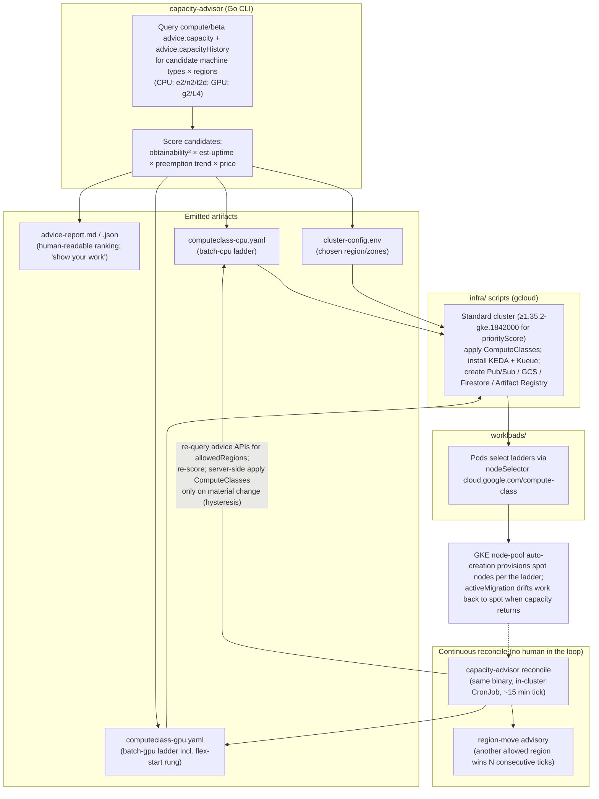

# GKE Spot Capacity Advisor Demo — Design

**Date:** 2026-07-23
**Status:** Approved (design review conducted interactively)
**Repo purpose:** A live-deployable demo showing GCE capacity-advice APIs driving
GKE spot node provisioning for modern batch/AI workloads.

## 1. Goal and audience

Build a repo anyone (customers, DevRel, the author) can clone and run against
their own GCP project. It demonstrates a pattern Google does not document
anywhere today: using the Compute Engine capacity advisor APIs
(`advice.capacity`, `advice.capacityHistory`, both beta) to *automatically*
choose spot machine types and zones for GKE, expressed as a custom
`ComputeClass` priority ladder that GKE's node-pool auto-creation acts on —
and to keep that choice current without human intervention via an in-cluster
reconcile loop bounded by user-set parameters (chiefly `allowedRegions`).

Three showcase workloads (plus one stretch) prove the pattern on work that
hugely benefits from opportunistic capacity in 2026: queue processing, vector
embedding refresh at scale, and LoRA fine-tuning with a spot → DWS flex-start
cost ladder.

Development project: `example-sandbox` (full access, GPU quota). Costs are
not tightly constrained but all infra has teardown scripts and node caps.

## 2. Non-goals

- No multi-cluster / MultiKueue capacity chasing. One regional cluster;
  cross-region moves are advisory, not automated (decided 2026-07-23,
  revising the earlier one-shot-only decision in favor of a continuous
  in-cluster reconcile loop).
- No autonomous cluster rebuilds. The reconciler's write authority is limited
  to ComputeClass objects; it may recommend a region move but never executes
  one.
- No BigQuery billing-export reconciliation. Cost readouts use instrumented
  node sampling + list prices (decided 2026-07-24); invoice-grade
  reconciliation lags days and is out of demo scope.
- No Terraform. Infra is numbered gcloud scripts (decided during review).
- No Autopilot. GKE Standard for full ComputeClass + node-pool auto-creation
  + extendable spot grace window.
- Act 4 (LLM batch inference) is stretch-only; built only if time allows.

## 3. Architecture

### Repo layout

- `advisor/` — Go CLI (`analyze`/`render`/`reconcile`); `cloud.google.com/go/compute/apiv1beta` AdviceClient
- `infra/` — numbered gcloud scripts + teardown + preflight + reconciler deploy (CronJob, RBAC, Workload Identity) + generated `migrate-region.sh`
- `workloads/`
  - `01-queue/` — Go Pub/Sub consumer, KEDA ScaledObject, publisher job
  - `02-embeddings/` — Python sentence-transformers worker, progress tracker, corpus loader
  - `03-finetune/` — LoRA Gemma job, GCS-FUSE checkpointing, Kueue queue
  - `04-batch-inference/` — stretch; reuses 02 plumbing with vLLM image
- `demo/` — per-act runbooks, watch.sh, preempt.sh (chaos), cost readout
- `docs/` — this design, plans

## 4. The `capacity-advisor` CLI (Go)

### Commands

- `capacity-advisor analyze` — inputs: `--profile cpu-batch|gpu-batch` (or
  `--machine-types`/`--regions` overrides) and `--size`. Per region ×
  machine-type candidate it calls:
  - `advice.capacity` → obtainability (0–1), estimated uptime (60/600/3600s),
    recommended zone shards. Batched to respect the 5-machine-type cap per call.
  - `advice.capacityHistory` per candidate zone → 30-day daily preemption-rate
    series + 1-year price history (SPOT provisioning model only, per API).
- `capacity-advisor render` — turns a saved analysis into ComputeClass YAMLs +
  `cluster-config.env`. `analyze --render` does both. Split exists so the
  analysis can be inspected/tweaked before rendering.
- `capacity-advisor reconcile` — the autonomy mode (see below). Runs
  analyze + render on a loop tick and applies the result in-cluster.

### Parameters (`advisor.yaml`, flags override)

- **`allowedRegions`** — the boundary for everything (bootstrap region choice,
  every API query, every reconcile decision). A list where each entry is:
  an explicit region (`us-central1`), a prefix glob (`europe-west*`), or a
  keyword expanding to Google region prefixes: `global` (all), `us` → `us-*`,
  `eu` → `europe-*`, `asia` → `asia-*`, plus `northamerica`, `southamerica`,
  `australia`, `me`, `africa`. Entries are unioned; the expansion is resolved
  against the live `compute regions list` so new regions are picked up.
- **Hysteresis:** `minScoreDelta` (default 15%) and `consecutiveTicks`
  (default 3) — a rung reorder or region-move advisory only fires when the
  improvement exceeds the delta for that many ticks. Prevents node-pool
  thrash on score noise.
- **Caps:** max nodes per ComputeClass (budget guardrail), max spot rungs (3).

### Reconcile mode (in-cluster autonomy)

The same binary runs as a Kubernetes CronJob (~15 min tick, configurable):

1. Re-query both advice APIs for all candidates within `allowedRegions`
   (zones outside the cluster's region inform only the region-move advisory).
2. Re-score. If the in-region ladder materially changed (per hysteresis),
   server-side-apply the updated ComputeClasses; `activeMigration` then
   physically moves work. If not, do nothing.
3. If an out-of-region candidate set beats the current region past the
   hysteresis bar, emit a **region-move advisory**: a Kubernetes Event, a
   structured log line, and a refreshed `advice-report.md` artifact — plus a
   generated `infra/migrate-region.sh` invocation line. Executing it stays a
   human decision.
4. On API failure: keep the last-known-good ladder, log, and retry next tick
   (never degrade a working ladder because the advice API hiccuped).

Auth: Workload Identity binds the CronJob's KSA to a GSA with
`roles/compute.viewer`; RBAC grants patch on `computeclasses` and create on
`events` only. The reconciler cannot touch node pools, the cluster, or
anything outside those objects.

### Scoring

Per candidate (machine type × zone), transparent factors, every raw input
echoed in the report:

- **obtainability** — from `advice.capacity`; hard-drop < 0.4 (documented
  "Low" band).
- **uptime factor** — 3600s → 1.0, 600s → 0.6, 60s → 0.2.
- **preemption factor** — `1 − mean(daily rate, last 7 days)`, penalized when
  the 30-day trend worsens.
- **price factor** — current spot price normalized per effective vCPU (CPU
  profile) or per GPU (GPU profile) across candidates.

`score = obtainability² × uptime × preemption × price` — obtainability squared
because unobtainable capacity has no price. Weights live in one obvious place
in code. The formula is deliberately simple; the demo's point is surfacing the
API's signals, not the cleverness of the ranking.

### Mapping to ComputeClass

The top 3 candidates become `priorities[]` rungs: `spot: true`, machine type,
`location.zones` pinned from shard recommendations, `priorityScore` scaled
from the composite score. The GPU class appends a `flexStart` rung
(`nodeRecycling` enabled) after the spot rungs. Floors: CPU class
`whenUnsatisfiable: ScaleUpAnyway`; GPU class `DoNotScaleUp` (flex-start is
the fallback). Both classes: `nodePoolAutoCreation.enabled: true` with node
caps, `activeMigration.optimizeRulePriority: true`. Generated YAML carries a
header comment embedding the scores that produced each rung, so
`kubectl get computeclass -o yaml` is part of the demo narrative.

### Constraints handled

Beta API (report timestamps every query; no guarantees), `roles/compute.viewer`
suffices (`compute.advice.capacity`/`.capacityHistory`), history excludes
N1+GPU / custom types / TPUs (not used), empty history → neutral preemption
factor + report flag.

## 5. Workload acts

Shared: namespaces labeled for cost attribution (`team=spot-demo` + per-act);
`make demo-act-N` entrypoints; `demo/preempt.sh` kills a random spot node via
`gcloud compute instances simulate-maintenance-event`.

### Act 1 — Queue processing on CPU spot (`batch-cpu`)

Go worker consumes a Pub/Sub subscription of ~5,000 simulated tasks with
controllable per-task duration. KEDA `gcp-pubsub` ScaledObject scales the
Deployment 0→50 on backlog. Workers carry the spot toleration +
`nodeSelector: {cloud.google.com/compute-class: batch-cpu}`; SIGTERM handler
stops pulling and nacks in-flight messages within the 15s non-system grace
window. Preemption = redelivery; task ledger proves zero loss. Success visual:
backlog drains to zero while nodes churn.

### Act 2 — Vector embedding refresh on spot L4s (`batch-gpu`)

Public corpus (Simple English Wikipedia subset, ~50k chunks) in GCS; Firestore
progress table keyed by chunk-hash + embedding-model-version (idempotent
upserts — double-processing harmless). Python workers (sentence-transformers
`BAAI/bge-base-en-v1.5` on L4, g2-standard-4 class machines) run as an Indexed
Job pulling chunk batches. Node kill mid-run →
job resumes where it left off. Success visual: throughput dips, completed work
never regresses; per-chunk cost readout vs on-demand.

### Act 3 — LoRA fine-tune Gemma with the cost ladder (`batch-gpu` + Kueue)

Adapted from Google's finetune-gemma-gpu tutorial: Gemma 2B LoRA (r=8) on the
b-mc2/sql-create-context dataset, single g2 node (advisor decides the L4
shape), HF Trainer checkpointing to GCS
via FUSE every N steps, `resume_from_checkpoint` on restart. Submitted through
Kueue; ComputeClass ladder tries spot first, falls back to the flex-start rung
(non-preemptible, ~53% off) when spot L4s are unobtainable. Bounded loss =
one checkpoint interval, stated in the runbook. This act narrates the ladder:
spot (60–91% off, interruptible) → flex-start (~53% off, not preempted) →
on-demand.

### Act 4 (stretch) — LLM batch inference

Swap Act 2's worker image for vLLM + Gemma scoring a prompts file using the
same queue/progress plumbing. Act 2's design must not preclude this reuse.

## 6. Demo experience

Terminal-first. Top-level README tells the story; each act's runbook has three
beats: **advise** (show the report), **provision/run** (watch nodes appear),
**survive** (chaos script, work resumes). A fourth, cross-act beat — **let it
run** — shows the reconciler CronJob's Events: ladders re-scored every tick,
applied only on material change, region-move advisories when a better allowed
region sustains. `demo/watch.sh` shows a live split view
(`kubectl get nodes -L compute-class,gke-spot` + backlog/progress + last
reconcile decision).

### Cost accounting: every act pays for itself (added 2026-07-24)

The demo's value proposition has two incentives, and every act must quantify
both: (1) **cost** — the platform pays for itself versus standard always-on
on-demand provisioning; (2) **obtainability** — you can run the workloads you
want even when infrastructure is scarce, because the advisor finds capacity
where it exists.

Cost evidence is produced per run, not hand-calculated:

- **Collector** (`demo/cost/collector.sh`): samples the cluster's node
  inventory every 30s during a run — node name, instance type, spot vs
  on-demand lifecycle, compute-class, first/last seen — into a run CSV.
- **Cost report** (`capacity-advisor cost` subcommand): joins the CSV with
  prices — spot machine prices from `capacityHistory` PRICE (the same API
  that chose the hardware proves the savings), on-demand prices from the
  Cloud Billing Catalog API (per-core + per-GB rates composed per machine
  type) — and renders `cost-report.md`/`.json` with three comparisons:
  1. **Actual**: Σ node-seconds × rate by lifecycle for the run.
  2. **Spot-discount counterfactual**: same node-hours at on-demand rates
     ("what the identical elastic run would have cost without spot").
  3. **Always-on counterfactual**: a peak-sized on-demand pool over the
     observation window, extrapolated to day/month ("the standard way").
  The combined saving is the product of the spot discount and the duty
  cycle — the report shows both factors separately, then multiplied.
- Each act's runbook closes with a fourth beat, **the bill**: start the
  collector before the run, stop it after, render the report.

### Advisor cost controls (added 2026-07-24)

The advisor already scores price (`price factor` in §4). Two additions keep
prices down *within parameters*, mirroring the allowedRegions philosophy:

- **`scoring.priceExponent`** (advisor.yaml, default 1.0): raises the price
  factor to a configurable power so operators can dial cost-aggressiveness
  (composite becomes `obtainability² × uptime × preemption × price^exponent`).
- **`scoring.maxHourlyUSDPerUnit`** (advisor.yaml, optional): hard-drops
  candidates whose spot $/vCPU-hr (cpu profiles) or $/GPU-hr (gpu profiles)
  exceeds the ceiling, with a report flag — a budget cap the Plan 4
  reconciler will enforce continuously. Candidates with unknown price are
  kept (neutral) but flagged, never silently dropped by the cap.

Deferred by choice: price-trend penalties from the 1-year PRICE history
(marginal effect on demo-scale decisions).

### Roadmap addendum: Autopilot variant (added 2026-07-24, Plan 5)

After the GPU acts (Plan 3) and reconciler (Plan 4), a closing chapter runs
Act 1 unchanged on a GKE **Autopilot** cluster: custom ComputeClasses work on
Autopilot (1.30+, node-billed for compute-class workloads), so the
advisor→ComputeClass pattern ports with zero node operations — proving the
design is a platform principle, not a Standard-mode trick. Standard remains
the primary mode for the core acts (flex-start rung mechanics, extended spot
grace window, and node-level visibility for the demo narrative).

### Roadmap addendum: fleet variant (added 2026-07-24, Plan 6)

The Plan 3 live runs proved the single-cluster limits empirically: a real
spot L4 stockout in us-east1-c (while `advice.capacity` read 0.90 for every
US g2 zone — advice is a prior, not live inventory), a passive flexStart
rung (NAP retries the spot rung on a retriable stockout and never escalates;
the DWS ProvisioningRequest path is documented incompatible with custom
compute classes), and a cross-region "migration" that is really a ~1-hour
teardown/rebuild. Casey's failover policy (decided 2026-07-24): when a
region *observably* fails to provision and other allowed regions have the
hardware, fail over in order of spot price — **next cheapest** is the
default; region-preference ordering is an alternative mode; the optional
`scoring.maxHourlyUSDPerUnit` cap still applies.

Plan 6 makes that policy autonomous by inverting the topology: a small
management cluster runs Kueue with **MultiKueue** dispatch; the advisor's
reconciler becomes a *cluster-lifecycle controller* that creates a fleet
member cluster in a region when advice + observed evidence say capacity
exists there, and drains/deletes it when dry or idle. Jobs never migrate —
they are dispatched to whichever member has capacity, ordered by the
failover policy; GCS (multi-/dual-region) is the only shared state. Fleet
membership + config management keep members identically provisioned
(ComputeClasses, namespaces, Kueue). Costs acknowledged: per-member control
plane, N-regional quota, and a real complexity jump — which is why this is
a closing variant, not the core demo.

Pulled forward into **Plan 4** (paid for the hard way during Plan 3's
migrations): a **multi-region (`us`) Artifact Registry repo** so images
survive region moves without rebuilds, and a **dual-region demo bucket** so
corpus/checkpoints need no re-upload — together they cut a manual migration
from ~an hour to ~15 minutes. Plan 4's reconciler must also ingest observed
NAP scale-up failures (Kubernetes events), not just re-polled advice
scores: evidence outranks the prior.

## 7. Error handling

- **Advisor:** all candidates < 0.4 obtainability → still renders with the
  floor promoted + loud warning; partial/empty history → neutral factor,
  flagged; quota/permission errors name the missing IAM permission.
- **Reconciler:** API failure → last-known-good ladder retained, retry next
  tick; malformed/empty region expansion → refuse to start (misconfiguration,
  not a runtime condition); hysteresis prevents oscillation; every applied
  change and every advisory is a Kubernetes Event for auditability.
- **Workloads:** Act 1 relies on ack-deadline redelivery (tasks idempotent by
  design); Act 2 upserts idempotent by chunk-hash; Act 3 bounded checkpoint
  loss.
- **Infra:** scripts idempotent and re-runnable; ComputeClass node caps as
  budget guardrails; one-command teardown (cluster + Pub/Sub + GCS + Firestore);
  preflight checks GKE version ≥ 1.35.2, L4 + preemptible-CPU quota, enabled
  APIs.

## 8. Testing

TDD throughout. Advisor: unit tests against recorded advice-API fixtures
(httptest) + golden-file tests for rendered YAML and report. Reconciler:
unit tests for `allowedRegions` expansion (keywords, globs, explicit),
hysteresis decisions (golden cases: noise vs material change vs sustained
region win), and apply/no-op/advisory branching with a fake K8s client. Workload logic:
SIGTERM drain, chunk idempotency, checkpoint-resume decisions unit-tested in
isolation. Manifests validated with kubeconform in `make test`. Per-act e2e
acceptance checklists run against the real cluster during development
(verified manually, not CI-automated).

## 9. Key references

- capacityHistory REST: https://cloud.google.com/compute/docs/reference/rest/beta/advice/capacityHistory
- capacity REST: https://cloud.google.com/compute/docs/reference/rest/beta/advice/capacity
- How-tos: https://cloud.google.com/compute/docs/instances/view-spot-preemption-price ,
  https://cloud.google.com/compute/docs/instances/view-vm-availability
- Go client: https://pkg.go.dev/cloud.google.com/go/compute/apiv1beta (AdviceClient)
- Custom compute classes: https://cloud.google.com/kubernetes-engine/docs/concepts/about-custom-compute-classes
- GKE spot: https://cloud.google.com/kubernetes-engine/docs/concepts/spot-vms
- DWS flex-start: https://cloud.google.com/kubernetes-engine/docs/concepts/dws
- Kueue/ProvisioningRequest: https://cloud.google.com/kubernetes-engine/docs/how-to/provisioningrequest
- Batch platform best practices: https://cloud.google.com/kubernetes-engine/docs/best-practices/batch-platform-on-gke
- Gemma fine-tune tutorial: https://cloud.google.com/kubernetes-engine/docs/tutorials/finetune-gemma-gpu
