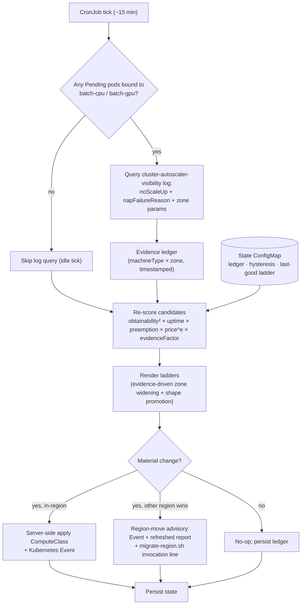
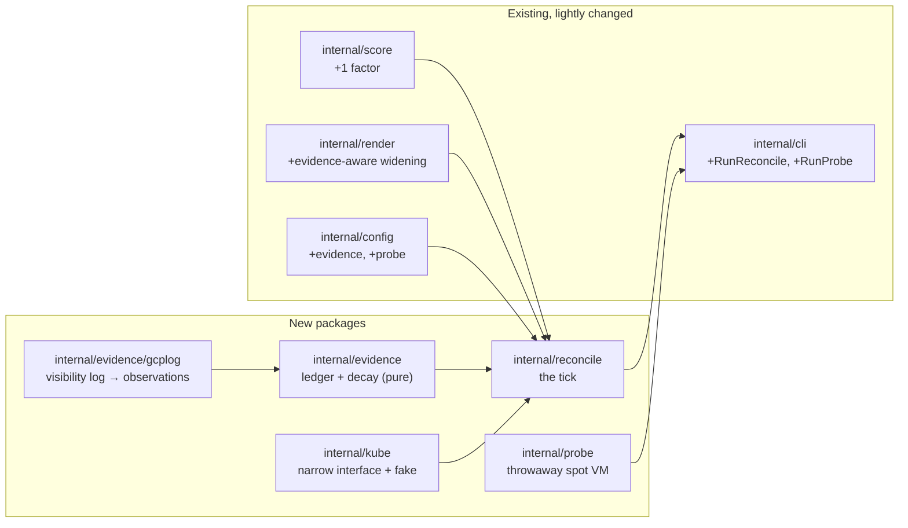

# Plan 4 — Reconcile Mode — Design

**Date:** 2026-07-26
**Status:** Approved (design review conducted interactively)
**Relates to:** `2026-07-23-gke-spot-capacity-advisor-design.md` §4 ("Reconcile mode"),
which this document refines with what the Plan 3 live runs proved.

## 1. Goal

Make the capacity ladder maintain itself. The advisor already chooses spot
machine types and zones once; Plan 4 runs the same binary as an in-cluster
CronJob that keeps that choice current without a human, bounded by
`allowedRegions` and the existing hysteresis and price caps.

The Plan 3 live runs changed what "current" has to mean. `advice.capacity`
read 0.90 obtainability for zones that had zero actual spot L4s, across three
regions, for 36 hours. A one-line summary of the lesson:

> **Advice is a prior. Observed provisioning failures are evidence. Evidence
> outranks the prior.**

Plan 4 is the mechanism for that sentence.

## 2. What Plan 3 proved, and what each finding demands

| Live finding | What Plan 4 must do |
| --- | --- |
| `advice.capacity` reported 0.90 for provably dry zones | Ingest observed NAP scale-up failures; do not trust re-polled scores alone |
| A throwaway `g2-standard-8` spot VM found stock while `-4` was dry in the same zone | Evidence must be keyed by **machine type × zone**, not zone alone |
| NAP retries a dry spot rung forever and never escalates to the lower-priority `flexStart` rung | The reconciler performs the escalation NAP won't: it rewrites the ladder |
| The `batch-gpu` class was hand-widened to 4 zones and hand-given a `-8` rung | Both deviations must fall out of scoring, not stay as hand edits |
| Cross-region "migration" was a ~1 hour teardown and rebuild | Multi-region Artifact Registry + dual-region bucket + a real migrate script |
| The advice landscape shifted materially in ~4 hours (`us-east4` collapsed 0.90 → 0.10) | Advice has a shelf life; evidence must decay, not persist forever |

## 3. Scope

**In scope.** Phase 1 (portability): multi-region `us` Artifact Registry repo,
dual-region `us` demo bucket, `infra/migrate-region.sh`. Phase 2 (reconciler):
the CronJob, evidence ingestion, evidence-weighted scoring, evidence-driven
zone widening and shape promotion, state persistence, region-move advisory,
RBAC and Workload Identity, an opt-in probe subcommand, and the cross-act
"let it run" demo beat.

**Out of scope.** Autonomous region moves — the reconciler advises and never
executes, per master spec §2. The Kueue `ProvisioningRequest` /
queued-provisioning architecture, which the GKE docs state is incompatible
with custom compute classes and would gut the ladder narrative for GPU.
MultiKueue and the fleet topology (Plan 6). Autopilot (Plan 5).

**Already done, verify only.** The Kueue v0.19 `waitForPodsReady` gotcha is
fixed in `infra/07-kueue.sh` (merged in Plan 3). Plan 4 confirms a fresh
install inherits the fix; it does not re-solve it.

## 4. Architecture

Phase 1 is three infra changes and is sequenced first, so that any region move
forced during Plan 4 development costs ~15 minutes instead of ~1 hour, and so
the region-move advisory has a real script to point at.

Phase 2 is one tick of the CronJob:



### 4.1 Evidence ingestion

The zone-attributed failure signal lives in the Cloud Logging
`container.googleapis.com/cluster-autoscaler-visibility` stream, as
`noScaleUp` entries carrying `napFailureReason` and `parameters` (the zone).
Kubernetes events are ephemeral and generally lack those structured
parameters, so they cannot tell the reconciler *which* zone is dry — which is
exactly what zone widening and rung demotion need.

The reconciler therefore uses a two-step gate:

1. **In-cluster precondition (cheap).** List Pending pods whose
   `nodeSelector` names one of our compute classes. Most ticks are idle and
   stop here, costing one API call.
2. **Log query (only when warranted).** Fetch `noScaleUp` entries since the
   last tick, extract `(machineType, zone, reason, timestamp)`, and fold them
   into the ledger.

This adds exactly one read-only role to the reconciler's GSA:
`roles/logging.viewer`, alongside the existing `roles/compute.viewer`.

### 4.2 Evidence-weighted scoring

The composite gains one factor and no new branches:

```
score = obtainability² × uptime × preemption × price^priceExponent × evidenceFactor
```

`evidenceFactor` is 1.0 with no observations. A fresh failure for a
`(machineType, zone)` pair drives it toward a configurable floor, and it
recovers on an exponential half-life (default 30 minutes). Recovery is what
makes the system self-healing: a zone that restocks earns its way back with no
human action, and stale evidence cannot pin a rung down forever — which
matters given the observed 4-hour shelf life of the landscape.

The report echoes both numbers, so the demo can show the disagreement
directly: *advice said 0.90; we watched it fail 12 minutes ago; effective
0.08.*

### 4.3 Both hand deviations, earned rather than typed

`render.buildRungs` already groups candidates by machine type, unions their
zones, and emits up to `maxSpotRungs` rungs. So both Plan 3 hand edits are
reachable through scoring alone:

- **Shape promotion.** A dry `g2-standard-4` has its factor crushed and falls
  below a healthy `g2-standard-8`, which `buildRungs` then promotes on its
  own. This is precisely the `-8` rung, discovered rather than typed.
- **Zone widening.** A rung whose pinned zones all carry fresh failures widens
  to the other in-region zones for that shape that have clean evidence. This
  is the 4-zone widening.

Because the ladder is the only thing NAP acts on, rewriting it *is* the
spot → alternative escalation that NAP declines to perform. The `flexStart`
rung stays in the class and stays honest: it is a fallback node *shape*, and
the reconciler is what finally makes something ask for it.

### 4.4 Hysteresis, with an evidence fast path

`consecutiveTicks` (default 3) exists to damp score *noise*. A proven
stockout is not noise. So:

- Ordinary score-driven reorders keep the full `minScoreDelta` +
  `consecutiveTicks` bar.
- Evidence-driven demotions apply after `evidence.fastPathTicks` (default 1).

Waiting 45 minutes to route around a zone that has already failed would be a
bug, not caution.

### 4.5 State

One ConfigMap in the reconciler's namespace, read at tick start and written at
tick end, holding a single JSON document: the evidence ledger, the per-class
last-applied ladder fingerprint, pending-change tick counters, and the last
advisory.

It is deliberately inspectable — `kubectl get cm reconcile-state -o yaml`
shows the reconciler's memory, which is the "let it run" beat's best visual.
State is lost on cluster rebuild, which is correct: a rebuild in a new region
invalidates zone-scoped evidence anyway.

### 4.6 Region-move advisory

Unchanged from master spec §2 in authority — the reconciler never executes a
move. What Plan 4 adds is the ordering policy and a real target: when an
out-of-region candidate set beats the current region past the hysteresis bar,
candidates are ranked **next-cheapest first** (decided 2026-07-24;
region-preference ordering remains an alternative mode, and
`scoring.maxHourlyUSDPerUnit` still applies). The advisory is a Kubernetes
Event, a structured log line, a refreshed `advice-report.md`, and a ready-to-run
`infra/migrate-region.sh <region>` invocation line.

### 4.7 Probe mode (opt-in, default off)

`capacity-advisor probe` launches a throwaway spot VM of a given shape in a
given zone to distinguish shape-level stock — reproducing the manual probe
that broke Plan 3's 36-hour stockout — then deletes it. Every probe VM also
carries a GCE max-run-duration, so a crashed reconciler cannot leak a paid
instance.

It is gated by `probe.enabled` in `advisor.yaml`, defaulting to `false`. The
deploy script binds instance-create IAM only when it is enabled, so the
default posture keeps the master spec's claim — the reconciler cannot touch
node pools, the cluster, or anything beyond ComputeClasses, Events, and its
own ConfigMap — literally true.

## 5. Components



`internal/kube` is a narrow, hand-rolled interface —
`PendingPodClasses`, `GetState`/`PutState`, `ApplyComputeClass`
(server-side apply), `EmitEvent` — implemented over `client-go` (dynamic
client for the ComputeClass CRD, typed clients for core objects) and faked
wholesale in tests. Keeping the interface ours means the tick logic never
imports `client-go`, stays readable, and stays fast to test.

## 6. Error handling

The governing rule: **never degrade a working ladder.**

| Condition | Behaviour |
| --- | --- |
| Advice or logging API fails | Keep last-known-good ladder, log, retry next tick |
| State ConfigMap missing or corrupt | Warn, treat as cold start, rebuild. Never crash-loop |
| Region expansion empty or malformed | Refuse to start — misconfiguration, not a runtime condition |
| Probe fails | Non-fatal; recorded as *absence* of evidence, never as negative evidence |
| All candidates below the 0.4 band | Existing behaviour: render with the floor promoted and a loud warning |

Every apply and every advisory emits a Kubernetes Event, so the whole
decision history is auditable with `kubectl get events`.

## 7. Testing

**Unit and golden.** Evidence decay curves; hysteresis decisions across the
three golden cases (noise, material change, sustained region win); the
evidence fast path; apply / no-op / advisory branching against the fake kube
client; golden ladders for evidence-driven zone widening and shape promotion;
`gcplog` parsing against recorded log fixtures.

**Live, on `batch-cpu`.** Real CronJob, real server-side applies, real
hysteresis across consecutive ticks, real Workload Identity and RBAC. The
evidence path is forced deterministically by scheduling an unschedulable pod
with an impossible shape, which makes NAP emit a genuine zonal failure at zero
cost — no waiting on a real stockout.

**GPU.** The reconciler's logic is hardware-agnostic; `batch-gpu` rides the
identical code path. Plan 4 documents that rather than re-proving it against
scarce L4 capacity, which cost Plan 3 roughly 36 hours.

**Manifests.** The CronJob, RBAC, and ServiceAccount manifests go through
`kubeconform` in `make test`, like every other manifest in the repo.

## 8. Deliverables

1. Multi-region `us` Artifact Registry repo; images survive region moves.
2. Dual-region `us` demo bucket; corpus and checkpoints survive region moves.
3. `infra/migrate-region.sh` — rebuilds the cluster only, ~15 minutes.
4. `capacity-advisor reconcile` and `capacity-advisor probe` subcommands.
5. `infra/08-reconciler.sh` — CronJob, KSA/GSA Workload Identity, RBAC.
6. Reconciler documentation and the cross-act "let it run" demo beat.
7. `advisor.yaml` gains `evidence` and `probe` blocks, both documented.
