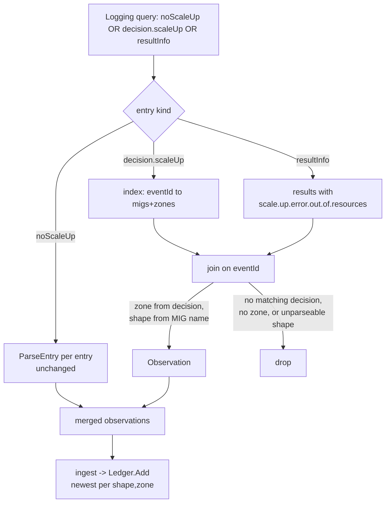

# scaleUp Out-of-Resources Evidence Gap — Design

**Date:** 2026-08-03
**Status:** Approved (design review conducted interactively)
**Relates to:** `2026-07-26-plan4-reconcile-mode-design.md` (reconcile mode /
evidence ledger) and `advisor/internal/evidence/gcplog/gcplog.go:99-102`, which
names this gap in a comment but does not close it.

## 1. Goal

Make the advisor collect the one class of genuine capacity refusal it currently
cannot see — a stockout on an **existing** spot MIG — and give Act 4 a reliable,
repeatable way to provoke one on demand so the demo actually demonstrates the
advisor reacting to real evidence.

Two separable deliverables, both in scope:

- **Code gap.** A genuine out-of-resources on an existing MIG surfaces as
  `scale.up.error.out.of.resources`, which the reader's filter never collects
  (it selects only `noScaleUp`). Close that.
- **Provocation.** Establish a recipe using a spot **g2-standard (L4)** pool
  that reliably forces that stockout, wired into the Act 4 runbook.

## 2. Background — why the signal is split across two events

Unlike a `noScaleUp` record, which is self-contained, a failed scale-up is
reported across **two** cluster-autoscaler-visibility log events that must be
joined by `eventId`:

| Event | Key fields | What it gives |
| --- | --- | --- |
| `decision.scaleUp` | `eventId`, `increasedMigs[].mig.{name,zone}` | the **zone** (and the MIG name → shape) |
| `eventResult` | `resultInfo.results[].eventId`, `resultInfo.results[].errorMsg.{messageId,parameters}` | the **failure** (`scale.up.error.out.of.resources`) and the **failing MIG IDs** (names only, **no zone**) |

So a `(shape, zone)` observation for a real stockout requires: take each
`resultInfo` result whose `errorMsg.messageId` is `scale.up.error.out.of.resources`,
find its `eventId`'s matching `decision.scaleUp`, and for each failing MIG ID
recover the zone from that decision's `increasedMigs[].mig.zone` and the shape
from the MIG name via the existing `migShapeRe`.

Source: GKE "Cluster autoscaler visibility" docs. The docs caution the schema
"does not contain all possible messages and may be extended at any time," and
the exact format of `errorMsg.parameters` ("Failing MIG IDs" — short name vs.
full resource URL) is **not confirmable from docs**. This is why the work is
sequenced live-first (§7).

## 3. Scope

**In scope.**
- Broaden the Logging query and parser to collect
  `scale.up.error.out.of.resources` via the two-event `eventId` join.
- Generalize the reconciler's `Log` interface from `NoScaleUp` to a single
  `Refusals` method that returns both kinds of refusal as
  `[]evidence.Observation` (Approach A, §5).
- A provocation recipe (manifests + runbook Beat) using a spot g2-standard (L4)
  pool, live-verified end to end.
- A unit-test fixture captured from a **real** stockout on the cluster.

**Out of scope.**
- Widening `migShapeRe` for `a2-ultragpu-1g` / `a3-highgpu-8g`. L4
  (`g2-standard-N`) parses under the current regex; the trailing-`g` GPU shapes
  remain a documented, untouched gap (`gcplog.go:60-63`).
- Collecting `scale.up.error.quota.exceeded` or any non-stockout scale-up error.
- Changing the decay curve, ledger keying, or scoring. This only adds a new
  source of observations to the existing pipeline.

## 4. Non-negotiable invariants (inherited)

These already govern the package and must continue to hold for the new path:

- **Never store unattributable evidence.** An observation missing either shape
  or zone is dropped, not guessed. An orphan result (no in-window matching
  decision) yields nothing.
- **Never fabricate an observation** that steers the ladder off a healthy rung.
  A false stockout is worse than a missed one — the prior merely leaves us
  uninformed; a fabricated failure is wrong.
- **Enumerate capacity reasons; do not allowlist.** But for scale-up we invert
  cautiously: only the explicit `scale.up.error.out.of.resources` messageId is
  treated as capacity evidence — other scale-up errors (quota, IP exhaustion,
  boot failures) are not stockouts and must not enter the ledger.

## 5. Code design (Approach A — one `Refusals` method)

The reconciler should not care whether a refusal came from `noScaleUp` or
`scaleUp`; both mean "a zone refused capacity for this shape." So the interface
collapses to one method, backed by **one broadened Logging query** (one API
round-trip, one time window — the join needs decision and result in the same
window).

### 5.1 Interface change

`advisor/internal/reconcile/reconcile.go`:

```go
// before
NoScaleUp(ctx context.Context, since time.Time) ([]evidence.Observation, error)
// after
Refusals(ctx context.Context, since time.Time) ([]evidence.Observation, error)
```

Mechanical blast radius: the interface (`reconcile.go`), the fake
`gcplogfake.Log` (`advisor/internal/evidence/gcplog/fake/fake.go`) — its
`NoScaleUpFn` field and method — and its ~9 call sites in
`reconcile_test.go` plus `cli/reconcile_test.go`. The reconciler's `ingest`
changes only the call site (`reconcile.go:254`).

### 5.2 Filter

Broaden `Filter()` to match all three payload shapes for this cluster/location:

```
jsonPayload.noDecisionStatus.noScaleUp:* OR
jsonPayload.decision.scaleUp:*           OR
jsonPayload.resultInfo:*
```

### 5.3 Parse

`noScaleUp` stays per-entry (`ParseEntry` unchanged). The scale-up join is a
**page-level** operation because it correlates across entries:

1. First pass: build `map[eventId] -> []{migName, zone}` from every
   `decision.scaleUp` entry's `increasedMigs`.
2. Second pass: for every `resultInfo.results[]` whose `errorMsg.messageId` is
   `scale.up.error.out.of.resources`, look up its `eventId`; for each failing
   MIG ID in `errorMsg.parameters`, match it to that decision's MIGs to recover
   the zone, derive the shape via `migShapeRe`, and emit one
   `evidence.Observation{MachineType, Zone, Reason: "scale.up.error.out.of.resources", At: resultTimestamp}`.
3. Drop any result with no matching in-window decision, any MIG ID that does not
   parse to a shape, and any recovered pair missing a zone.

The reader method runs both and returns the merged slice. Merged observations
flow into the existing `ingest` → `Ledger.Add` unchanged; `Ledger.Add` already
keeps the newest per `(shape, zone)`.

### 5.4 Data flow



## 6. Provocation recipe (L4 spot stockout on demand)

To exercise the **scaleUp path** specifically, the stockout must hit an existing
MIG, not a NAP-created one. Recipe shape:

- An existing **spot g2-standard-4 (L4)** node pool with autoscaling, pinned to
  a single zone (one zone concentrates demand against one zone's spot supply).
- A burst workload (Job/Deployment) requesting L4 GPUs with enough replicas to
  drive the pool to scale up **beyond** available spot L4 in that zone.
- Result: the existing MIG attempts scale-up and the zone returns
  out-of-resources → `scale.up.error.out.of.resources`.

Reliability risk (from the GPU-shape decision): L4 spot is sometimes available,
so the burst size and/or the chosen zone are tuning knobs the investigate step
(§7) sets from live behavior. If L4 proves too available to stock out even
under a large burst, that finding is reported back before committing the recipe
— it may force revisiting the A100 option (with its regex-widening cost).

Deliverables: manifests under the Act 4 demo area, and a rewritten Beat in
`demo/act4/runbook.md` describing the trigger and the expected advisor reaction.

## 7. Sequencing — live-first

1. **Investigate / capture (live, billing).** Stand up the L4 spot pool, run the
   burst, and confirm the cluster actually emits
   `scale.up.error.out.of.resources` (not `quota.exceeded`, not a NAP
   `noScaleUp`). Capture the real `decision.scaleUp` + `resultInfo` pair,
   including the exact `errorMsg.parameters` MIG-ID format. This becomes the test
   fixture and confirms the join keys.
2. **Code (TDD).** Build the filter + join + interface rename against the
   captured fixture, red→green→refactor.
3. **Provocation + end-to-end.** Finalize manifests and the runbook Beat;
   verify on the live cluster that a provoked stockout flows all the way to a
   ledger entry and an evidence-fast-path ladder change.

Rationale: the schema's `errorMsg.parameters` format is unconfirmed, and
[[verify-evidence-fixes-live]] records that green unit tests missed evidence
false positives twice on this exact package — the live fixture is what catches
them.

## 8. Testing

Unit (gcplog), all keyed off the captured fixture:

- **Happy path:** decision + matching result → one `(shape, zone)` observation
  with reason `scale.up.error.out.of.resources`.
- **Orphan result:** result with no in-window decision → no observation.
- **Partial failure:** decision increases MIGs in two zones, result names only
  one → exactly one observation, for the named zone.
- **Non-stockout error:** `errorMsg.messageId` = `scale.up.error.quota.exceeded`
  → ignored.
- **Unparseable MIG ID:** a failing ID that `migShapeRe` cannot resolve → dropped,
  not stored with an empty shape.
- **Merge:** a page carrying both a `noScaleUp` capacity record and a scaleUp
  stockout → both observations returned.

Every test-adding task names the nearest wrong implementation to mutate and
reports the kill (per the Plan 4 process lesson on vacuous assertions).

Integration: `ingest` with a fake `Refusals` returning a scaleUp observation
drives a ledger entry and trips the evidence fast path.

## 9. Risks & open questions

- **`errorMsg.parameters` format.** Resolved by step 1 before the parser is
  written. If IDs are full resource URLs, the join matches on a normalized
  suffix.
- **L4 spot too available to stock out.** Resolved by step 1's tuning; escalation
  path is the A100 shape (out of current scope, would reopen the regex decision).
- **Window edge orphans.** A decision just before `since` with its result inside
  the window yields an orphan → dropped. Acceptable and consistent with the
  drop-unattributable invariant; the next tick with a fresh failure re-observes.
- **Cost.** The provocation runs real L4 spot GPUs on a live, billing cluster.
  Teardown is covered by standing consent ([[teardown-standing-consent]]); the
  burst is torn down immediately after capture.
