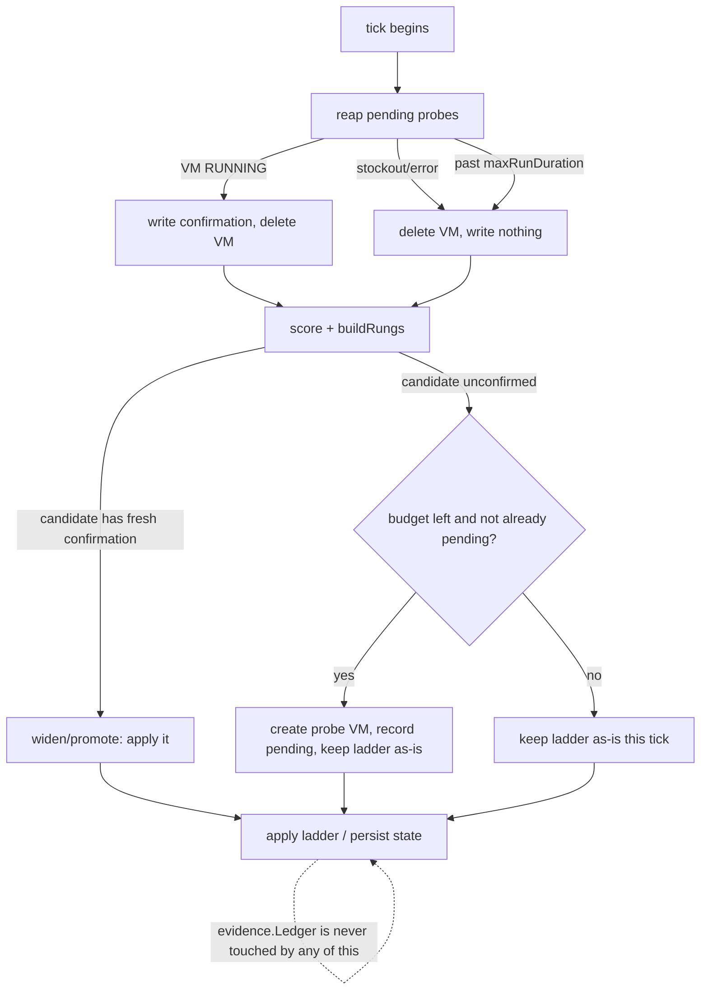

# Automated Verify-by-Probe — Design

**Date:** 2026-08-08
**Status:** Approved (design review conducted interactively)
**Relates to:** `2026-07-26-plan4-reconcile-mode-design.md` (the reconciler,
the evidence ledger, and the opt-in probe it deliberately left un-automated);
`demo/act3/runbook.md` (the two hand-edits this automates) and
`demo/act4/runbook.md` ("automating verify-by-probe is the obvious next plan").

## 1. Goal

Make the reconciler verify a stale obtainability prior with a real probe before
it widens or promotes a rung — so the ladder gains a zone or a larger shape only
when capacity is *confirmed to exist right now*, not merely scored high by a
beta advice API that Act 3 watched read `0.90` for empty zones. This reproduces,
automatically, the two edits a human made by hand in Act 3: widening
`batch-gpu` to more zones, and adding a larger-shape rung when the smaller one
was dry.

Unlike a genuine stockout (which cannot be provoked on demand — Act 4/Plan 5
proved spot capacity is usually healthy), a probe *can* be triggered on demand:
it just creates a VM. So this is the one capacity-verification loop the demo can
actually exercise end to end.

## 2. Background — why a probe, and the boundary it must respect

The advice API's obtainability is a **prior with a shelf life**, not inventory.
Evidence from cluster-autoscaler `noScaleUp`/`scaleUp` logs corrects it
*downward* when a real refusal is observed. But nothing corrects it *upward* on
demand: the reconciler cannot widen onto a zone the prior scored low, or promote
a shape it never sharded, without some positive confirmation. A live probe is
that confirmation.

**The permanent Plan 4 boundary (unchanged):** `probe.Result` must NEVER be
written to `evidence.Ledger`. A probe can fail for reasons unrelated to
capacity — quota, a bad image, a network policy — and the ledger drops a
`(shape, zone)` pair straight to the floor. Folding a false failure into it
would crush a zone the reconciler should have left alone. This design honors
that by making the probe a **positive-only** signal on a *separate* track:

- A **successful** probe *confirms* capacity → the candidate becomes eligible
  to widen/promote onto.
- A **failed or errored** probe is *inconclusive* → nothing is applied, and
  nothing is written anywhere that penalizes the pair. The ledger is untouched.

## 3. Scope

**In scope.**
- A separate probe-confirmation track in the reconcile state (confirmations,
  pending probes, a daily budget) — never mixed with the evidence ledger.
- Gating the widen/promote decision on a fresh confirmation.
- An async probe lifecycle (Approach A): the probe VM itself is the pending
  probe; create in one tick, poll/reap in a later tick.
- A new opt-in `probe.automated` flag (default false) that also gates binding
  instance-create IAM to the reconciler service account.
- Fixing `probe/gce/gce.go`'s hardcoded default-VPC network so a probe runs on
  the cluster's actual network/subnet.
- Splitting the probe package's one-shot `Run` into create/poll/delete ops the
  reconciler can drive across ticks (the human `probe` subcommand keeps its
  one-shot behavior as a composition of them).

**Out of scope.**
- Canary-probing the live top rung, or probing to verify a region-migration
  advisory (possible later gates; not this plan).
- Making probe results feed the evidence ledger (forbidden, permanently).
- Changing scoring, decay, hysteresis, or the ledger itself.
- Configurable budget knobs — the conservative policy is hard-coded constants
  (§5.6); expose them later only if a real need appears (YAGNI).

## 4. Invariants

Inherited and must continue to hold:
- **Probe results never touch the evidence ledger.** (Plan 4, permanent.)
- **Never degrade a working ladder.** A rung keeps its current zones/shape if no
  candidate is confirmed; widening/promotion only ever *adds* confirmed options.
- **Never store unattributable/negative probe outcomes as a penalty.** A
  failure is the absence of a confirmation, not evidence.

New:
- **Confirmations expire.** A confirmation older than the TTL (§5.6) is ignored,
  because spot capacity is volatile — a stale "yes" is a correctness risk.
- **Bounded spend.** At most one probe launched per tick and a hard daily cap;
  every probe VM is spot, size-bounded, deadline-bounded, and reaped.

## 5. Design

### 5.1 The positive-only confirmation

A confirmation records only that a `(shape, zone)` was obtainable at a moment:

```go
type ProbeConfirmation struct {
    MachineType string    `json:"machineType"`
    Zone        string    `json:"zone"`
    At          time.Time `json:"at"` // when the probe reached RUNNING
}
```

There is no negative form. Failures produce no record beyond consuming budget
(§5.6) and an optional short "attempted" backoff to avoid re-probing a broken
config every tick.

### 5.2 Config and opt-in

`config.Probe` gains:
- `Automated bool` (`yaml: automated`, default false) — gates reconciler
  probing. `Enabled` continues to gate only the human `probe` subcommand; the
  reconciler additionally requires `Automated`.
- `Network`, `Subnet string` — the network/subnet a probe VM joins. Default:
  discover the cluster's (see §5.8); explicit values override.

### 5.3 State model (separate from the ledger)

The reconcile state ConfigMap gains three fields, all disjoint from `ledger`:

```go
type State struct {
    // ... existing: Ledger, Applied, Pending, LastLogQuery ...
    ProbeConfirmations map[string]ProbeConfirmation `json:"probeConfirmations"` // key: shape\x00zone
    PendingProbes      []PendingProbe               `json:"pendingProbes"`
    ProbeBudget        ProbeBudget                  `json:"probeBudget"`
}

type PendingProbe struct {
    VMName      string    `json:"vmName"`
    MachineType string    `json:"machineType"`
    Zone        string    `json:"zone"`
    CreatedAt   time.Time `json:"createdAt"`
}

type ProbeBudget struct {
    WindowStart time.Time `json:"windowStart"` // start of the rolling 24h window
    Count       int       `json:"count"`       // probes launched in the window
}
```

### 5.4 Async probe lifecycle (Approach A: the VM is the pending probe)

Each tick, before scoring, the reconciler **reaps** then may **launch**:

- **Reap** every `PendingProbe`:
  - VM reached RUNNING → write a `ProbeConfirmation{At: now}`, delete the VM,
    drop the pending entry.
  - VM's create failed on stockout, or any error → inconclusive: delete the VM
    (best effort), drop the pending entry, write nothing. Ledger untouched.
  - `now - CreatedAt >= maxRunDuration` → give up: delete the VM, drop the entry.
- **Launch** (at most one per tick, §5.6): if scoring identified a widen/promote
  candidate `(shape, zone)` that has no fresh confirmation and no pending probe,
  and budget remains, create a spot probe VM for it, append a `PendingProbe`,
  and increment the budget. The ladder is **not** changed for that candidate
  this tick — it resolves on a later tick once confirmed.

The VM name is prefixed (`capacity-probe-<shape>-<zone>-…`) so an orphaned VM
from a crashed tick is discoverable and reaped by a prefix scan. `maxRunSeconds`
on the instance is the GCE-side self-terminate backstop already in place.

### 5.5 Reconcile integration — gating widen/promote

The widen/promote seam in `buildRungs` (an evidence-dry rung being rebuilt from
in-region zones the advice API never sharded, and shape promotion) now consults
the confirmation cache:

- A widen/promote candidate is **applied only if** it has a fresh confirmation.
- An unconfirmed candidate is **not applied**; instead it is surfaced to the
  launch step as a probe candidate. The rung keeps its current zones/shape this
  tick (never degrade).
- If a rung is evidence-dry and no candidate is yet confirmed, behavior matches
  today's `exhausted=all-zones-dry` — but now a probe is in flight to resolve it
  over the next tick or two, instead of the state being terminal.

Confirmations are read-only inputs to `buildRungs`; the launch decision is made
by the reconciler around it, so `buildRungs` stays a pure function of
(analysis, ledger, confirmations).

### 5.6 Budget policy (conservative, hard-coded)

```go
const (
    probeConfirmTTL   = 30 * time.Minute // matches the evidence decay half-life
    probesPerTick     = 1
    probesPerDay      = 6
    probeBudgetWindow = 24 * time.Hour
)
```

A confirmation older than `probeConfirmTTL` is ignored (and eligible for
re-probe). `ProbeBudget` resets when `now - WindowStart >= probeBudgetWindow`.

### 5.7 Probe package refactor

Today `probe.Compute` is `CreateSpotVM` (which **blocks** until the VM reaches
RUNNING, returning an error on stockout) + `DeleteVM`, and `probe.Run` is
`CreateSpotVM` → `DeleteVM` (delete unconditional, on a detached context). The
blocking wait lives inside `CreateSpotVM`, so async needs the create and the
wait separated:

```go
type Compute interface {
    InsertSpotVM(ctx, r Request) error                       // issue create, do NOT wait
    VMStatus(ctx, project, zone, name string) (Status, error) // RUNNING | PROVISIONING | STOCKOUT | GONE
    DeleteVM(ctx, project, zone, name string) error          // unchanged
    // CreateSpotVM may remain as InsertSpotVM + poll VMStatus, or Run composes it.
}
```

- The **reconciler** (async) uses `InsertSpotVM` in the launch step and
  `VMStatus` + `DeleteVM` in the reap step.
- The **human `probe` subcommand** keeps its blocking one-shot: `probe.Run`
  becomes InsertSpotVM → poll VMStatus to RUNNING/stockout → DeleteVM (still on
  a detached, `maxRunSeconds`-backstopped context), preserving today's behavior
  and its Ctrl-C cleanup semantics.

The gce implementation gains `VMStatus` (a `get` on the instance mapping GCE
status → the `Status` enum) and `InsertSpotVM` (the current create without the
wait-for-RUNNING poll).

### 5.8 gce.go network fix

`probe/gce/gce.go` hardcodes `global/networks/default`. Replace with the
network/subnet from `config.Probe.Network`/`Subnet`, defaulting to the cluster's
own (discoverable from the node pool / instance metadata, or required in config
when `automated` is on). A probe on the wrong network fails to join and reads as
a false stockout — so this is a correctness prerequisite, not polish.

### 5.9 IAM / RBAC

Enabling `probe.automated` binds `compute.instances` create/get/delete to the
reconciler service account (Plan 4 bound these only for the human probe path).
This is an `infra/` change gated behind the flag: the binding is applied only
when automated probing is turned on, keeping the default-off posture.

### 5.10 Data flow



## 6. Error handling & safety

- **Non-stockout create failure** (quota, network, image): inconclusive; log a
  warning, delete best-effort, count against budget so a broken config cannot
  thrash. Never a ledger write.
- **Orphaned probe VMs** (tick crashed between create and record): reaped by a
  name-prefix scan bounded by `maxRunDuration`; the GCE self-terminate deadline
  is the final backstop so an abandoned VM cannot bill indefinitely.
- **Tick stays fast:** launch and reap are O(1) GCE calls (create/get/delete);
  no waiting on VM boot within a tick.
- **Concurrency:** at most one in-flight launch per tick; multiple pending
  probes across ticks are bounded by the daily cap.

## 7. Testing

Unit (fake `Compute` with scriptable `Insert`/`Status`/`Delete`):
- Launch when a widen/promote candidate is unconfirmed and under budget.
- Skip launch when a fresh confirmation exists; **re-probe** once it exceeds
  `probeConfirmTTL`.
- Skip launch when the daily cap is hit; reset after the window.
- Reap: RUNNING → confirmation written + VM deleted; STOCKOUT/error → no
  confirmation, VM deleted; past deadline → VM deleted, entry dropped.
- Widen/promote applies **only** confirmed candidates; an unconfirmed candidate
  never enters the rung; a working ladder is never degraded to zoneless.
- **The ledger invariant:** a failed probe writes nothing to `evidence.Ledger`
  (assert ledger unchanged across a reap that sees a stockout). Name the wrong
  implementation to mutate and report the kill.
- Async two-tick flow: tick N launches (ladder unchanged, pending recorded),
  tick N+1 reaps + applies.

Every test-adding task names the nearest wrong implementation to mutate and
re-runs the mutation (per the standing anti-vacuous-assertion discipline).

## 8. Sequencing / deliverables

1. Probe package refactor (`Insert`/`Status`/`Delete`; `Run` recomposed) + the
   gce.go network fix — pure code, unit-tested against the fake.
2. State model additions (confirmations/pending/budget) + budget helpers.
3. Reconcile integration: reap → gate widen/promote → launch; conservative
   constants.
4. Config (`Automated`, `Network`, `Subnet`) + infra IAM binding gated on
   `probe.automated`.
5. A runbook Beat demonstrating an automated probe confirming a zone on demand
   (this one IS demonstrable live, unlike a stockout).

## 9. Risks & open questions

- **Network discovery.** If the cluster's network/subnet can't be reliably
  auto-discovered, `probe.automated` may require explicit `Network`/`Subnet` in
  config. Resolved during task 1/4 against the live cluster.
- **Confirmation vs. reality drift.** A 30-min confirmation can go stale before
  a workload lands (spot is volatile). Accepted: a confirmed prior is strictly
  better than the beta API's, and the ledger still corrects downward on a real
  refusal.
- **Probe VM boot time for GPU shapes** may approach `maxRunDuration`; the reap
  simply carries the pending probe to the next tick until RUNNING or deadline.

## 10. Non-goals (restated)

No canary/region-advisory probing, no probe-into-ledger, no scoring changes, no
configurable budget. The probe is a positive-only, opt-in, bounded confirmation
that gates widen/promote and nothing else.
