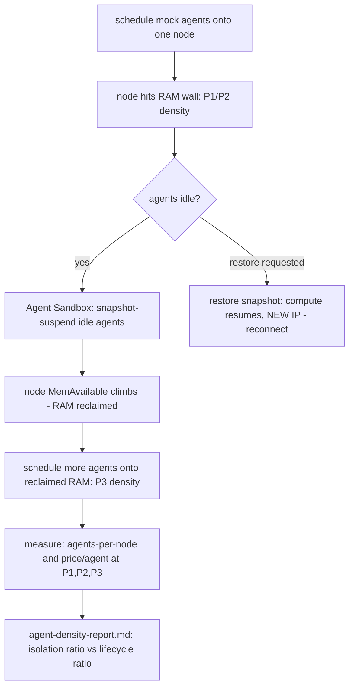

# Act 5 — Agent Lifecycle (reclaim the idle ones) — Design

**Date:** 2026-08-11
**Status:** Approved (design review conducted interactively)
**Relates to:** `2026-07-23-gke-spot-capacity-advisor-design.md` (the demo's
two-incentive thesis — cost and obtainability) and the author's post *"Your
Agents Aren't Too Insecure. They're Too Awake."* (caseywest.com), whose argument
this act turns into a running, reproducible artifact.

## 1. Goal

Prove, on the cluster, the post's thesis: **for agent fleets the cost wall is
idle RAM, not isolation** — and GKE Agent Sandbox Pod snapshots turn that idle
RAM back into density on demand. Concretely, reproduce the shape of Google's own
benchmark (one node: baseline → +gVisor isolation → +suspend/resume) and show
the lifecycle lever dwarfs the isolation lever.

This act matters strategically because it is **the one value-prop in this repo
that is provable on demand.** Every "capacity is scarce → the advisor finds it
elsewhere" demonstration has stalled on the same wall — you cannot summon a real
spot stockout (L4 and A100 both had capacity, twice). Suspend/resume you can
trigger any time, so this act closes the demo's standing gap: a live, repeatable
proof rather than an opportunistic one.

## 2. Background

Google's GKE Agent Sandbox benchmark packs one `n2-standard-48`: **61** agents
baseline, **88** with the gVisor sandbox (isolation lever, ~**+44%**), **274**
with sandbox + suspend/resume (lifecycle lever, up to **3.5×**). Memory, not
isolation, runs out first; an idle agent's cost is the RAM it holds doing
nothing.

- **Available today (Google-Cloud-native, which is acceptable for this repo):**
  GKE Agent Sandbox ships both halves — gVisor isolation and **Pod snapshots**
  (suspend/resume). Docs: `.../concepts/pod-snapshots`,
  `.../how-to/agent-sandbox-pod-snapshots`, `.../how-to/agent-sandbox`.
- **Future, not built:** the portable primitive — Kubernetes 1.37
  `CheckpointPod`/`RestorePod` CRI RPCs (PR #140366, GA ~2026-08-26). Confirmed
  unreachable now: GKE's RAPID channel tops out at `1.36.2-gke.2281000`, no 1.37
  anywhere. This act uses the managed GKE feature today and names the primitive
  as the direction — matching the post's "bet on the primitive, adopt the
  product."
- **One hard caveat:** a Pod snapshot preserves memory/threads/registers/FDs,
  but a restored pod gets a **new IP and its live sockets drop** — transparent
  to compute, not to network. The mock agent is therefore designed to tolerate
  reconnection.

## 3. Scope

**In scope.**
- A small **mock idle-bursty agent**: allocates a configurable RAM working set,
  cycles active↔idle on a schedule, and is network-reconnect-tolerant.
- Manifests to run the agent under **GKE Agent Sandbox** with Pod snapshots.
- A focused **density measurement**: agents-per-node and **$/agent** at each of
  the three ladder points.
- An **Act 5 runbook** with five beats, and a **live three-point run** capturing
  real numbers (right-sized for the ratio, not the 274 headline).

**Out of scope (non-goals).**
- The **control-plane-is-the-real-bottleneck** argument (the post's most novel
  point). It bites only at fleet scale; you cannot credibly show API-server
  pressure at demo scale, and faking it would violate this repo's
  evidence-not-assertion norm. Documented as "what bites at scale," not built.
- The **K8s 1.37 CRI checkpoint/restore** primitive (not on GKE yet).
- A **real LLM-backed agent** (a documented seam is left to swap one in later,
  mirroring how Act 2 was built to allow the vLLM Act 4).
- **Spot × lifecycle compounding** as the spine — it gets a closing note tying
  back to the original case, but the act's core is the lifecycle lever alone.

## 4. The three-point ladder (what we measure and why)

The thesis is comparative, so all three points are measured — the middle one is
just a run configuration, not new engineering:

| Point | Configuration | Lever it isolates |
| --- | --- | --- |
| **P1 baseline** | agents as plain pods, packed to the node's RAM wall | none (the floor) |
| **P2 sandbox** | same, under gVisor Agent Sandbox | isolation (cheap co-location) |
| **P3 lifecycle** | P2 + snapshot-suspend the idle agents, then pack more | lifecycle (idle-RAM reclaim) |

Metric per point: **agents packed** and **$/agent** = (node $/hr) ÷ (agents
packed). Node price comes from the advisor's existing pricing path (the same
Cloud Billing Catalog / capacityHistory the `cost` subcommand uses), so the
number is grounded, not hand-entered. The claim the act proves: `P2/P1`
(isolation gain) ≪ `P3/P2` (lifecycle gain).

## 5. Components

### 5.1 Mock agent (`workloads/05-agents/agent/`)
A small Go binary (fast start, tiny image, precise memory control):
- Allocates a `--working-set-mib` heap region and touches it so the RSS is real
  (snapshot must move actual pages, not lazy allocations).
- Cycles `--active-seconds` / `--idle-seconds`; exposes state (active/idle) via a
  file or a trivial HTTP endpoint so the harness knows which agents are idle.
- **Reconnect-tolerant:** holds no long-lived inbound connection assumptions;
  any liveness/readiness or work pull re-establishes after restore (new IP).
- Emits a heartbeat log so resume-after-restore is visible.

### 5.2 Manifests (`workloads/05-agents/manifests/`)
- The Agent Sandbox runtime/sandbox configuration and the agent workload
  (Deployment or Indexed Job) with the RAM request that makes packing
  deterministic.
- Pinned to the Act-5 node so density is measured against known capacity.

### 5.3 Density harness (`demo/act5/`)
- `run-ladder.sh` — drives P1→P2→P3: pack to the RAM wall, record agents +
  node `MemAvailable`; enable sandbox; snapshot the idle agents (the
  Agent-Sandbox pod-snapshot command); pack more; record again.
- `measure` — joins agent counts + node price into `agent-density-report.md`
  (`$/agent` per point + the two ratios). Reuses the advisor pricing package
  rather than a new price source.

### 5.4 Runbook (`demo/act5/runbook.md`) — five beats
1. **Pack** — schedule agents to the node's RAM wall; baseline density (P1/P2).
2. **Reclaim (money shot)** — snapshot the idle agents; watch `MemAvailable`
   climb.
3. **Redensify** — schedule more agents onto the reclaimed RAM; density jumps
   (P3).
4. **Resume on demand** — restore a suspended agent; it comes back — record the
   new-IP caveat honestly.
5. **The bill** — `$/agent` P1 vs P2 vs P3, with the isolation-vs-lifecycle
   ratio called out.

### 5.5 Data flow

## 6. Live validation plan (this act IS demonstrable — so we run it)

1. **Verify enablement** on a cluster in the sandbox project — GKE Agent Sandbox
   + Pod snapshots enable-able on 1.36.2 (or bump within the RAPID 1.36.2 line).
   Prefer a **small dedicated/ephemeral cluster or node pool** for Act 5 to keep
   the demo cluster clean.
2. **Right-size for the ratio, not the headline.** Use a modest node and tune
   `--working-set-mib` so ~a dozen agents hit the RAM wall — the *density ratio*
   is the proof, not the absolute 274. The runbook cites Google's benchmark for
   the headline figures and reports our smaller run as the reproduction ("measure
   it yourself").
3. **Run the three-point ladder live**, capture real `MemAvailable` + agent
   counts → `$/agent`, record in the Beat.
4. **Tear down immediately** after capture (standing teardown consent).

## 7. Error handling & caveats
- **Restore is not network-transparent** — new IP, dropped sockets; the agent
  and any liveness checks reconnect. Called out in the runbook, not smoothed.
- **Snapshot storage** — pod snapshots persist to storage; the harness cleans up
  snapshots on teardown so they do not accrue.
- **Enablement prereqs** — if Agent Sandbox needs a feature/version the demo
  cluster lacks, the ephemeral Act-5 cluster carries it; recorded in the runbook.
- **RSS realism** — the mock agent must fault in its working set, or a snapshot
  moves near-zero pages and the reclaim looks unrealistically cheap.

## 8. Testing
- **Mock agent (unit):** working-set allocation actually resident; active/idle
  cycle transitions; reconnect logic after a simulated restore. Name the wrong
  implementation to mutate per the standing anti-vacuous-assertion discipline.
- **`measure` (unit):** `$/agent` and the two ratios computed correctly from
  fixture counts + a fixed node price; a zero-agent point rejected, not divided.
- **Manifests:** kubeconform in `make test` where applicable.
- **Live acceptance:** the three-point ladder run (§6) — the reproduction is the
  acceptance test; unlike a stockout, it is repeatable.

## 9. Non-goals (restated)
No control-plane-pressure demo, no K8s 1.37 primitive, no real LLM agent, no
spot-compounding spine, no isolation-only framing (all three points measured so
the isolation-vs-lifecycle comparison is real).
