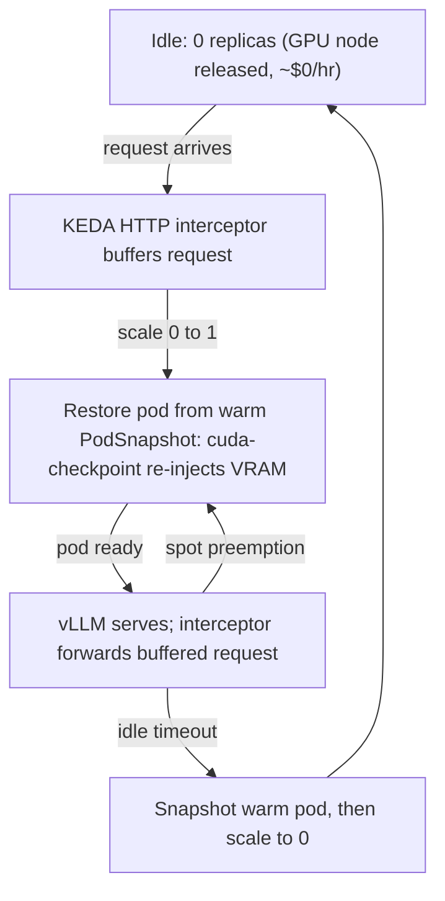

# Act 6 — Serving on Spot (scale-to-zero with warm GPU restore) — Design

**Date:** 2026-08-17
**Status:** Approved (design review conducted interactively)
**Relates to:** `2026-08-11-agent-lifecycle-act-design.md` (Act 5 — the
suspend/resume lifecycle lever this act applies to *serving*) and
`2026-07-23-gke-spot-capacity-advisor-design.md` (the demo's two-incentive
thesis — cost and obtainability). This is the first of a two-act split; the
scarcity/obtainability half is **Act 7** (separate spec).

## 1. Goal

Teach a reader **how and when** to run an LLM inference service on spot GPUs
cheaply, using **scale-to-zero** with **GKE Pod-snapshot restore** to make waking
back up fast. It is the serving analog of Act 5's suspend/resume: an idle service
holds an expensive GPU doing nothing, and the lifecycle lever — snapshot the warm
process, release the node, restore on demand — turns that idle GPU-hour back into
money. The same warm-restore path also recovers the service quickly after a spot
preemption, so one mechanism earns two payoffs.

Where Act 5 proved the lever on **CPU** gVisor pods, Act 6 proves it on a **GPU**
serving workload — a distinct capability (VRAM/CUDA state, not just host memory).

## 2. Background

- **GKE Pod snapshots support GPU pods.** They use NVIDIA `cuda-checkpoint` in
  coordination with gVisor (`nvproxy`) to complete in-flight work, copy GPU
  device memory (VRAM) and the CUDA context into host memory, then re-inject that
  state into the GPU on restore — so a restored vLLM pod resumes with the model
  already resident rather than reloading weights. This is explicitly aimed at
  cutting initialization latency for GPU inference. (Verified via current GKE /
  NVIDIA / gVisor documentation, 2026-08.)
- **It is new for this repo.** Act 5 only demonstrated CPU gVisor snapshots.
  GPU snapshot/restore is therefore treated as **unproven here until a spike
  proves it** (§6, step 1) — the series' evidence-not-assertion rule.
- **Constraints that shape the design:**
  - Checkpoint images are VRAM-sized (tens of GB); GCS read time can erode the
    restore win. → favor a **small model on a single L4** (single-process, no
    tensor-parallel checkpoint synchronization) and consider discarding the KV
    cache before snapshot to shrink the image.
  - GPU state is serialized into host memory during snapshot/restore, so the
    pod's memory limit must **budget for VRAM overhead**.
  - Restore requires an **identical machine series + GPU architecture + matching
    gVisor kernel and GPU driver versions** — this pins the node pool.
  - **E2 machine types and MIG are not supported** for Pod snapshots.
- **Inherited caveat (from Act 5):** a restored pod gets a new IP and its live
  sockets drop. For a service fronted by a Kubernetes Service + KEDA HTTP
  interceptor this is absorbed at the proxy layer; in-flight requests at snapshot
  time are not preserved.

## 3. Scope

**In scope.**
- A **single-replica vLLM** Deployment: a small model on **1×L4** (`g2`),
  spot-preferred compute class, `runtimeClassName: gvisor`.
- **KEDA HTTP-driven scale-to-zero**: the HTTP interceptor buffers the first
  request, scales 0→1, and forwards once the pod is ready.
- **GPU Pod snapshot/restore** wired into the 0→1 path (`PodSnapshot*` CRDs,
  committed as artifacts, not runbook prose).
- **Reuse of the same restore path for spot-preemption recovery.**
- **Cost story** via the existing advisor `cost` subcommand: idle $/hr, and
  $/1000-requests at a stated duty cycle vs. always-on on-demand and always-on
  spot.
- The **infra to make it reproducible**: a version-pinned gVisor GPU node pool,
  `--enable-pod-snapshots`, the GCS storage config, and the exact IAM grant to
  the `gkenode` service agent — closing Act 5's reproducibility debt, extended
  for GPU.
- An **Act 6 runbook** with dated beats, each claim tagged LIVE or PROJECTED.

**Out of scope (non-goals).**
- **Multi-replica HA / load-balanced serving fleets** — a different lesson;
  single replica keeps the snapshot/restore story legible.
- **The A100 scarcity / obtainability / probe-failover beat** — that is **Act 7**.
- **Multi-GPU / tensor-parallel models** — multi-process checkpoint
  synchronization is out of scope; single-process only.
- **Autoscaling beyond 0↔1** (HPA request-rate scaling of a warm fleet).

## 4. Architecture & components

- `workloads/06-serve/` — vLLM Deployment (1×L4, spot compute class, gVisor),
  Service, KEDA `HTTPScaledObject`, and the `PodSnapshot*` CRDs
  (StorageConfig / Policy / Trigger). All committed and `kubeconform`-validated.
- `infra/` additions — a gVisor **GPU** node pool pinned to machine series + GPU
  arch + gVisor/driver versions; `--enable-pod-snapshots`; the GCS snapshot
  storage config; and `gcloud storage buckets add-iam-policy-binding` granting
  `roles/storage.admin` on the snapshot bucket to
  `service-<PROJECT_NUMBER>@gcp-sa-gkenode.iam.gserviceaccount.com` (the Act 5
  root-cause fix, made runnable and GPU-extended).
- **Reuse:** advisor `cost` subcommand for the dollar figures; KEDA (already in
  the repo's stack via the queue worker).
- **Model:** a small instruct model that fits 24 GB with KV headroom (keeps the
  checkpoint small and the restore win large); exact choice fixed in the plan.

## 5. Control flow

## 6. Validation plan

Ordered; each step gates the next. Every recorded number is tagged LIVE or
PROJECTED.

1. **Feasibility spike (HARD GATE).** On one L4: warm a vLLM pod → snapshot →
   restore → confirm the model resumes from VRAM without reloading, and measure
   **restore-time vs cold-load-time**. Build this as a throwaway prototype first.
   *If restore is not meaningfully faster than cold load, the flagship thesis
   fails* — fall back to "measure honest cold start" (KEDA scale-to-zero without
   snapshot) and rescope the act accordingly.
2. **Scale-to-zero economics (LIVE).** Idle cost → ~$0; **$/1000 requests** at a
   stated duty cycle vs. always-on on-demand and always-on spot (advisor `cost`).
3. **Wake latency (LIVE).** First-request latency after idle via the restore path
   vs. the cold-load baseline — the reader-facing UX number.
4. **Preemption recovery (LIVE).** Simulate spot reclaim; recover via restore;
   record downtime and confirm no cold reload occurred.

## 7. Risks & dependencies

- **Depends on** closing Act 5's snapshot reproducibility debt (the CRDs,
  RuntimeClass, IAM grant, and node pool that today live only as runbook prose),
  folded in here as Act 6's foundation and extended for GPU.
- **Version-pinning fragility:** gVisor kernel / GPU driver / GPU architecture
  must match across snapshot and restore; the node pool definition encodes this,
  and the runbook must state the pinned versions.
- **Checkpoint size** may erode the restore win via GCS read time; mitigated by a
  small model and optional KV-cache discard. Step 1 measures whether the win
  survives before the full build proceeds.
- **Feasibility** is documentation-confirmed but unproven in this repo; the
  spike gate (§6.1) exists precisely to de-risk it before investing in the act.

## 8. Testing

- **Unit / static:** `kubeconform -strict` on all new manifests (matching the
  existing workloads), and TDD-with-fakes for any Go glue (cost view, activation
  helpers), matching the advisor's package conventions.
- **Live acceptance:** the four §6 steps, recorded as dated runbook beats with
  LIVE/PROJECTED tags. The act is "done" when steps 1–4 are green and every
  reader-facing claim is either LIVE or explicitly labelled PROJECTED.
