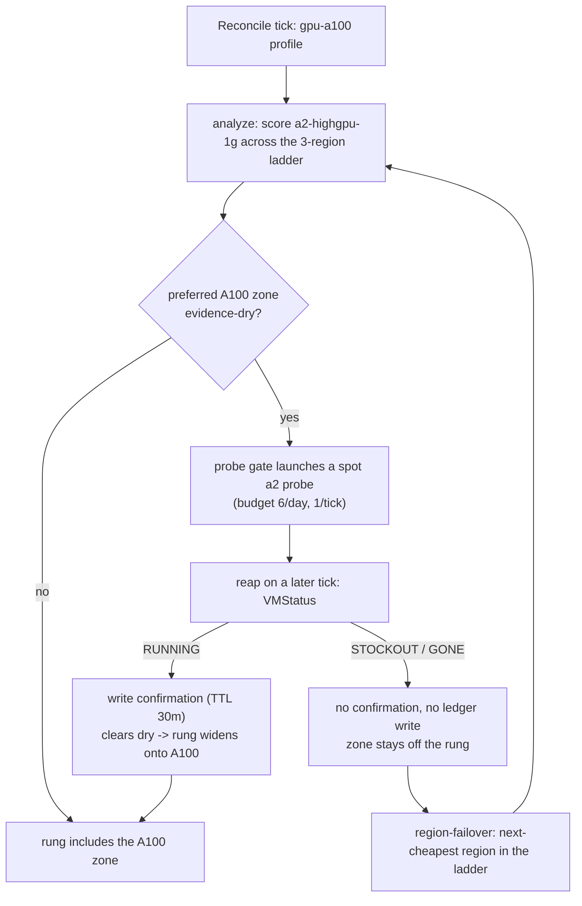

# Act 7 — Obtainability under GPU scarcity (A100 ladder rung + probe-gated failover) — Design

**Date:** 2026-08-19
**Status:** Approved (design review conducted interactively)
**Relates to:** `2026-08-17-serving-on-spot-act.md` (Act 6 — the serving/cost half
of the GPU arc, whose §3 non-goals explicitly defer "the A100 scarcity /
obtainability / probe-failover beat" to Act 7); `2026-08-08-probe-automation-design.md`
(the automated capacity probe wired into the reconciler, which this act turns
toward A100); and `2026-07-23-gke-spot-capacity-advisor-design.md` (the demo's
two-incentive thesis — cost *and* obtainability). This closes the capacity
thread (Thread 1, the SPINE) as the last unbuilt beat of the series.

## 1. Goal

Prove the advisor **survives GPU scarcity** on the hardest-to-get accelerator.
Point the already-built capacity-probe machinery at the **A100** (`a2-highgpu-1g`,
1×A100 40GB) and demonstrate, LIVE, the two halves of the obtainability story the
prior acts could only assert:

1. **Probe-confirmed widening.** An evidence-dry A100 zone that a live spot probe
   confirms as obtainable is widened/promoted back onto its rung — obtainability
   established by a real allocation, not by advice-API optimism.
2. **Stockout-driven failover.** A probe that comes back `StatusStockout`/`Gone`
   writes *no* confirmation (and *never* the evidence ledger), so the zone stays
   off the rung and the region-failover policy routes to the next-cheapest region
   in the ladder.

This is the payoff shot for the whole capacity thread: the mechanism proven on
cheap CPU/L4 capacity in Acts 1–6 now has to earn its keep where capacity is
genuinely scarce.

## 2. Background

- **The probe is already wired into the reconciler.** `advisor/internal/reconcile/probe.go`
  implements `launchProbe`/`reapProbes` and the two gate seams `gateWidenPromote`
  (recovers dry *sharded* zones) and `gateWiden` (explores never-sampled widen
  targets), bounded by `probesPerDay=6`, `probesPerTick=1`, `probeConfirmTTL=30m`.
  Act 7 **extends probe-gating to A100 — it does not re-wire it.**
- **A100 comes integral to the `a2` machine family.** Unlike the `n1`+attached-GPU
  pattern, an `a2-highgpu-1g` instance carries its A100 as part of the machine
  type. Verified against the probe's insert path: `probe/gce/gce.go`'s
  `instanceFor` allocates an A100 simply by naming `a2-highgpu-1g` — **no
  `GuestAccelerators` field is required.** So "extend probe-gating to A100" is
  almost entirely a matter of making `a2` a *valid candidate shape*, not new
  probe plumbing.
- **`a2-highgpu-1g` regional availability (verified 2026-08-19, web).** Present in
  `us-central1`, `us-east1`, and `europe-west4` (plus others). Observed spot
  rates: us-central1 ≈ \$1.93/hr, us-east1 ≈ \$1.93/hr, europe-west4 ≈ \$1.69/hr.
  The ladder **order is emergent from the advisor's live composite score** (which
  already weights price/unit); the config only lists the allowed regions.
- **The evidence-ledger boundary is a hard invariant (Plan 4).** A probe outcome
  MUST NOT write `st.Ledger`: a failed probe is the *absence* of a confirmation,
  never an evidence penalty. Enforced today by `reconcile/probe_test.go`; Act 7
  re-asserts it for a GPU/A100 candidate.
- **What GPU scarcity buys us that CPU could not.** Acts up through Plan 5
  recorded a genuine spot stockout as **opportunistic / unprovokable** on cheap
  shapes. A100 spot is scarce enough that an organic stockout is plausibly
  capturable; where it is not, the failover path is forced deterministically and
  labelled distinctly (§6).

## 3. Scope

**In scope.**
- **A100 as a GPU ladder rung.** `machinetype.Units` learns the `a2` GPU shapes
  so price normalization works; a `gpu-a100` config profile (`kind: gpu`,
  `machineTypes: [a2-highgpu-1g]`) flows through `analyze` → `render` as
  candidates/rungs with no analyzer changes.
- **Probe-gating extended to A100.** The existing gate seams probe `a2` candidates
  once they exist; new test coverage proves an A100 candidate is probed and that
  an A100 stockout never writes the ledger.
- **Region-failover across the A100 ladder** (`us-central1`, `us-east1`,
  `europe-west4`), exercising the next-cheapest-region policy.
- **A LIVE runbook** (`demo/act7/runbook.md`) with dated beats, each claim tagged
  `LIVE-ORGANIC`, `LIVE-FORCED`, or `PROJECTED`, mirroring `demo/act6/runbook.md`.

**Out of scope (non-goals).**
- **Any serving workload on A100.** Act 7 is the capacity/obtainability beat on
  the advisor + probe machinery; the vLLM serving story is Act 6's and is only
  *referenced*. (No new `workloads/` manifests, no gVisor/driver/snapshot
  re-verification on `a2`.)
- **Multi-GPU / `a2-ultragpu` / tensor-parallel shapes.** Single-GPU
  `a2-highgpu-1g` keeps the obtainability story legible. (The `a2` family map may
  include the larger shapes for unit correctness, but only `-1g` is exercised.)
- **Re-wiring the probe.** The lifecycle, budget, TTL, and gate seams are Act 6-era
  and are reused verbatim.
- **New probe capabilities** (e.g. GPU-workload validation on the probe VM). The
  probe answers only "can this machine be allocated as spot right now?" — which is
  exactly the obtainability question.

## 4. Architecture & components

- **`advisor/internal/machinetype/units.go`** — add the `a2` family to the GPU
  denominator map: `a2-highgpu-1g:1, a2-highgpu-2g:2, a2-highgpu-4g:4,
  a2-highgpu-8g:8` (A100-per-instance, matching the existing `g2` treatment).
  Only `-1g` is exercised live; the rest are for unit correctness.
- **`advisor.yaml` (+ any rendered/config fixtures)** — a `gpu-a100` profile and
  the three-region `allowedRegions` ladder. No schema change: `config.Profile`
  already carries `kind`/`machineTypes`/`size`.
- **`advisor/internal/reconcile/probe.go` / `probe_test.go`** — expected **zero
  production change**; `gateWidenPromote`/`gateWiden` are shape-agnostic. The work
  is a test asserting (a) an evidence-dry `a2-highgpu-1g` candidate earns a probe,
  and (b) an A100 `StatusStockout` leaves `st.Ledger` untouched.
- **`probe/gce/gce.go`** — expected **zero change** (A100 is integral to `a2`); a
  test may pin the expectation that `instanceFor("a2-highgpu-1g")` sets the right
  machine-type URL and requires no accelerator field, so a future refactor can't
  silently break A100 probing.
- **`demo/act7/runbook.md`** — the LIVE evidence artifact.
- **Reuse:** the entire probe lifecycle, the evidence ledger, the analyze/render
  ladder, and the region-failover policy — all unchanged.

Anything in the analyze/render path that genuinely chokes on an `a2` candidate
(e.g. a region that skips the family, an unhandled shape) surfaces via TDD and
earns a **targeted** fix — not a speculative one.

## 5. Control flow

## 6. Validation plan

Ordered; each step gates the next. Every recorded number is tagged
`LIVE-ORGANIC`, `LIVE-FORCED`, or `PROJECTED`.

1. **Unit / static (HARD GATE).** New `machinetype`, `config`, and
   `reconcile/probe` tests green (RED → GREEN → REFACTOR); full `make test`
   (Go + shellcheck + all kubeconform) exit 0.
2. **A100 spot GPU quota check (prerequisite, LIVE).** Confirm the sandbox has
   preemptible/spot A100 quota in at least the preferred ladder region; record the
   quota and region. If quota is zero everywhere, the organic-obtainable beat
   (step 3) is impossible and only the forced-failover beat (step 4) runs — noted
   explicitly in the runbook rather than silently skipped.
3. **LIVE obtainable probe (opportunistic).** Run the probe (or a reconcile tick
   with `probe.automated`) against `a2-highgpu-1g` in the preferred region;
   capture `RUNNING` → confirmation → rung widen. Tag **LIVE-ORGANIC**. Tear the
   probe VM down (self-terminates via `maxRunDuration` regardless).
4. **Stockout → failover (opportunistic + forced fallback, HARD GATE on one of
   the two).** Attempt a genuine A100 spot stockout across the ladder and capture
   probe→`StatusStockout`→no-confirmation→failover-to-next-region
   (**LIVE-ORGANIC**). If A100 is obtainable everywhere at test time, force the
   path deterministically (bogus zone / quota-0 region) and capture the identical
   downstream behavior (**LIVE-FORCED**). Either way, assert the probe wrote **no
   ledger entry** (re-provoke on the cluster per the standing evidence rule).
5. **Runbook.** `demo/act7/runbook.md` with dated beats and per-claim tags,
   mirroring `demo/act6/runbook.md`. The act is "done" when steps 1–4 are green
   and every reader-facing claim is `LIVE-*` or explicitly `PROJECTED`.

## 7. Risks & dependencies

- **A100 spot quota** in `example-sandbox` may be zero — mitigated by the step-2
  check and the forced-failover fallback so the act still lands a defensible beat.
- **Organic stockout is non-deterministic** — prior acts never provoked one on
  demand. The `LIVE-FORCED` fallback guarantees the failover beat is captured;
  the `LIVE-ORGANIC` vs `LIVE-FORCED` tag keeps the evidence honest.
- **A leaked GPU probe VM is the expensive failure mode** — mitigated by the
  probe's mandatory `maxRunDuration` backstop (GCE self-deletes) plus the reap's
  unconditional delete. Tear down after each LIVE run (standing consent).
- **False stockout from a wrong VPC** — the probe reads a wrong network as a
  stockout; the LIVE run must use the same network/subnet config the reconciler
  uses (`probe.network`/`probe.subnet`).
- **Depends on** the Act 6-era probe automation and the evidence ledger, both on
  `main`; Act 7 adds no new subsystem.

## 8. Testing

- **Unit / static:** TDD-with-fakes in the advisor's existing style —
  `machinetype/units_test.go` (a2 shapes), `config` (a `gpu-a100` profile parses
  and validates), `reconcile/probe_test.go` (an A100 candidate is probed; an A100
  stockout never touches the ledger). `probe/gce` may pin the no-accelerator
  expectation. Plus `make test`'s shellcheck + `kubeconform -strict`.
- **Live acceptance:** the §6 steps recorded as dated runbook beats with
  `LIVE-ORGANIC` / `LIVE-FORCED` / `PROJECTED` tags. Evidence is re-provoked on
  the cluster (green unit tests have twice missed a false-positive ledger write),
  and all demo infra is torn down after each run.
